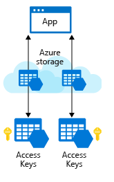

You have added the required client libraries to your application and are ready to connect to your Azure storage account.

To work with data in a storage account, your app will need two pieces of data:

- Access key
- REST API endpoint

## Security access keys

Each storage account has two unique _access keys_ that are used to secure the storage account. If your app needs to connect to multiple storage accounts, your app will require an access key for each storage account.



## REST API endpoint

In addition to access keys for authentication to storage accounts, your app will need to know the storage service endpoints to issue the REST requests.

The REST endpoint is a combination of your storage account _name_, the data type, and a known domain. For example:

| Data type | Example endpoint |
|-----------|------------------|
| Blobs     | `https://[name].blob.core.windows.net/` |
| Queues    | `https://[name].queue.core.windows.net/` |
| Table     | `https://[name].table.core.windows.net/` |
| Files     | `https://[name].file.core.windows.net/` |

If you have a custom domain tied to Azure, then you can also create a custom domain URL for the endpoint.

## Connection strings

The simplest way to handle access keys and endpoint URLs within applications is to use **storage account connection strings**. A connection string provides all needed connectivity information in a single text string.

Azure Storage connection strings look similar to the following example, but with the access key and account name of your specific storage account:

```
DefaultEndpointsProtocol=https;AccountName={your-storage};
   AccountKey={your-access-key};
   EndpointSuffix=core.windows.net
```

## Security

Access keys are critical to providing access to your storage account, and as a result, should not be given to any system or person that you do not want to have access to your storage account. Access keys are the equivalent of a username and password to access your computer.

Typically, storage account connectivity information is stored within an environment variable, database, or configuration file.

> [!IMPORTANT]
> It is important to note that storing this information in a configuration file can be dangerous if you include that file in source control and store it in a public repository. This is a common mistake and means that anyone can browse your source code in the public repository and see your storage account connection information.

Each storage account has two access keys. The reason for this is to allow keys to be rotated (regenerated) periodically as part of security best practice in keeping your storage account secure. This process can be done from the Azure portal or the Azure CLI/PowerShell command line tool.

Rotating a key will invalidate the original key value immediately and will revoke access to anyone who obtained the key inappropriately. With support for two keys, you can rotate keys without causing downtime in your applications that use them. Your app can switch to using the alternate access key while the other key is regenerated. If you have multiple apps using this storage account, they should all use the same key to support this technique. Here's the basic idea:

1. Update the connection strings in your application code to reference the secondary access key of the storage account.
2. Regenerate the primary access key for your storage account using the Azure portal or command line tool.
3. Update the connection strings in your code to reference the new primary access key.
4. Regenerate the secondary access key in the same manner.

> [!TIP]
> It's highly recommended that you periodically rotate your access keys to ensure they remain private, just like changing your passwords. If you are using the key in a server application, you can use an **Azure Key Vault** to store the access key for you. Key Vaults include support to synchronize directly to the Storage Account and automatically rotate the keys periodically. Using a Key Vault provides an additional layer of security, so your app never has to work directly with an access key.

### Shared access signatures (SAS)

Access keys are the easiest approach to authenticating access to a storage account. However they provide full access to anything in the storage account, similar to a root password on a computer.

Storage accounts offer a separate authentication mechanism called _shared access signatures_ that support expiration and limited permissions for scenarios where you need to grant limited access. You should use this approach when you are allowing other users to read and write data to your storage account. There are links to our documentation on this advanced topic at the end of the module.
