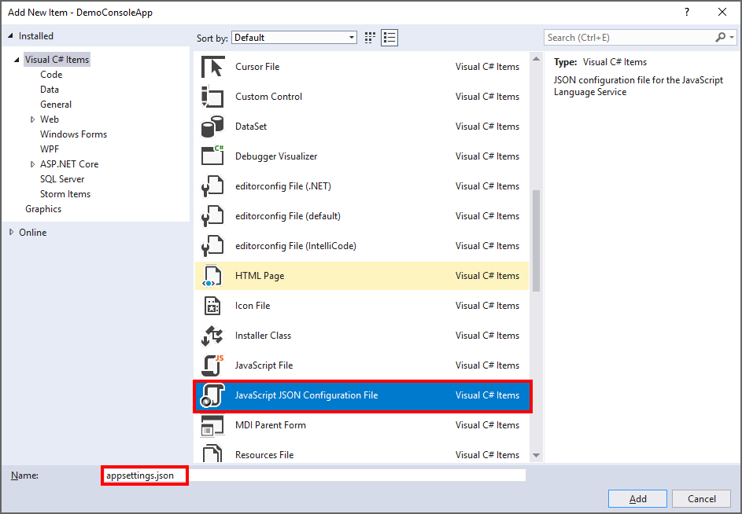
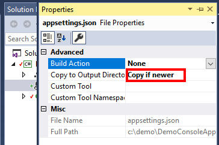
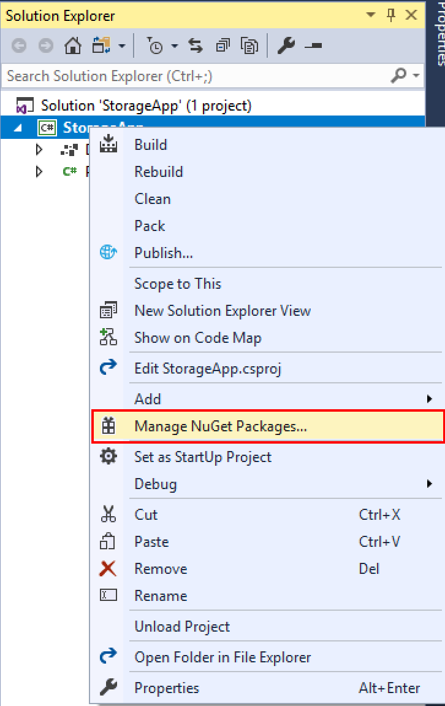

## Exercise - Add Azure Storage configuration to your app

This exercise will take you through the steps required to retrieve the access key and add it to your app configuration. This exercise assumes you have completed the previous unit where you added a reference to the Azure Storage client library.

Since we have created a .NET Core console application, we need to add support for reading from configuration files to the application.

1. In your Visual Studio project that we created in the previous unit, right click the project, select **Add**, then select **New Item** (or hold down CTRL-SHIFT-A).
1. A modal dialog is presented. Select **JavaScript JSON Configuration File** and type **appsettings.json** into the *Name* textbox, then click **Add**
  
1. A file is added to the project with contents similar to the following:
    ```json
    {
      "exclude": [
        "**/bin",
        "**/bower_components",
        "**/jspm_packages",
        "**/node_modules",
        "**/obj",
        "**/platforms"
      ]
    }
    ```
1. Remove the **exclude** entry and its associated contents and replace with a single entry **StorageAccountConnectionString** with an empty string value. It should look similar to the following:
    ```json
    {
      "StorageAccountConnectionString": ""
    }
    ```
1. Select the **appsettings.json** file, right click it and select **Properties** (alternatively press ALT+ENTER or F4).
1. Change the **Copy to Output Directory** to **Copy if newer**
  

  > This ensures that the app configuration file is placed in the output directory when the app is compiled/built.

A .NET Core console application requires certain libraries to be added to allow it to easily read from a JSON configuration file.

1. Right click on the project and select **Manage Nuget Packages …**
  
1. A page is displayed showing currently installed Nuget packages. Click on the **Browse** option and type in **Microsoft.Extensions.Configuration.Json** in the search field. **Microsoft.Extensions.Configuration.Json** package is displayed in the search results.
1. Select the **Microsoft.Extensions.Configuration.Json** package and in the right pane select **Install**
1. A **Preview Changes** dialog is displayed. Click **OK**
1. A Licence acceptance dialog is displayed. Click **I Accept**

Now that we have added the required libraries to enable reading configuration, we need to enable that functionality within our console application.

1. Locate the **Program.cs** file in your project and open it in Visual Studio.
1. At the top of the file, a **using System;** is present. Underneath that line, add the following lines of code:
    ```csharp
    using Microsoft.Extensions.Configuration;
    using System.IO;
    ```
1. Replace the contents of the **Main** method with the following code:
    ```csharp
    var builder = new ConfigurationBuilder()
        .SetBasePath(Directory.GetCurrentDirectory())
        .AddJsonFile("appsettings.json");

    var configuration = builder.Build();
    ```
1. Your **Program.cs** file should now look like the following:
    ```csharp
    using System;
    using Microsoft.Extensions.Configuration;
    using System.IO;

    namespace DemoConsoleApp
    {
        class Program
        {
            static void Main(string[] args)
            {
                var builder = new ConfigurationBuilder()
                    .SetBasePath(Directory.GetCurrentDirectory())
                    .AddJsonFile("appsettings.json");

                var configuration = builder.Build();
            }
        }
    }
    ```

> This code initializes the configuration system to read from the **appsettings.json** file.

Now we need to get the storage account connection string and place it into the configuration for our app.


1. Navigate to the Azure portal for your subscription that contains your storage account.
1. Navigate to your storage account.
1. Navigate to the Account Keys blade of the storage account in the portal.
1. Copy the **key1** connection string.
1. Paste in the contents of the access key you copied from the portal as the value for the **StorageAccountConnectionString**. Your configuration should now look similar to the following:
    ```json
    {
      "StorageAccountConnectionString": "your-access-key-connection-string-goes-here"
    }
    ```

## Summary

This unit has taken you through the configuration of your application with your storage account connection string. To access a storage account requires the storage account name and access key. The simplest way to reference this is to use the storage account connection string which contains both of these pieces of information in the one string. You are now ready to begin coding your app to access your Azure Storage account.
