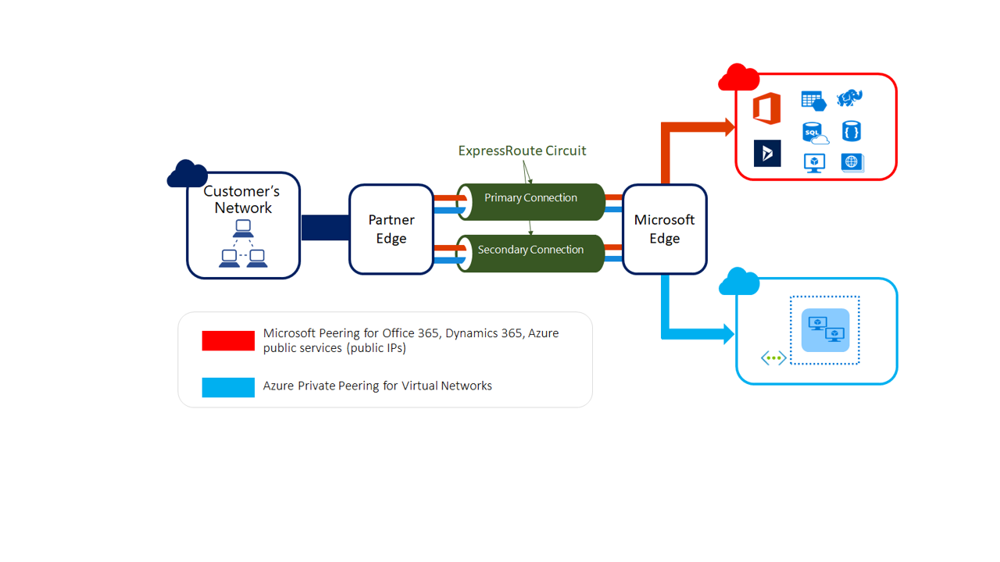
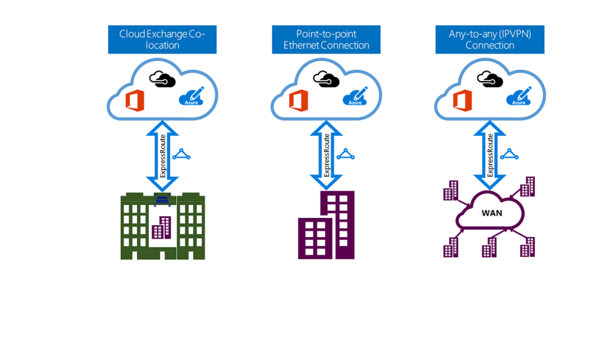

As part of the project for the finance company, you need to understand how Azure ExpressRoute integrates with on-premises and Azure networks. You need to understand what Azure ExpressRoute is, the benefits it provides compared to other site to site connectivity options and whether Azure ExpressRoute service is the best service to use to provide the finance company with the best possible network performance.

## Azure ExpressRoute Service

Azure ExpressRoute lets you seamlessly extend your on-premises networks into the Microsoft cloud. This connection between your organization and Azure is dedicated and private. Establishing an ExpressRoute connection enables you to connect to services like Azure, Office 365, and Dynamics 365, all of which are Microsoft cloud services. Security is enhanced, connections are more reliable, latency is minimal, and throughput is greatly increased.

## Features and benefits of ExpressRoute

There are several benefits to using ExpressRoute as the preferred connection service between Azure and on-premises networks. The following sections describe these benefits.

### Layer 3 connectivity

Layer 3 (address-level) connectivity is provided between your on-premise network and Microsoft cloud through connectivity partners.  These connections can be from a point-to-point, any-to-any network, or a virtual cross-connection through an exchange.

### Built-in redundancy

Each connectivity provider uses redundant devices to ensure connections established with Microsoft are highly available. You can configure multiple circuits to complement this feature. All redundant connections are configured with Layer 3 connectivity to ensure SLAs are met.

### Connectivity to Microsoft Cloud services

ExpressRoute enables direct access to the following services in all regions:

- Microsoft Office 365
- Microsoft Dynamics 365
- Azure compute services, such as Azure virtual machines
- Azure cloud services, such as Cosmos DB and Azure storage

Office 365 was created to be accessed securely and reliably via the Internet. Because of this, we recommend ExpressRoute for specific scenarios. For information about using ExpressRoute to access Office 365, visit the Azure ExpressRoute for Office 365 article linked in the **Learn more** section at the end of this module.

### Across on-premises connectivity with ExpressRoute Global Reach

You can enable ExpressRoute Global Reach to exchange data across your on-premises sites by connecting your ExpressRoute circuits. For example, if you have a private data center in California connected to ExpressRoute in Silicon Valley, and another private data center in Texas connected to ExpressRoute in Dallas, with ExpressRoute Global Reach, you can connect your private data centers together through two ExpressRoute circuits. Your cross-data-center traffic will traverse through Microsoft's network.

### Dynamic Routing

ExpressRoute uses the Border Gateway Protocol (BGP) routing protocol. BGP is used to exchange routes between on-premise networks and resources running in Azure. This protocol enables dynamic routing between your on-premises network and services running in the Microsoft cloud.

## ExpressRoute connectivity models

ExpressRoute supports three connection models that you can use to connect between your on-premises network and the Microsoft cloud:

- CloudExchange co-location
- Point-to-point Ethernet connection
- Any-to-any connection

### Co-located at cloud exchange

Co-located providers can normally offer both Layer 2 and Layer 3 connections between your infrastructure, which may be located in the co-location facility, and the Microsoft cloud. For example, if your datacenter is co-located at a cloud exchange such as an ISP, you can request a virtual cross-connection to the Microsoft cloud.

### Point-point Ethernet connections

Point-to-point connections provide Layer 2 and Layer 3 connectivity between your on-premises site and Microsoft Azure.  You can connect your offices or datacenters to Azure using the point-to-point links. For example, if you have an on-premises datacenter, you can use a point-to-point Ethernet link to connect to Microsoft.

### Any-to-any networks

With point-to-point connectivity, you can integrate your WAN with Microsoft Azure by providing connections to your offices and datacenters. Azure will integrate with your WAN connection to provide a seamless connection, just like you would have between your datacenter and any branch offices. With point-to-point connections, all WAN providers offer Layer 3 connectivity. For example, if you already use MPLS to connect to your branch offices or other sites in your organization, an ExpressRoute connection to Microsoft will behave just like another location on your private WAN.

## Security considerations

With ExpressRoute, your data doesn’t travel over the public Internet, so it's not exposed to the potential risks associated with Internet communications. ExpressRoute is a private connection from your on-premises infrastructure to your Azure infrastructure. Even if you have an ExpressRoute connection, DNS queries, certificate revocation list checking, and content delivery network (CDN) requests are still sent over the public Internet.
