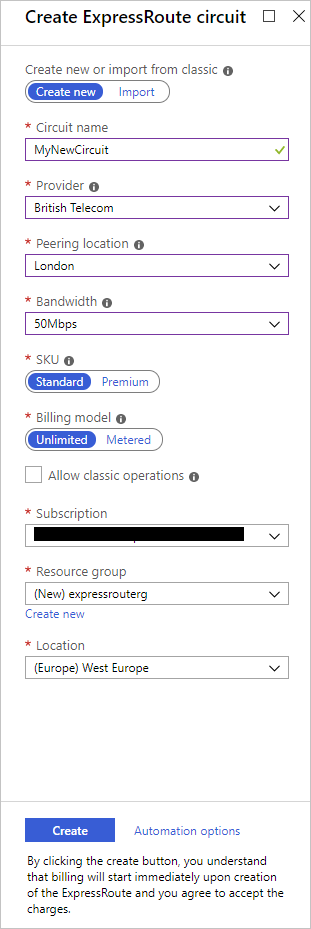
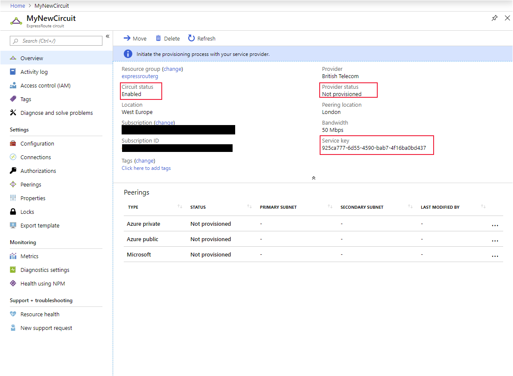
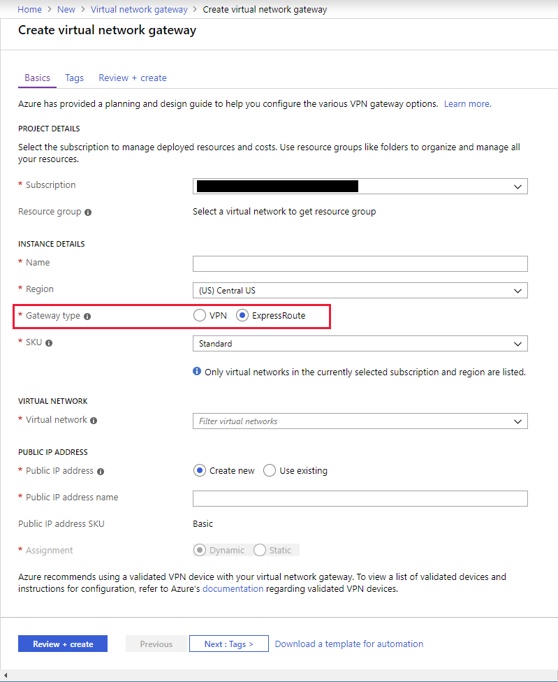

You've learned about the purpose of Azure ExpressRoute service, and the services for which you can use it. Now you're ready to start learning about how the service works. You'll see how it interacts with Azure and on-premises networks to provide you with a secure and reliable connection between your on-premises datacenter and the Microsoft cloud.

In this unit, you'll learn how to create and use Azure circuits to connect your on-premise networks to the cloud.  You'll see the steps you need to take to create a circuit. You'll also learn about the other components of an ExpressRoute connection, which work together to form a connection from your on-premises datacenter to the Microsoft cloud.

## Architecture of ExpressRoute

ExpressRoute is supported across all regions and locations. To implement ExpressRoute, you need to work with an ExpressRoute partner.  The partner provides the edge service (an authorized and authenticated connection that operates through a partner-controlled router) that is responsible for extending your network to the Microsoft cloud. The partner sets up connections to an endpoint in an ExpressRoute location (implemented by a Microsoft edge-router), enabling you to peer your on-premises networks with the virtual networks available through the endpoint. These connections are referred to as *circuits*.

A circuit provides a physical connection for transmitting data through the ExpressRoute provider's edge routers to the Microsoft edge-routers. A circuit is established across a private wire rather than the public Internet. Your on-premises network is connected to the ExpressRoute provider's edge routers. The Microsoft edge-routers provide the entry point to the Microsoft cloud.

## Prerequisites for ExpressRoute

Before you can connect to Microsoft cloud services using ExpressRoute, you need to have:

- An ExpressRoute connectivity partner or cloud exchange provider that can set up a connection from your on-premise networks to the Microsoft cloud.
- An Azure subscription that is registered with your chosen ExpressRoute connectivity partner.
- An active Microsoft Azure account that can be used to request an ExpressRoute circuit.
- An active Office 365 subscription, if you want to connect to the Microsoft cloud and access Office 365 services.

ExpressRoute works by peering your on-premises networks with networks running in the Microsoft cloud. Resources on your networks can communicate directly with resources hosted by Microsoft. To support these peerings, ExpressRoute has a number of network and routing requirements.

- Ensure that BGP sessions for routing domains have been configured. Depending on your partner, this could be their or your responsibility. Additionally, for each ExpressRoute circuit, Microsoft requires redundant BGP sessions between Microsoft’s routers and your peering routers.
- You or your provider need to translate the private IP addresses used on-premises to public IP addresses using a NAT service as Microsoft will reject anything except public IP addresses through Microsoft peering.
- Reserve several blocks of IP addresses in your network for routing traffic to the Microsoft cloud. You configure these blocks either as a /30 subnet or two /29 subnets in your IP address space. One of these subnets is used to configure the primary circuit to the Microsoft cloud, and the other implements a secondary circuit. You use the first address in these subnets to communicate with services in the Microsoft cloud. Microsoft uses the second address to establish a BGP session.

ExpressRoute supports two peering schemes:

- Use a private peering to connect to Azure IaaS and PaaS services deployed inside Azure virtual networks. The resources that you access must all be located in one or more Azure virtual networks with private IP addresses; you can't access resources through their public IP address over a private peering.
- Use the Microsoft peering to connect to Azure PaaS services, Office 365 services, and Dynamics 365.

> [!NOTE]
> The Azure portal also enables you to configure public peering. This form of peering enables you to connect to the public addresses exposed by Azure services. However, this peering is deprecated and is not available for new circuits. This module does not describe public peering.

## Create an ExpressRoute circuit and peering

Establishing a connection to Azure through ExpressRoute is a multi-step process. You can perform many of these steps either using the Azure portal, or from the command line using PowerShell or the Azure CLI. This section describes the process using the Azure portal. For PowerShell and CLI instructions, see the **Learn more** section at the end of this module.

### Create a circuit

When using the Azure portal, click **Create a resource** > **Networking** > **ExpressRoute**. The **Create ExpressRoute circuit** page will require you to complete the following fields:

| Property  | Value  |
|---|---|
| Circuit name | A meaningful name for your circuit, without any white space or special characters |
| Provider | The ExpressRoute provider with which you've registered your subscription  |
| Peering Location | A location enabled by the ExpressRoute provider in which to create your circuit |
| Bandwidth | Select your bandwidth, from 50 Mbps up to 10 Gbps. Start with a low value. You can increase it later with no interruption to service. However, you can't reduce the bandwidth if you set it too high initially. |
| SKU | Select **Standard** if you have up to 10 virtual networks and only need to connect to resources in the same geopolitical region, otherwise select **Premium** |
| Billing model | Select **Unlimited** to pay a flat fee regardless of usage, or **Metered** to pay according to the volume of traffic that enters and exist the circuit.
| Subscription | The subscription you've registered with your ExpressRoute provider |
| Resource group | The Azure resource group in which to create the circuit |
| Location | The Azure location in which to create the circuit |

Circuit creation can take several minutes. Once the circuit has been provisioned, you can use the Azure portal to view the properties. You'll see that the **Circuit status** is enabled, meaning that the Microsoft side of the circuit is ready to accept connections. The **Provider status** will be **Not provisioned** initially. This is because the provider hasn't configured their side of the circuit for connecting to your network. You send the provider the value in the **Service key** field to enable them to configure the connection. This can take several days. You can revisit this page to check the provider status.

### Create peering configuration

Once the provider status is reported as **Provisioned**, you can configure the routing for the peerings. These steps only apply to circuits, which are created with service providers who offer Layer 2 connectivity.  For any circuits, which operate at Layer 3, the provider may be able to configure the routing for you.

The **ExpressRoute circuit** page (shown above) lists each peering and its properties. You can select a peering to configure these properties.

### Configure a private peering

You use a private peering to connect your network to your virtual networks running in Azure. To configure private peering, you must provide the following information:

- Peer ASN. The autonomous system number for your side of the peering. This ASN can be public or private, and 16 bits or 32 bits.
- Primary subnet. This is the address range of the primary /30 subnet that you created in your network. You'll use the first IP address in this subnet for your router, and Microsoft uses the second for its router.
- Secondary subnet. This is the address range of your secondary /30 subnet. This subnet provides a secondary link to Microsoft. The first two addresses are used to hold the IP address of your router and the Microsoft router.
- VLAN ID. This is the VLAN on which to establish the peering. The primary and secondary links will both use this VLAN ID.
- Shared key. This is an optional MD5 hash used to encode messages passing over the circuit.

### Configure a Microsoft peering

You use a Microsoft peering to connect to Office 365 and its associated services. To configure a Microsoft peering, you provide a peer ASN, primary subnet address range, secondary subnet address range, VLAN ID, and an optional shared key as described for a private peering. You must also provide the following information:

- Advertised public prefixes. This is a list of the address prefixes that you use over the BGP session. These prefixes must be registered to you, and must be prefixes for public address ranges.
- Customer ASN. This is optional. It is the client-side autonomous system number to use if you are advertising prefixes that aren't registered to the peer ASN.
- Routing registry name. This name identifies the registry in which the Customer ASN and public prefixes are registered.

## Connect a virtual network to an ExpressRoute circuit

Once the ExpressRoute circuit has been established, Azure private peering configured for your circuit and the BGP session between your network and Microsoft is active, you can enable connectivity from your on-premise network to Azure.

Before you can connect to a private circuit, you must create an Azure virtual network gateway, using a subnet on one of your Azure virtual networks. The virtual network gateway provides the entry point to network traffic entering from your on-premises network. It directs incoming traffic through the virtual network to your Azure resources. You can configure network security groups and firewall rules to control the traffic that is routed from your on-premises network and block requests from unauthorized addresses in your on-premises network.

> [!NOTE]
> You must create the Virtual Network Gateway using the type **ExpressRoute** and not **VPN**.
>
> 

Up to 10 virtual networks can be linked to ExpressRoute circuit, but these virtual networks must be in the same geopolitical region as the ExpressRoute circuit.  You can link a single virtual network to four ExpressRoute circuits if necessary, and the ExpressRoute circuit can be in the same or different subscription to the virtual network.

If you're using the Azure portal, you connect a peering to a virtual network gateway as follows:

1. On the **ExpressRoute circuit** page for your circuit, select **Connections**.
1. On the **Connections** page, click **Add**.
1. On the **Add connection** page, give your connection a name, and then select your virtual network gateway. When the operation has completed, your on-premises network will be connected through the virtual network gateway to your virtual network in Azure. The connection will be made across the ExpressRoute connection. 

## High availability and failover with ExpressRoute

In each ExpressRoute circuit, there are two connections from the connectivity provider to two different Microsoft edge-routers. This configuration occurs automatically, and provides a degree of availability within a single location.

Consider setting up ExpressRoute circuits in different peering locations to provide high availability and protect against a regional outage. For example, you might create circuits in the US East and US Central regions and connect these circuits to your virtual network. This way, if one ExpressRoute circuit was to go down, you won't lose connectivity to your resource and you can fail over the connection to another ExpressRoute circuit.

You can also have multiple circuits across different providers to ensure your network is always available even if an outage is affecting all circuits from a single approved provider.  You can set the **Connection Weight** property to prefer one circuit to another.

## ExpressRoute Direct and FastPath

Microsoft also provides an ultra high-speed option called ExpressRoute Direct. This service enables dual 100-Gbps connectivity. It's suitable for scenarios that involve massive and frequent data ingestion, and for solutions that require extreme scalability, such as banking, government, and retail.

You enroll your subscription with Microsoft to activate ExpressRoute Direct. For more information, visit the ExpressRoute article in the **Learn more** section at the end of this module.

ExpressRoute Direct supports FastPath. When FastPath is enabled, it sends network traffic, which is destined to a virtual machine, directly to that virtual machine, bypassing the virtual network gateway, improving the performance between Azure virtual networks and on-premises networks.

FastPath doesn't support virtual network peering (where you have virtual networks connected together), nor does it support user-defined routes on the gateway subnet.
