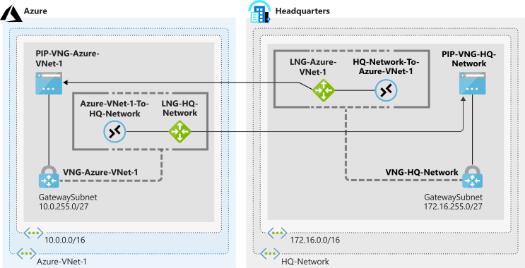
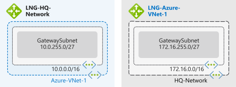

Your company is now ready to deploy a site-to-site VPN that allows your on-premises servers to connect to resources in Azure. You can then start to securely share data from each of your sites, and you can use resources hosted in Azure across your organization. 

Start by creating your Azure-side resources and on-premises network resources. For this deployment, you use the following network topology.



In this exercise, we simulate an on-premises datacenter (HQ-Network) by using an additional Azure virtual network. There are many makes and models of on-premises VPN devices, and it isn't possible to describe their configuration in this unit. The logical method of configuration is the same for a VPN device. You just need to replace the steps for HQ-Network with steps tailored to your on-premises device.

In the previous diagram, notice that the local network gateway names in each location reflect the *target* networks rather than the *source* network. This naming convention is a good practice. It clarifies that the local network gateway refers to the *other* network that you're connecting to.

In this unit, you configure the virtual networks with a subnet, add a gateway subnet, and then create the local network gateway by using the Azure CLI.

## Create the Azure-side resources

1. Run the following command in Azure Cloud Shell to create the **Azure-VNet-1** virtual network and the **Services** subnet.

    ```azurecli
    az network vnet create \
        --resource-group <rgn>[sandbox resource group name]</rgn> \
        --name Azure-VNet-1 \
        --address-prefixes 10.0.0.0/16 \
        --subnet-name Services \
        --subnet-prefixes 10.0.0.0/24
    ```

1. Run the following command in Cloud Shell to add the **GatewaySubnet** subnet to **Azure-VNet-1**.

    ```azurecli
    az network vnet subnet create \
        --resource-group <rgn>[sandbox resource group name]</rgn> \
        --vnet-name Azure-VNet-1 \
        --address-prefixes 10.0.255.0/27 \
        --name GatewaySubnet
    ```

1. Run the following command in Cloud Shell to create the **LNG-HQ-Network** local network gateway.

    ```azurecli
    az network local-gateway create \
        --resource-group <rgn>[sandbox resource group name]</rgn> \
        --gateway-ip-address 94.0.252.160 \
        --name LNG-HQ-Network \
        --local-address-prefixes 10.1.0.0/16
    ```

    This gateway represents the on-premises network that you're connecting to. The IP address specified as the remote gateway (which is the simulated on-premises network) must be updated later because it doesn't exist yet in our scenario.

## Create the simulated on-premises network and supporting resources

1. Run the following command in Cloud Shell to create the **HQ-Network** virtual network and the **Applications** subnet.

    ```azurecli
    az network vnet create \
        --resource-group <rgn>[sandbox resource group name]</rgn> \
        --name HQ-Network \
        --address-prefixes 172.16.0.0/16 \
        --subnet-name Applications \
        --subnet-prefixes 172.16.0.0/24
    ```

1. Run the following command in Cloud Shell to add **GatewaySubnet** to **HQ-Network**.

    ```azurecli
    az network vnet subnet create \
        --resource-group <rgn>[sandbox resource group name]</rgn> \
        --address-prefixes 172.16.255.0/27 \
        --name GatewaySubnet \
        --vnet-name HQ-Network
    ```

1. Run the following command in Cloud Shell to create the **LNG-Azure-VNet-1** local network gateway.

    ```azurecli
    az network local-gateway create \
        --resource-group <rgn>[sandbox resource group name]</rgn> \
        --gateway-ip-address 94.0.252.160 \
        --name LNG-Azure-VNet-1 \
        --local-address-prefixes 172.16.255.0/27
    ```

    This gateway describes the Azure network that you're connecting to. You update the IP address specified as the remote gateway (which is in Azure) later.

## Verify the topology

1. Run the following command in Cloud Shell to verify that the virtual networks have been successfully created.

    ```azurecli
    az network vnet list --output tsv
    ```

1. Run the following command in Cloud Shell to verify that the local network gateways have been successfully created.

    ```azurecli
    az network local-gateway list \
        --resource-group <rgn>[sandbox resource group name]</rgn> \
        --output table
    ```

The following diagram shows the resources that you've deployed.


