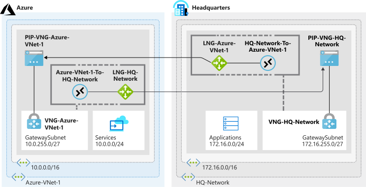

You're now ready to complete your site-to-site VPN gateway by creating the public IP addresses, virtual network gateways, and connections. Remember that you used placeholders for the public IP address references when you created your local network gateways. So one of your tasks now is to update these gateways with the actual public IP addresses assigned to your virtual network gateways.

Ideally, the public IP addresses and virtual network gateways should be created *before* the local network gateways. In this exercise, you see how to update the local network gateways. You can use the same commands to update any configuration elements in the local network gateways, like remote network address spaces.

## Create the Azure-side VPN gateway

First, you create the VPN gateway for the Azure end of the connection. It can take up to 45 minutes to create a virtual network gateway. To save time, you use Azure CLI commands with the `--no-wait` parameter. This parameter lets you create both virtual network gateways simultaneously to minimize the overall time required to create these resources.

1. Run the following command in Cloud Shell to create the **PIP-VNG-Azure-VNet-1** public IP address.

    ```azurecli
    az network public-ip create \
        --resource-group <rgn>[sandbox resource group name]</rgn> \
        --name PIP-VNG-Azure-VNet-1 \
        --allocation-method Dynamic
    ```

1. Run the following command in Cloud Shell to create the **VNG-Azure-VNet-1** virtual network.

    ```azurecli
    az network vnet create \
        --resource-group <rgn>[sandbox resource group name]</rgn> \
        --name VNG-Azure-VNet-1 \
        --subnet-name GatewaySubnet 
    ```

1. Run the following command in Cloud Shell to create the **VNG-Azure-VNet-1** virtual network gateway. 

    ```azurecli
    az network vnet-gateway create \
        --resource-group <rgn>[sandbox resource group name]</rgn> \
        --name VNG-Azure-VNet-1 \
        --public-ip-addresses PIP-VNG-Azure-VNet-1 \
        --vnet VNG-Azure-VNet-1 \
        --gateway-type Vpn \
        --vpn-type RouteBased \
        --sku VpnGw1 \
        --no-wait
    ```

## Create the on-premises VPN gateway

Next, you create a VPN gateway to simulate an on-premises VPN device.

1. Run the following command in Cloud Shell to create the **PIP-VNG-HQ-Network** public IP address.

    ```azurecli
    az network public-ip create \
        --resource-group <rgn>[sandbox resource group name]</rgn> \
        --name PIP-VNG-HQ-Network \
        --allocation-method Dynamic
    ```

1. Run the following command in Cloud Shell to create the **VNG-HQ-Network** virtual network.

    ```azurecli
    az network vnet create \
        --resource-group <rgn>[sandbox resource group name]</rgn> \
        --name VNG-HQ-Network \
        --subnet-name GatewaySubnet 
    ```

1. Run the following command in Cloud Shell to create the **VNG-HQ-Network** virtual network gateway.

    ```azurecli
    az network vnet-gateway create \
        --resource-group <rgn>[sandbox resource group name]</rgn> \
        --name VNG-HQ-Network \
        --public-ip-addresses PIP-VNG-HQ-Network \
        --vnet VNG-HQ-Network \
        --gateway-type Vpn \
        --vpn-type RouteBased \
        --sku VpnGw1 \
        --no-wait
    ```

1. Gateway creation takes approximately 30+ minutes to complete. To monitor the progress of the gateway creation, run the following command. We're using the Linux `watch` command to run the `az network vnet-gateway list` command periodically, which enables you to monitor the progress.

    ```azurecli
    watch -d -n 5 az network vnet-gateway list \
        --resource-group <rgn>[sandbox resource group name]</rgn> \
        --output table
    ```

1. After each VPN gateway shows a **ProvisioningState** of **Succeeded**, you're ready to continue. Press <kbd>Ctrl+C</kbd> to halt the command after the gateway is created.

    ```output
    ActiveActive    EnableBgp    EnablePrivateIpAddress   GatewayType    Location        Name              ProvisioningState    ResourceGroup                         ResourceGuid                          VpnType
    --------------  -----------  ------------------------ -------------  --------------  ----------------  -------------------  -----------------------------  ------------------------------------  ----------
    False           False        False                    Vpn            southcentralus  VNG-Azure-VNet-1  Succeeded            <rgn>[sandbox resource group name]</rgn>  48dc714e-a700-42ad-810f-a8163ee8e001  RouteBased
    False           False        False                    Vpn            southcentralus  VNG-HQ-Network    Succeeded            <rgn>[sandbox resource group name]</rgn>  49b3041d-e878-40d9-a135-58e0ecb7e48b  RouteBased
    ```

## Update the local network gateway IP references

> [!IMPORTANT]
> Your virtual network gateways must be successfully deployed before you start the next exercise. A gateway can take up to 30+ minutes to complete. If the ProvisioningState does not show "Succeeded" yet, you need to wait.

In this section, you update the remote gateway IP address references that are defined in the local network gateways. You can't update the local network gateways until you've created the VPN gateways and an IPv4 address is assigned to and associated with them.

1. Run the following Azure CLI command to check whether both virtual network gateways have been created. The initial state shows **Updating**. You want to see **Succeeded** on both VNG-Azure-VNet-1 and VNG-HQ-Network.

    ```azurecli
    az network vnet-gateway list \
        --resource-group <rgn>[sandbox resource group name]</rgn> \
        --output table
    ```

    ```output
    Name              Location    GatewayType    VpnType     VpnGatewayGeneration    EnableBgp    EnablePrivateIpAddress    Active    ResourceGuid                        ProvisioningState    ResourceGroup
    ----------------  ----------  -------------  ----------  ----------------------  -----------  ------------------------  --------  ------------------------------------  -------------------  ------------------------------------------
    VNG-Azure-VNet-1  westus      Vpn            RouteBased  Generation1         False        False                     False     9a2e60e6-da57-4274-99fd-e1f8b2c0326d  Succeeded            learn-cfbcca66-16fd-423e-b688-66f242d8f09e
    VNG-HQ-Network    westus      Vpn            RouteBased  Generation1         False        False                     False     c36430ed-e6c0-4230-ae40-cf937a102bcd  Succeeded            learn-cfbcca66-16fd-423e-b688-66f242d8f09e
    ```

    Remember to wait until the lists of gateways are successfully returned. Also, remember that the local network gateway resources define the settings of the *remote* gateway and network that they're named after. For example, the **LNG-Azure-VNet-1** local network gateway contains information like the IP address and networks for **Azure-VNet-1**.

1. Run the following command in Cloud Shell to retrieve the IPv4 address assigned to **PIP-VNG-Azure-VNet-1** and store it in a variable.

    ```azurecli
    PIPVNGAZUREVNET1=$(az network public-ip show \
        --resource-group <rgn>[sandbox resource group name]</rgn> \
        --name PIP-VNG-Azure-VNet-1 \
        --query "[ipAddress]" \
        --output tsv)
    ```

1. Run the following command in Cloud Shell to update the **LNG-Azure-VNet-1** local network gateway so that it points to the public IP address attached to the **VNG-Azure-VNet-1** virtual network gateway.

    ```azurecli
    az network local-gateway update \
        --resource-group <rgn>[sandbox resource group name]</rgn> \
        --name LNG-Azure-VNet-1 \
        --gateway-ip-address $PIPVNGAZUREVNET1
    ```

1. Run the following command in Cloud Shell to retrieve the IPv4 address assigned to **PIP-VNG-HQ-Network** and store it in a variable.

    ```azurecli
    PIPVNGHQNETWORK=$(az network public-ip show \
        --resource-group <rgn>[sandbox resource group name]</rgn> \
        --name PIP-VNG-HQ-Network \
        --query "[ipAddress]" \
        --output tsv)
    ```

1. Run the following command in Cloud Shell to update the **LNG-HQ-Network** local network gateway so that it points to the public IP address attached to the **VNG-HQ-Network** virtual network gateway.

    ```azurecli
    az network local-gateway update \
        --resource-group <rgn>[sandbox resource group name]</rgn> \
        --name LNG-HQ-Network \
        --gateway-ip-address $PIPVNGHQNETWORK
    ```

## Create the connections

You complete the configuration by creating the connections from each VPN gateway to the local network gateway that contains the public IP address references for that gateway's remote network.

1. Create the shared key to use for the connections. In the following command, replace `<shared key>` with a text string to use for the IPSec preshared key. The preshared key is a string of printable ASCII characters no longer than 128 characters. It can't contain special characters, like hyphens and tildes. You use this preshared key on both connections.

    > [!NOTE]
    > In this example, any set of numbers will work for a shared key: SHAREDKEY=123456789. In production environments, we recommend using a string of printable ASCII characters no longer than 128 characters *without* special characters, like hyphens or tildes.

    ```bash
    SHAREDKEY=<shared key>
    ```

2. Remember that **LNG-HQ-Network** contains a reference to the IP address on your simulated on-premises VPN device. Run the following command in Cloud Shell to create a connection from **VNG-Azure-VNet-1** to **LNG-HQ-Network**.

    ```azurecli
    az network vpn-connection create \
        --resource-group <rgn>[sandbox resource group name]</rgn> \
        --name Azure-VNet-1-To-HQ-Network \
        --vnet-gateway1 VNG-Azure-VNet-1 \
        --shared-key $SHAREDKEY \
        --local-gateway2 LNG-HQ-Network
    ```

3. Remember that **LNG-Azure-VNet-1** contains a reference to the public IP address associated with the **VNG-Azure-VNet-1** VPN gateway. This connection would normally be created from your on-premises device. Run the following command in Cloud Shell to create a connection from **VNG-HQ-Network** to **LNG-Azure-VNet-1**.

    ```azurecli
    az network vpn-connection create \
        --resource-group <rgn>[sandbox resource group name]</rgn> \
        --name HQ-Network-To-Azure-VNet-1  \
        --vnet-gateway1 VNG-HQ-Network \
        --shared-key $SHAREDKEY \
        --local-gateway2 LNG-Azure-VNet-1
    ```

You have now finished the configuration of the site-to-site connection. It may take a few minutes, but the tunnels should automatically connect and become active.

## Verification steps

Let's confirm that the VPN tunnels are connected.

1. Run the following command to confirm that **Azure-VNet-1-To-HQ-Network** is connected.

    ```azurecli
    az network vpn-connection show \
        --resource-group <rgn>[sandbox resource group name]</rgn> \
        --name Azure-VNet-1-To-HQ-Network  \
        --output table \
        --query '{Name:name,ConnectionStatus:connectionStatus}'
    ```

    You should see output like the following, indicating the connection is successful. If the `ConnectionStatus` shows as `Connecting` or `Unknown`, wait a minute or two, and rerun the command. The connections can take a few minutes to fully connect.

    ```output
    Name                        ConnectionStatus
    --------------------------  ------------------
    Azure-VNet-1-To-HQ-Network  Connected
    ```

The site-to-site configuration is now complete. Your final topology, including the subnets, and connections, with logical connection points, appears in the following diagram. Virtual machines deployed in the **Services** and **Applications** subnets can now communicate with each other, now that the VPN connections have been successfully established.


