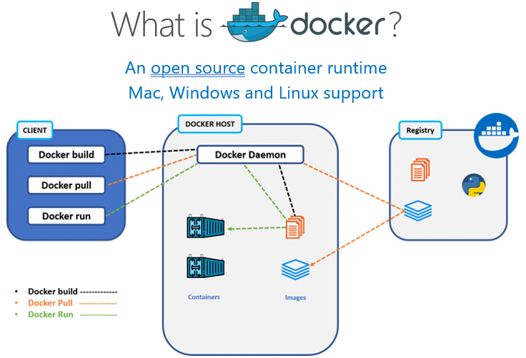

In this unit, you'll containerize a Java application

Unlike virtual machines that emulate hardware, containers run directly on top of the host operating system, kernel and hardware, as essentially just another process. Because of this, containers require less system resources, resulting in a smaller footprint with substantially less overhead, faster application startup times, and a great use case for scaling on demand. 

There are multiple container runtimes. In this module, you’ll be you’ll leverage the widely used Docker runtime to build a Docker image that will ultimately, in the next unit, deploy to the host operating system of your local machine and within the Azure Kubernetes Service.

## Build a Docker image

The Docker runtime is used to build, run, push, and pull Docker images. The below image depicts these use cases followed by a description of each use case/Docker command.

| Docker command | Description |
|-|-|
| docker build | Build a Docker image, essentially the instructions/layers needed for Docker to ultimately create a running container from an image. The result of this command is an image. |
| docker pull  | Containers are initialized from images, they are pulled from registries, such as Azure Container Registry, and this is where Azure Kubernetes Service will pull from. The result of this command is a network pull of an image. |
| docker run   | A running instance of a Docker image is a container, all of the layers needed to run and interact with the Java application are executed with this command. The result of this command is a running application process on the host operating system. |
| docker push | Azure Container Registry will store the images so they are readily available and network close for Azure deployments and scale. |