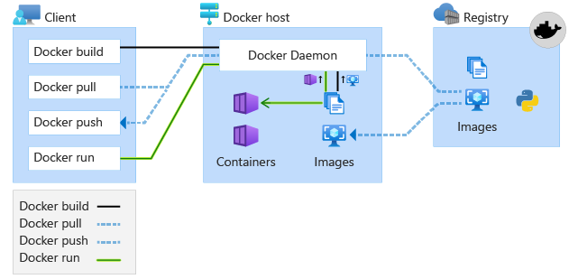
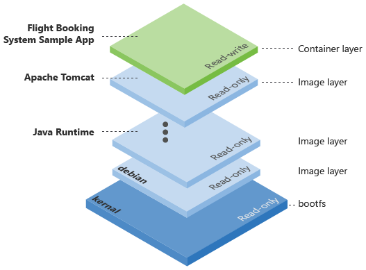
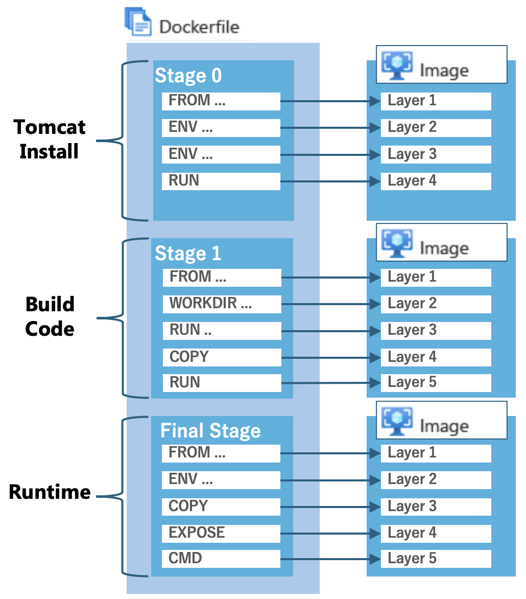

In this unit, you'll containerize a Java application.

As mentioned earlier, containers run directly on top of the host operating system, kernel and hardware, as essentially just another process. Because of this, containers require less system resources, resulting in a smaller footprint with substantially less overhead, faster application startup times, and a great use case for scaling on demand.

There are multiple container runtimes that are used to build both Windows containers and Linux containers. In this module, you’ll leverage the widely used Docker runtime to build a Docker image that will ultimately, in the next unit, deploy as a Linux container to the host operating system of your local machine and then within the Azure Kubernetes Service.

## Docker overview

The Docker runtime is used to build, pull, run, and push Docker images. The below image depicts these use cases followed by a description of each use case/Docker command.



| Docker command | Description |
|-|-|
| docker build | Build a Docker image, essentially the instructions/layers needed for Docker to ultimately create a running container from an image. The result of this command is an image. |
| docker pull  | Containers are initialized from images, which are pulled from registries, such as Azure Container Registry, and this is where Azure Kubernetes Service will pull from. The result of this command is a network pull of an image that will occur in Azure. Note, you can optionally pull images locally, this is common when building images that require dependencies/layers for which your application may need, such as an application server. |
| docker run   | A running instance of a Docker image is a container, all of the layers needed to run and interact with the running container application are executed with this command. The result of this command is a running application process on the host operating system. |
| docker push | Azure Container Registry will store the images so they are readily available and network close for Azure deployments and scale. |

## Clone the Java Application

First you'll clone the Flight Booking System Sample repo.

> [!NOTE]
> If the Azure Kubernetes Service creation has successfully completed in your CLI tab, use that one, otherwise if it's still running, open a new tab and cd to the location of where you prefer to clone the Flight Booking System Sample.

Run the following command in your CLI:

```bash
git clone https://github.com/chtrembl/Flight-Booking-System-JavaServlets_App.git
```

Run the following command in your CLI:

```bash
cd Flight-Booking-System-JavaServlets_App/Project/TurkishAirlines
```

Run the following command in your CLI:

```bash
mvn clean install
```

Maven should have successfully built the Flight Booking System Sample Web Application Archive artifact FlightBookingSystemSample-0.0.-SNAPSHOT.war, as seen below:

```bash
[INFO] Building war: /mnt/c/Users/chtrembl/dev/git/Flight-Booking-System-JavaServlets_App/Project/FlightBookingSystemSample/target/FlightBookingSystemSample-0.0.1-SNAPSHOT.war
[INFO] ------------------------------------------------------------------------
[INFO] BUILD SUCCESS
[INFO] ------------------------------------------------------------------------
[INFO] Total time:  17.698 s
[INFO] Finished at: 2021-09-28T15:18:07-04:00
[INFO] ------------------------------------------------------------------------
```

Imagine you’re that Java developer and you have just built this FlightBookingSystemSample-0.0.1-SNAPSHOT.war, your next step is to probably work with the operation engineers to get this artifact deployed to an on-premises server and/or virtual machine. This effort requires that the servers and/or virtual machines, are to be available and configured with the required dependencies for Flight Booking System Sample to start and run successfully. Both of which are challenging and time consuming, especially on demand when increased load is hitting your application. With Docker, these challenges are alleviated.

## Construct a Docker file

At this point, you're ready to construct a Docker file. A Dockerfile is a text document that contains all the commands a user could execute on the command line to assemble a container image, each of which are layers (which can be cached for efficiency), that build on top of each other.

For example, Flight Booking System Sample needs to deploy to and run inside of an application server. An application server is not packaged inside of the FlightBookingSystemSample-0.0.1-SNAPSHOT.war, it is an external dependency needed for the FlightBookingSystemSample-0.0.1-SNAPSHOT.war to run, listen for and process HTTP requests, manage user sessions and facilitate flight bookings. If this was a traditional, non containerized deployment, operation engineers would install and configure an application server on some physical server and/or virtual machine, before deploying the FlightBookingSystemSample-0.0.1-SNAPSHOT.war to it. These operation engineers would also need to ensure that the JDK being used on your machine (what mvn clean install was using to compile the war) is in fact corresponding to the same JRE being used by the application server. Managing these dependencies is challenging and time consuming.

With a Dockerfile, you can write the instructions (layers) needed to accomplish this automatically, by layering in the steps needed to ensure Flight Booking System Sample has all of the dependencies needed to deploy to the Docker container runtime. This is very compelling when you start to think about on demand scale at unplanned intervals. It's worth noting that each layer is leveraging Docker cache which contains the state of the Docker image at each instructional milestone optimizing compute time and reuse. If a layer isn't changing, cached layers will be used. Common use cases for cached layers are things like Java Run Time, Application Server and/or other dependencies for the Flight Booking System Sample Application. If/when a version changes on a previously cached layer, a new cached entry will be created.

The below image depicts the layers of a Docker image, you'll notice all the top layer is the read/write Flight Booking System Sample Application Layer that is built on top of the previous read only layers, all of which are resulting from the commands in the Dockerfile.



Docker also has the concept of multi-stage builds, a feature that enables you to create a smaller container image with better caching and a smaller security footprint allowing for increased optimization and maintenance of the Dockerfile over time. For example, instructions that can be used to accomplish both a compilation of the application, FlightBookingSystemSample-0.0.1-SNAPSHOT.war, as well as a build of the Docker image itself, leaving the remnants of the FlightBookingSystemSample-0.0.1-SNAPSHOT.war compilation behind, resulting in a smaller footprint in the long run, which pays dividends when you start thinking about these images traveling around the network.  With multi-stage builds, you use multiple FROM statements in your Dockerfile. Each FROM instruction can use a different base, and each of these statements begins with a clean slate, removing any unnecessary files in the caching layer that might normally be cached.

It is imperative to ensure that the application is built by the same JDK corresponding to the same JRE that will be isolated in the Docker image at runtime. In the example below, you will see a Build stage, that leverages a specific version of Maven and specific version of the JDK to compile the FlightBookingSystemSample-0.0.1-SNAPSHOT.war. This stage ensures that any Docker runtime executing this stage will get the expected generated byte code that the Dockerfile author has specified (otherwise, the operation engineers would have to be cross referencing their Java and application server runtime with that of the developer(s)). The Package stage will then use a specific version of Tomcat and the JRE corresponding to the JDK in the Build stage. Again, this is done to ensure all dependencies (Java Development Kit JDK, Java Runtime Environment JRE, Application Server) are controlled and isolated to ensure the expected behavior can be seen across all machines this image will run on.

It is also worth noting, that with this multi-stage build, there is technically NO need for Maven and Java to be installed on the system, Docker will pull them down for use with both building the application as well as runtime of the application, avoiding any potential versioning conflict and unexpected behavior, unless of course you are compiling code and building artifacts outside of Docker.

The below image depicts the multi-stage build and what is occurring in each stage based on the commands specified in the Dockerfile. In Stage 0 (Build Stage) you'll notice this is where the Flight Booking System Sample Application gets compiled and FlightBookingSystemSample-0.0.1-SNAPSHOT.war is generated. This stage allows the for consistency of what versions of Maven and Java are used to compile this application. Once the FlightBookingSystemSample-0.0.1-SNAPSHOT.war is created, thats the only layer needed for the Stage 1 (Runtime Stage), all previous layers can be discarded. Docker will then use this FlightBookingSystemSample-0.0.1-SNAPSHOT.war layer from Stage 0 to construct the remaining layers needed for runtime, in this case, configuring the application server and starting the application.



Within the root of your project, Flight-Booking-System-JavaServlets_App/Project/TurkishAirlines, Create a file called Dockerfile:

```bash
vi Dockerfile
```

Add the following contents to Dockerfile and then save and exit:

```dockerfile
#
# Build stage
#
FROM maven:3.6.0-jdk-11-slim AS build
WORKDIR /build
COPY pom.xml .
COPY src ./src
COPY web ./web
RUN mvn clean package

#
# Package stage
#
FROM tomcat:8.5.72-jre11-openjdk-slim
COPY tomcat-users.xml /usr/local/tomcat/conf
COPY --from=build /build/target/*.war /usr/local/tomcat/webapps/FlightBookingSystemSample.war
EXPOSE 8080
CMD ["catalina.sh", "run"]
```

> [!NOTE]
> Optionally, the Dockerfile_Solution in the root of your project contains the contents needed.

As you can see, this Docker file Build stage has 6 instructions.

| Docker command | Description |
|-|-|
| FROM   | FROM maven will be the base layer that this FlightBookingSystemSample-0.0.1-SNAPSHOT.war is built from, a specific version of Maven and specific version of JDK to ensure the same compilation of byte code occurs on all machines running this build. |
| WORKDIR   | WORKDIR is used to define the working directory of a Docker container at any given time, in this case, where compiled artifacts will reside. |
| COPY   | COPY adds files from your Docker client's current directory. Setting up the files needed for Maven to compile, pom.xml will be needed by the Docker context |
| COPY   | Setting up the files needed for Maven to compile. The src folder containing the Flight Booking System Sample application will be needed by the Docker context |
| COPY   | Setting up the files needed for Maven to compile. The web folder containing the Flight Booking System Sample application dependencies will be needed by the Docker context|
| RUN    | RUN mvn clean package instruction is used to execute any command on top of the current image. In this case RUN is used to execute the Maven build, which will compile the FlightBookingSystemSample-0.0.1-SNAPSHOT.war |

As you can see, this Docker file Package stage has 5 instructions.

| Docker command | Description |
|-|-|
| FROM   | FROM tomcat will be the base layer that this Docker image will be built on top of. The Flight Booking System Sample Docker image will be an image built on top of the tomcat image. The Docker runtime will attempt to locate the tomcat image locally, if it does not have this version, it will pull one down from the registry. If you were to inspect the tomcat image that's being referenced here, you would see its built using many other layers, all of which make it reusable as one packaged application server Docker image for the world to use when deploying their Java application. tomcat:8.5.72-jre11-openjdk-slim was selected and tested for the purposes of module. Note, all previous layers from the first Build stage are gone once Docker recognizes this second FROM instruction. |
| COPY   | COPY tomcat-users.xml will copy the tomcat-users.xml file that manages the Flight Booking System Sample users (managed within source control using Tomcat identity, typically this would be in an external identity management system) into the tomcat Docker image so that its present in the Docker image each and evert time a Docker image is created |
| ADD    | ADD target/*.war /usr/local/tomcat/webapps/FlightBookingSystemSample.war will copy the maven compiled FlightBookingSystemSample-0.0.1-SNAPSHOT.war to the tomcat images webapps folder to ensure that when Tomcat is initialize, it will in fact find the FlightBookingSystemSample-0.0.1-SNAPSHOT.war to be installed on the application server. |
| EXPOSE | EXPOSE 8080 is needed as Tomcat is configured to listen to traffic on port 8080, this ensures the Docker process will listen on this port. |
| CMD | CMD instruction is used to set a command to be executed when running the container. In this case, CMD ["catalina.sh", "run"] instructs Docker to initialize the Tomcat Application Server. |

> [!NOTE]
> Without a version tag on the FROM tomcat line, the latest will be applied. Generally you will want to leverage a version tag (remember, caching is applied, so if layers are consistently changing, you will incur bandwidth, latency, compute time and/or side effect of untested builds/layers.) For the sake of this module, we have preselected specific Maven, Tomcat, Java JRE/JDK tags that are tested to work with FlightBookingSystemSample-0.0.1-SNAPSHOT.war at runtime.

For more information on Dockerfile construction please visit [https://docs.docker.com/engine/reference/builder/](https://docs.docker.com/engine/reference/builder/)