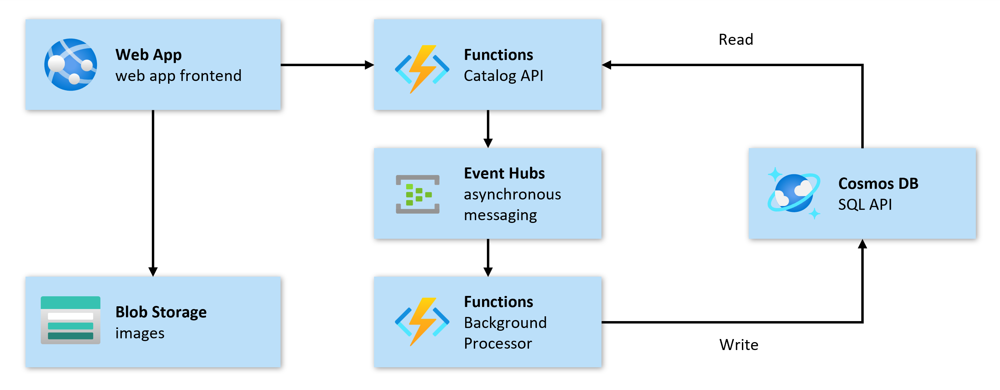

**Continuous Validation (CV)** is one of the concepts of the **Azure Mission-Critical** design methodology that helps to ensure that a mission-critical solution stays operational even when failures and exceptional situations occur. This is done by testing changes and releases in a controlled environment under production-like conditions such as sustained user load and by injecting faults to test the workloads resiliency and measures to handle faults.

Continuous Validation is implemented as a set of processes and tools, embedded into a pipeline or workflow to enable developers and ops teams to do CV on a regular basis for example prior to every release or major code changes and helps to ensure a solution's performance and resiliency before it gets rolled out to production.

In Continuous Validation, you:

- Run tests under production-like conditions
- Define tests based on user and system flows and their expected performance
- Establish baselines for different scenarios and stages
- Evaluate and adjust baselines and thresholds on a regular basis
- Implement automated Continuous Validation pipelines

Microsoft Azure provides the following services to implement load testing and chaos engineering:

- [Azure Load Testing](/azure/load-testing/overview-what-is-azure-load-testing) is a managed service used to generate synthetic traffic to test the application and underlying infrastructure and services.
- [Azure Chaos Studio](/azure/chaos-studio/chaos-studio-overview) is a managed service that provides chaos engineering capabilities to systematically inject failures into key components of the application.

To validate the impact of application changes under realistic conditions at any time of the development cycle, you can run these two services simultaneously by embedding them in an Azure DevOps CI/CD pipeline.

## Example scenario

Contoso Shoes migrated its on-premises deployments to the cloud two years ago. Although they saw improvements in operations, it was challenging to keep their availability and uptime within the service level agreement (SLA). Previous product launches led to outages because the system wasn't able to meet the increase in load and they weren't able to anticipate the issues and their impact earlier in the development cycle. It resulted in significant financial loss. Based on that experience, Contoso Shoes has successfully applied the [principles of mission-critical architecture](/azure/architecture/framework/mission-critical/mission-critical-design-principles) in their main customer-facing application.

## Application

The application works like other common e-commerce websites, including the main website of the Contoso Shoes store. Employees are able to browse a catalog of products, update individual items, and interact with other users through comments.

Contoso Shoes management has decided that it's critical for its customers to:

- Interact with the catalog by displaying a list of items and browsing items
- Proceed through the checkout process to actually purchase items

## Architecture

The following diagram shows the architecture of the application. Ensure you have a good understanding of the individual components and their role within the functionality of the system.

### Components

The application architecture has the following components:

- Front-end web application: The user interface of this workload, which runs on Azure Web Apps.
  - Reads: Catalog API, Azure Blob Storage
  - Writes: Requests coming from end users, Catalog API

- Catalog API: The API layer that the front-end web application uses to perform data operations on both catalog items and comments. It doesn't do any database writes itself; instead, a message is sent to an event hub to be processed asynchronously. Hosted on Azure Functions.
  - Reads: Azure Cosmos DB
  - Writes: Azure Event Hubs

- Background processor: A component without any public endpoint, which is used for asynchronous processing of database updates. Hosted on Azure Functions.
  - Reads: Azure Event Hubs
  - Writes: Azure Cosmos DB

- Messaging bus: The messaging bus uses Azure Event Hubs to pass messages between the Catalog API and the background processor.

- Database: Data is persisted in Azure Cosmos DB. The Catalog API reads from the database directly, and writes are handled by the background processor. In addition, images are stored in Azure Blob Storage.

- Secrets: The application components of this workload use secrets to authorize access. Secrets are stored in Azure Key Vault. The Catalog API and background processor use connection strings to access the database and Azure Event Hubs, while the front-end web application uses an API key to call the Catalog API.

To prevent performance bottlenecks and to increase confidence in new releases, Contoso Shoes has decided to implement [continuous validation](/azure/architecture/guide/testing/mission-critical-deployment-testing).

## Learning objectives

By the end of this module, you'll be able to:

- Understand the importance of user and system flows as the foundation for defining load tests and chaos experiments for your workload.
- Establish a baseline with expected thresholds for the system.
- Define requirements for load testing and chaos experiments.
