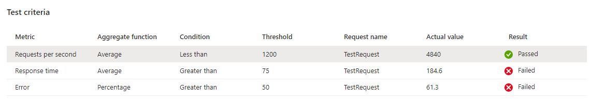

In the previous unit we've learned what user and system flows are, that an application usually consists of several user and system flows and that not all of them have the same requirements in regards to performance and availability.

- For example, in the checkout user flow, the average page load duration of each checkout step should be less than 500 milliseconds, when up to 100 concurrent users are using the checkout at the same time.

## Use Azure Load Testing to evaluate thresholds

During the development phase, the performance of components and resource requirements are often not clearly known or understood. Load Testing can help to identify the expected performance of the individual components as well as of the overall solution. This includes the scale-out behavior, and the thresholds to expect for building your baseline.

The following questions should be asked initially and reevaluated on a regular basis:

- How long does an individual request take?
- How many requests/operations/concurrent users per second can a component serve?
- How much resources are consumed?
- How do 10/50/100 concurrent users affect the underlying infrastructure and backend service?
- When do the involved components scale in and out?

These questions need to be translated into tests and thresholds. A "written down" baseline helps to analyze and evaluate the performance of the overall solution and its components in a consistent way and identify changes and drifts.

With [Azure Load Testing](/azure/load-testing/overview-what-is-azure-load-testing), you can evaluate the expected thresholds. The built-in *test criteria* capability, allows you to specify certain criteria that a load test needs to pass. You can use this capability to implement different baselines.



These test criteria can be specified in JSON and handed over to the load test service when creating a load test via the API. Here's an example of how this looks like:

```json
[
    {
        "passFailMetrics": {
            "<guid>": {
                "clientmetric": "requests_per_sec",
                "aggregate": "avg",
                "condition": "<",
                "value": 1200.0,
                "result": null,
                "actualValue": 0.0,
                "action": "continue"
            },
            "<guid>": {
                "action": "continue",
                "actualValue": 0.0,
                "aggregate": "avg",
                "clientmetric": "response_time_ms",
                "condition": ">",
                "value": 75.0
              },
              "<guid>": {
                "action": "continue",
                "actualValue": 0.0,
                "aggregate": "percentage",
                "clientmetric": "error",
                "condition": ">",
                "value": 0.0
              }
        }
    }
]
```

When you run your tests, there might be different requirements for special situations (such as a faulty component or a load spike) compared to normal operations, where higher error rates or lower requests per second are expected and acceptable. This should result in different baselines with adjusted thresholds for different scenarios.

Typical scenarios are:

- High load situations where scale-out is expected and required which might result in a temporary performance degradation till the scale-out operation was completed
- Chaos experiments as part of a CV pipeline where a higher error rate can be expected till resiliency measures kick in to self-heal the application or fail over to another region

## Set up baselines

To set up baselines for load tests, follow these steps:

1. Define the baselines and test criteria for individual user flows and the overall solution.

1. Adjust the thresholds for regular runs to verify that the application continues to provide the expected performance and doesn't produce any errors.

1. Use a separate baseline for chaos testing that tolerates expected spikes in error rates and temporary reduced performance.

This activity is continuous and needs to be done regularly. For example, after introducing new features, changing service SKUs, and others.
