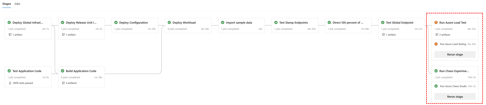
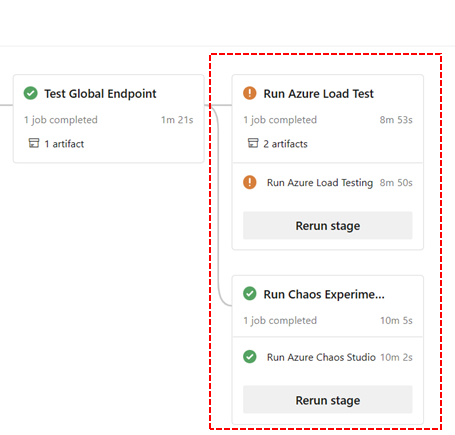

Although you can run load tests manually, with or without Azure Chaos experiments in parallel, is it recommended to implement an automated continuous validation process that can run on a regular basis in a consistent way. To do so, embed load testing and chaos experiments into your CI/CD pipelines and compare the results against pre-defined baselines. This lowers the entry barrier and effort associated with this activity and allows developers and ops personnel to use it as part of every release or major change which will result in a higher quality of your releases.

Injecting failures in isolation into an empty or idle environment isn't meaningful and will not generate any useful insights. To be able to properly observe a system's behavior, you must put it under load at the same time as the failures are getting injected. However, when you run your load test, you might need to consider adjusting your baselines for certain situations. For example, you might accept a higher response time when a certain component fails but you still expect the test to pass.

You can use Azure Pipelines, GitHub Actions or the CI/CD tool of your choice.

 In the pipeline, define the Azure Load Test and Azure Chaos Studio services as Infrastructure-as-Code (IaC) with Azure Resource Manager (ARM) templates, Bicep, Terraform or others. Azure Load Testing [provides first-party tasks](/azure/load-testing/tutorial-identify-performance-regression-with-cicd) for Azure Pipelines and GitHub Actions to interact with the load testing service, and to create and orchestrate tests.

Ensure that the load test run and the chaos experiments overlap to produce meaningful results. The load test should start before fault is injected and continue to run for some time when the Chaos experiment is finished to properly see the impact of the injected faults.

 Failed load test runs should be analyzed to verify if the used baseline is still accurate or if it needs to be adjusted.
