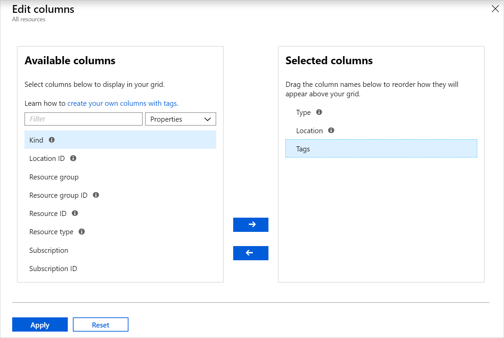
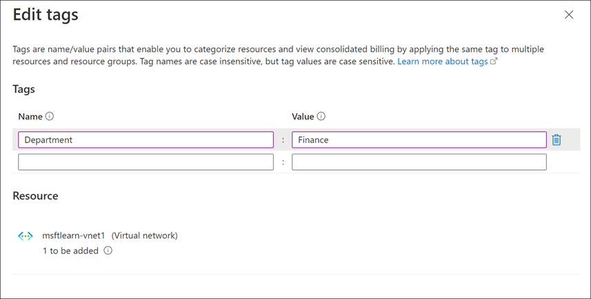
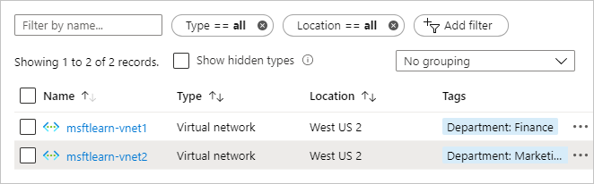
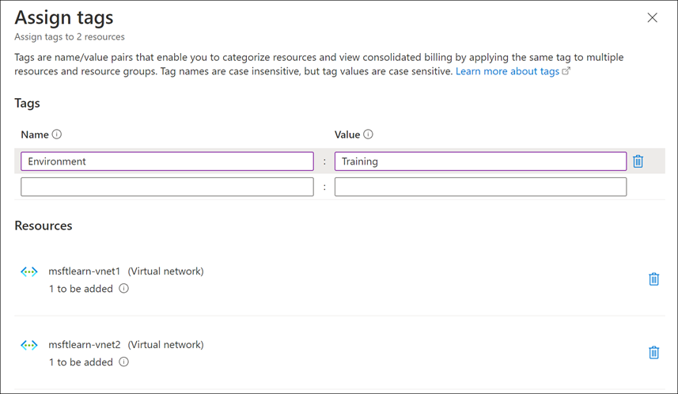
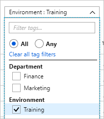

You've gone through your resources and moved them into resource groups that are more organized than before. But what if resources have multiple uses? How do you better search, filter, and organize these resources? Tags can be helpful as you look to improve organization of your Azure resources.

## What are tags?

Tags are name/value pairs of text data that you can apply to resources and resource groups. Tags allow you to associate custom details about your resource, in addition to the standard Azure properties a resource has the following properties:

- department (like finance, marketing, and more)
- environment (prod, test, dev)
- cost center
- life cycle and automation (like shutdown and startup of virtual machines)

A resource can have up to 50 tags. The name is limited to 512 characters for all types of resources except storage accounts, which have a limit of 128 characters. The tag value is limited to 256 characters for all types of resources. Tags aren't inherited from parent resources. Not all resource types support tags, and tags can't be applied to classic resources.

Tags can be added and manipulated through the Azure portal, Azure CLI, Azure PowerShell, Resource Manager templates, and through the REST API. For example, to add a resource tag to a virtual network using the Azure CLI, you could use the following command:

```azurecli
az resource tag --tags Department=Finance \
    --resource-group msftlearn-core-infrastructure-rg \
    --name msftlearn-vnet1 \
    --resource-type "Microsoft.Network/virtualNetworks"
```

You can use Azure Policy to automatically add or enforce tags for resources your organization creates based on policy conditions that you define. For example, you could require that a value for the Department tag is entered when someone in your organization creates a virtual network in a specific resource group.

## Apply tags to resources

Let's apply some tags to the resources you created. Recall that you created a resource group **msftlearn-core-infrastructure-rg** and two virtual networks inside that resource group, **msftlearn-vnet1** and **msftlearn-vnet2**. The names of the virtual networks are relatively generic, so you'd like to associate the virtual networks with services from different departments.

1. Open the [Azure portal](https://portal.azure.com/?azure-portal=true), and navigate to your **msftlearn-core-infrastructure-rg** resource group.

1. On the **Overview** pane of your resource group, you should see your two virtual networks listed. The default view doesn't display the tags column, so you'll add that column to the list view. In the toolbar, select **Edit columns**. On the **Edit columns** pane, select **Add Column** and then select the field to display the dropdown list. Select the Property **Tags** to add it to the columns in the list view. Select **Save** to add your changes.

    

    You should now see the tags column, but it will be empty since you haven't added any tags yet. You'll add the tags directly here.

1. You can also add tags to any resource that supports this feature on the resource's **Tags** pane. In the list of resources, you should see an ellipsis (**...**) in the right column. Select the **...** for the **msftlearn-vnet1** resource, then select **Edit tags** to display the **Edit tags** pane. This pane enables you to create specific tags for the selected resource.

1. Let's add a couple tags to this virtual network. The two fields on this pane remember all of the previously used tags. You can select one or create a new tag. In the **Name** box type `Department`, and in the **Value** box type `Finance`. Click **Save** to save your changes.

    

1. Do the same steps for the **msftlearn-vnet2** virtual network. For this virtual network, add a `Department` tag to the resource with value `Marketing`.

    You should now see your tags applied to each resource.

    

1. To quickly categorize resources, you can add tags to resources in bulk. In your list, select the checkbox on the left for each virtual network, and then, in the toolbar, select **Assign tags**. (If not visible, this option may be contained inside the **...** menu.) By selecting multiple resources, you can add a tag all of the selected items, making it easy to apply the same tag to multiple resources.

    Add the `Environment`:`Training` tag to the selected resources. You should see in the dialog that the tag will be applied to each of the virtual networks.

    

    In the resource list, you'll now see the **Tags** column with multiple values. If your window width is limited, you may see the tag text truncated. Hover over the title of a column and use the vertical line to resize the column, or, if you see an ellipsis in the far right, it indicates additional columns are available but not shown.

1. Take a look at how you can use tags to filter your resources. On the Azure portal menu or from the **Home** page, select **All resources**.

1. Select **Add filter**. In the **Filter** field, select **Environment**, and for the **Value** select **Training** and ensure all other checkboxes are empty, and then select **Apply**. You should see only your two virtual networks displayed, since you tagged those resources with the **Environment** tag set to **Training**.

    

1. You can further filter the resource list by adding a filter for **Department** tag with a value of either **Finance** or **Marketing**.

## Use tags for organization

The above exercise is just one example of where and how you can use tags to organize your resources. With their flexibility, there are several ways you can use tags to your advantage:

You can use tags to group your billing data. For example, if you're running multiple VMs for different organizations, use the tags to group usage by cost center. You can also use tags to categorize costs by runtime environment, such as the billing usage for VMs running in the production environment. When you export billing data or access it through billing APIs, tags are included as part of the data and can be used to further slice your data from a cost perspective.

You can retrieve all the resources in your subscription that have a specific tag name or value. Tags enable you to retrieve related resources from different resource groups, as well. This approach is helpful when you need to organize resources for billing or management.

Tagging resources can also help in monitoring to track down impacted resources. Monitoring systems can use tag data with alerts, giving you the ability to know exactly who is impacted. In our example above, you applied the **Department** tag with a value of **Finance** to the **msftlearn-vnet1** resource. If an alarm was thrown on **msftlearn-vnet1** and the alarm included the tag, you'd know that the finance department may be impacted by the condition that triggered the alarm. This contextual information can be valuable if an issue occurs.

It's also common for tags to be used in automation. If you want to automate the shutdown and startup of virtual machines in development environments during off-hours to save costs, you can use tags to support automation. Add a **shutdown:6PM** and **startup:7AM** tag to the virtual machines, then create an automation job that looks for these tags, and shuts them down or starts them up based on the tag value. There are several solutions in the Azure Automation Runbooks Gallery that use tags in a similar manner to accomplish this result.
