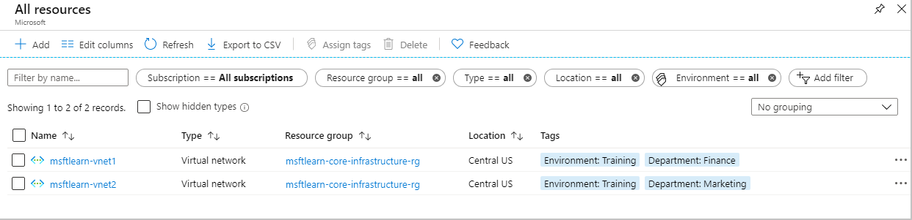

You've gone through your resources and moved them into resource groups that are more organized than before. But what if resources have multiple uses? How do you better search, filter, and organize these resources? Tags can be helpful as you look to improve organization of your Azure resources.

## What are tags?

Tags are name/value pairs of text data that you can apply to resources and resource groups. Tags allow you to associate custom details about your resource, in addition to the standard Azure properties a resource has:

- department (finance, marketing, etc.)
- environment (prod, test, dev),
- cost center
- life cycle and automation (e.g. shutdown and startup of virtual machines).

 A resource can have up to 15 tags. The name is limited to 512 characters for all types of resources except storage accounts, which have a limit of 128 characters. The tag value is limited to 256 characters for all types of resources. Tags are not inherited from parent resources.

Tags can be added and manipulated through the Azure portal, Azure CLI, Azure PowerShell, Resource Manager templates, and through the REST API. For example, to add a resource tag to a virtual network using the Azure CLI, you could use the following command:

```azurecli
az resource tag --tags Department=Finance \
       -g msftlearn-core-infrastructure-rg \
       -name msftlearn-vnet1 \
       --resource-type "Microsoft.Network/virtualNetworks"
```

In addition, you can leverage Azure Policy to add tags to created resources based on conditions such as who is creating the resource, or the type of resource being created. For example, you could add a tag to identify a cost center, or specific environment a resource will be created in.

## Apply tags to resources

Let's apply some tags to the resources you created. Recall that we created a resource group **msftlearn-core-infrastructure-rg** and two VNets inside that resource group, **msftlearn-vnet1** and **msftlearn-vnet2**. The names of the VNets are relatively generic, so we'd like to associate the VNets with services from different departments. 

1. Go ahead and pull up the [Azure portal](https://portal.azure.com/?azure-portal=true). Navigate to your **msftlearn-core-infrastructure-rg** resource group.

1. On the **Overview** tab of your resource group, you should see your two VNets listed. The default view doesn't display the tags column, so let's add that to the display. Select **Edit columns** at the top. In the **Available columns** list, select **Tags** and click **->** to add it to the **Selected columns** list. Click **Apply** to apply your changes.

    

1. You should now see the tags column, but it will be empty since we've not added any tags yet. We'll add the tags directly here. You can also add tags to any resource that supports it on the resource's **Tags** panel. In the list of resources, you should see a pencil in the **TAGS** column where you can directly edit the tags. Click the pencil for the **msftlearn-vnet1** resource.

1. This will display the dialog to edit the Tags. Let's add a couple tags to this VNet. In the **NAME** box type **Department**, and in the **VALUE** box type **Finance**. Click **Save** to save your changes, then click **Close** to close the dialog.

    

1. Let's do the same steps for the **msftlearn-vnet2** VNet. For this VNet, add a **Department:Marketing** tag to the resource.

    You should now see your tags applied to each resource.

    

1. Let's add tags to both of these resources in bulk. Select the checkbox on the left for each of the VNets and click **Assign tags** in the top menu. By selecting multiple resources, we can add a tag to them in bulk, making it easy if we have multiple resources we want to apply the same tag to.

    Add the **Environment:Training** tag to the resources. You should see in the dialog that the tag will be applied to each of the VNets.

    

    Back in the resource list you'll now see a **2** displayed as we now have two tags applied to each resource.

1. Let's take a look at how we can use tags to filter your resources. On the main Azure menu on the left select **All resources**.

1. In the **All tags** drop down, under **Environment** select **Training**. You should see only your two VNets displayed, since we tagged those resources with the **Environment:Training** tag.

    

1. We can further filter these by additionally filtering on the **Department:Finance** or **Department:Marketing** tags.

## Use tags for organization

The above example is just one example of where you can use tags to organize your resources. With their flexibility, there are several ways you can use tags to your advantage.

You can use tags to group your billing data. For example, if you're running multiple VMs for different organizations, use the tags to group usage by cost center. You can also use tags to categorize costs by runtime environment, such as the billing usage for VMs running in the production environment. When exporting billing data or accessing it through billing APIs, tags are included in that data and can be used to further slice your data from a cost perspective.

You can retrieve all the resources in your subscription with a specific tag name or value. Tags enable you to retrieve related resources from different resource groups. This approach is helpful when you need to organize resources for billing or management.

Tagging resources can also help in monitoring to track down impacted resources. Monitoring systems could include tag data with alerts, giving you the ability to know exactly who is impacted. In our example above, we applied the **Department:Finance** tag to the **msftlearn-vnet1** resource. If an alarm was thrown on **msftlearn-vnet1** and the alarm included the tag, we'd know that the finance department may be impacted by the condition that triggered the alarm. This contextual information can be valuable if and when an issue occurs.

It's also common for tags to be used in automation. If you want to automate the shutdown and startup of virtual machines in development environments during off-hours to save costs, you can use tags to assist in this. Add a **shutdown:6PM** and **startup:7AM** tag to the virtual machines, then create an automation job that looks for these tags, and shuts them down or starts them up based on the tag value. There are several solutions in the Azure Automation Runbooks Gallery that use tags in a similar manner to accomplish this.
