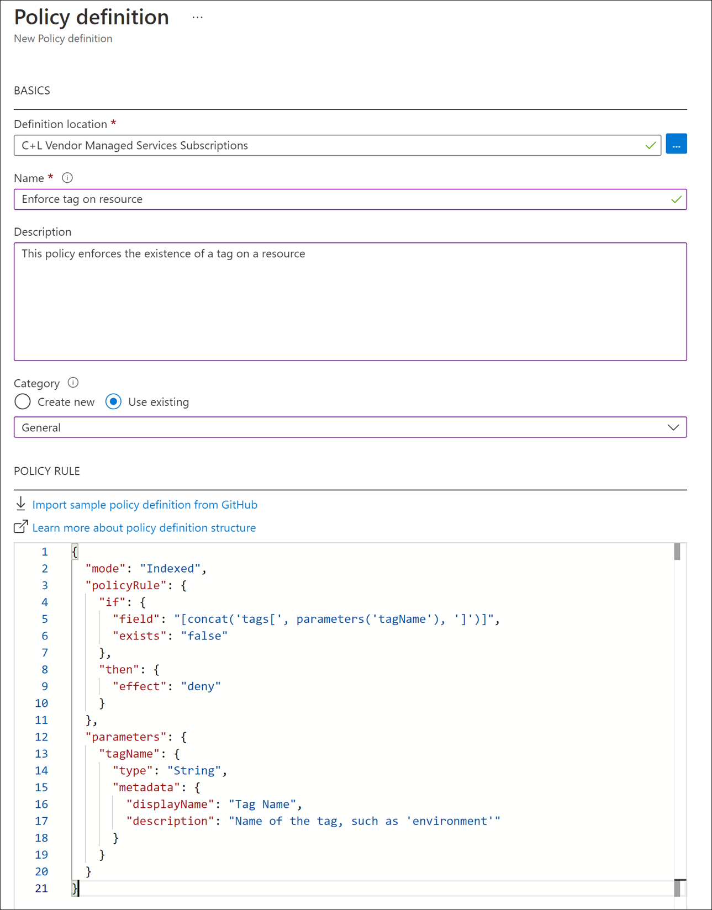
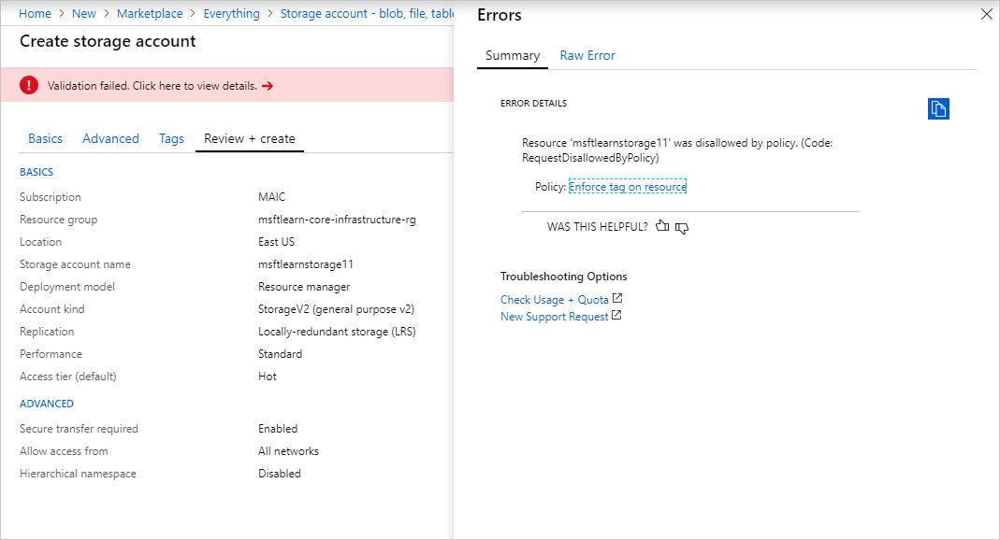
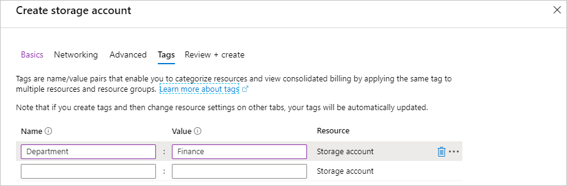

You're organizing your resources better in resource groups, and you've applied tags to your resources to use them in billing reports and in your monitoring solution. Resource grouping and tagging have made a difference in the existing resources, but how do you ensure that new resources follow the rules? Let's take a look at how policies can help you enforce standards in your Azure environment.

## What is Azure Policy?

Azure Policy is a service you can use to create, assign, and manage policies. These policies apply and enforce rules that your resources need to follow. These policies can enforce these rules when resources are created, and can be evaluated against existing resources to give visibility into compliance.

Policies can enforce things such as only allowing specific types of resources to be created, or only allowing resources in specific Azure regions. You can enforce naming conventions across your Azure environment. You can also enforce that specific tags are applied to resources. Let's take a look at how policies work.

## Create a policy

We'd like to ensure that all resources have the **Department** tag associated with them and block creation if it doesn't exist. We'll need to create a new policy definition and then assign it to a scope; in this case the scope will be our **mslearn-core-infrastructure-rg** resource group. Policies can be created and assigned through the Azure portal, Azure PowerShell, or Azure CLI. Let's walk through how to do create a policy in the portal.

### Create the policy definition

1. Go ahead and pull up the [Azure portal](https://portal.azure.com/?azure-portal=true) in a web browser if you haven't already. In the search box in the top navigation bar, search for **Policy** and select the **Policy** service.

1. In **Authoring** section in the left menu, select **Definitions**.

1. You should see a list of built-in policies that you can use. In this case, we're going to create our own custom policy. Click **+ Policy definition** in the top menu.

1. This brings up the **New policy definition** dialog. To set the **Definition location**, click the blue **...**. Select the subscription for the policy to be stored in, which should be the same subscription as our resource group. Click **Select**.

1. Back on the **New policy definition** dialog, for **Name** give your policy a name of **Enforce tag on resource**.

1. For the **Description**, enter **This policy enforces the existence of a tag on a resource.**

1. For **Category** select **Use existing** and then select the **General** category.

1. For the **Policy rule**, delete all text in the box and paste in the following JSON.

    ```json
    {
      "mode": "indexed",
      "policyRule": {
        "if": {
          "field": "[concat('tags[', parameters('tagName'), ']')]",
          "exists": "false"
        },
        "then": {
          "effect": "deny"
        }
      },
      "parameters": {
        "tagName": {
          "type": "String",
          "metadata": {
            "displayName": "Tag Name",
            "description": "Name of the tag, such as 'environment'"
          }
        }
      }
    }
    ```

    Your policy definition should look like below. Click **Save** to save your policy definition.

    

### Create a policy assignment

We've created the policy, but we haven't actually put it into effect yet. To enable the policy, we need to create an assignment. In this case, we'll assign it to the scope of our **msftlearn-core-infrastructure-rg** resource group, so that it applies to anything inside the resource group.

1. In the policy pane, in the **Authoring** section on the left, select **Assignments**.

1. Select **Assign policy** at the top.

1. In the **Assign policy** pane, we'll assign our policy to our resource group. For **Scope**, click the blue **...**. Select your subscription and the **msftlearn-core-infrastructure-rg** resource group, then click **Select**.

1. For **Policy definition**, click the blue **...**. In the **Type** drop-down, select **Custom**, select the **Enforce tag on resource** policy you created, then click **Select**.

1. In the **Parameters** section, for **Tag name** enter **Department**. Click **Assign** to assign the policy.

### Test out the policy

Now that we have assigned the policy to our resource group, any attempts to create a resource without the **Department** tag should fail. Let's try this out.

1. Click **+ Create a resource** in the top left of the portal.

1. Search for **Storage Account** and select **Storage account - blob, file, table, queue** in the results. Click **Create**.

1. Select your subscription, and the **msftlearn-core-infrastructure-rg** resource group.

1. For **Storage account name**, give it any name of your choice, but note that it does have to be a globally unique name.

1. Leave the rest of the options at their default, click **Review + create**.

    Validation of your resource creation will fail because we don't have a **Department** tag applied to the resource.

	

    Let's fix the violation so we can successfully deploy the storage account.

1. Select **Tags** at tht top of the **Create storage account** pane.

1. Add a **Department:Finance** tag to the list.

	

1. Now click **Review + create**. Validation should now pass, and if you click **Create** your storage account will be created.

## Use policies to enforce standards

We've seen how we could use policies to ensure that our resources have the tags that organize our resources. There are other ways policies can be used to our benefit.

We could use policy to restrict which Azure regions we can deploy resources to. For organizations that are heavily regulated or have legal or regulatory restrictions on where data can reside, policies help to ensure that resources aren't provisioned in geographic areas that would go against these requirements.

We could use policy to restrict which types of virtual machine sizes can be deployed. You may want to allow large VM sizes in your production subscriptions, but maybe you'd like to ensure that you keep costs minimized in your dev subscriptions. By denying the large VM sizes through policy in your dev subscriptions, you can ensure they don't get deployed in these environments.

We could also use policy to enforce naming conventions. If our organization has standardized on specific naming conventions, using policy to enforce the conventions helps us to keep a consistent naming standard across our Azure resources.
