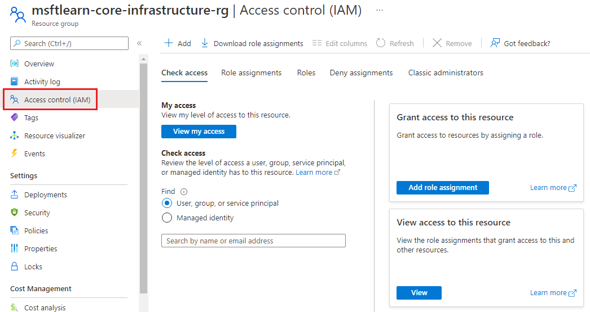

Implementing Azure Policy ensured that all our employees with Azure access are following our internal standards for creating resources, but we have a second issue we need to solve: how do we protect those resources once they are deployed? We have IT personal that need to manage settings, developers that need to have read-only access, and administrators that need to be able to control them completely. Enter Role-Based Access Control (RBAC).

RBAC provides fine-grained access management for Azure resources, enabling you to grant users the specific rights they need to perform their jobs. RBAC is considered a core service and is included with all subscription levels at no cost.

Using RBAC, you can:
- Allow one user to manage VMs in a subscription, and another user to manage virtual networks.
- Allow a database administrator (DBA) group to manage SQL databases in a subscription.
- Allow a user to manage all resources in a resource group, such as VMs, websites, and virtual subnets.
- Allow an application to access all resources in a resource group.

To view access permissions, use the **Access Control** (IAM) blade in the Azure portal. On this blade, you can see who has access to an area and their role. Using this same blade, you can also grant or remove access.

In the above screenshot, **Alain Charon** has been assigned the **Backup Operator** role for this resource group.

### How RBAC defines access

RBAC uses an **allow model** for access. When you are assigned to a role, RBAC _allows_ you to perform specific actions, such as read, write, or delete. Therefore, if one role assignment grants you read permissions to a resource group, and a different role assignment grants you write permissions to the same resource group, you will have write permissions on that resource group.

## Best Practices for RBAC

Here are some best practices you should use when setting up resources.

- Segregate duties within your team and grant only the amount of access to users that they need to perform their jobs. Instead of giving everybody unrestricted permissions in your Azure subscription or resources, allow only specific actions at a particular scope.
- When planning your access control strategy, grant users the lowest privilege level that they need to do their work.
- Use **Resource Locks** to ensure critical resources aren't modified or deleted (more on that next!)