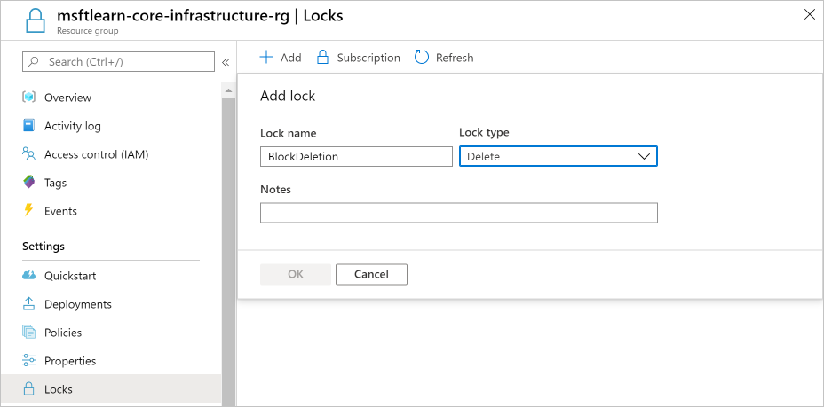
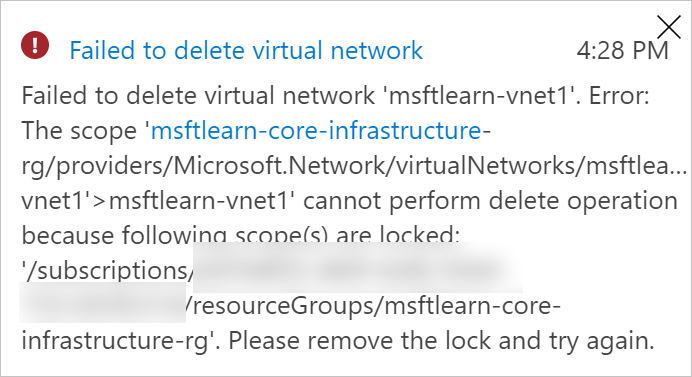

In a recent conversation, your manager mentioned that there had been instances where critical Azure resources were mistakenly deleted. Since there was disorganization across their Azure environment, good intentions of cleaning up unnecessary resources resulted in accidental deletions of resources critical to other systems. You've heard of resource locks on Azure. You mention to your manager that you think you can help prevent this type of incident from happening in the future. You'll take a look at how you could use resource locks to solve this problem.

## What are resource locks?

Resource locks are a setting that can be applied to any resource to block modification or deletion. Resource locks can set to either **Delete** or **Read-only**. **Delete** will allow all operations against the resource but block the ability to delete it. **Read-only** will only allow read activities to be performed against it, blocking any modification or deletion of the resource. Resource locks can be applied to subscriptions, resource groups, and to individual resources, and are inherited when applied at higher levels.

> [!NOTE]
> Applying **Read-only** can lead to unexpected results because some operations that seem like read operations actually require additional actions. For example, placing a **Read-only** lock on a storage account prevents all users from listing the keys. The list keys operation is handled through a POST request because the returned keys are available for write operations.

When a resource lock is applied, you must first remove the lock in order to perform that activity. By putting an additional step in place before allowing the action to be taken on the resource, it helps protect resources from inadvertent actions, and helps protect your admins from doing something they may not have intended to do. Resource locks apply regardless of RBAC permissions. Even if you are an owner of the resource, you must still remove the lock before you'll actually be able to perform the blocked activity.

You'll take a look at how a resource lock works in action.

## Create a resource lock

Recall our **msftlearn-core-infrastructure-rg** resource group. You've now got two virtual networks and a storage account in them. You consider these resources to be critical pieces of our Azure environment and want to ensure that they aren't mistakenly deleted. To prevent the resource group and its contained resources from being deleted, apply a resource lock to the resource group.

1. In a web browser, navigate to the [Azure portal](https://portal.azure.com/?azure-portal=true) if you haven't already. In the search box in the top navigation bar, search for `msftlearn-core-infrastructure-rg`, and select the resource group.

1. In the left menu, in the **Settings** section, select **Locks**. You should see that the resource currently has no locks. You'll add one.

1. Select **+ Add**. Name the lock `BlockDeletion`, and select a **Lock type** of **Delete**. Select **OK**.

    

    You now have a lock applied to the resource group that will prevent deletion of the resource group. This lock is inherited by all resources within the resource group. You'll try to delete one of the virtual networks to see what happens.

1. Go back to **Overview**, and to view the resource, select **msftlearn-vnet1**.

1. In the **Overview** pane for **msftlearn-vnet1**, at the top, select **Delete**, then to confirm, select **Yes**. You should receive an error, stating that there is a lock on the resource preventing its deletion.

    

1. In the left menu, in the **Settings** section, select **Locks**. You should see here that our **msftlearn-vnet1** has a lock that is inherited by from the resource group.

1. Navigate back to the **msftlearn-core-infrastructure-rg** resource group, and bring up the **Locks** pane. You'll remove our lock so you can clean up. Select the **...** on the **BlockDeletion** lock, and then select **Delete**.

## Use resource locks in practice

You've seen how resource locks can protect from accidental deletion. To delete the virtual network, you needed to remove the lock. This concerted action helps ensure that you really intend to delete or modify the resource in question.

Use resource locks to protect those key pieces of Azure that could have a large impact if they were removed or modified. Some examples are ExpressRoute circuits, and virtual networks, critical databases, and domain controllers. Evaluate your resources, and apply locks where you'd like to have an extra layer of protection from accidental actions.
