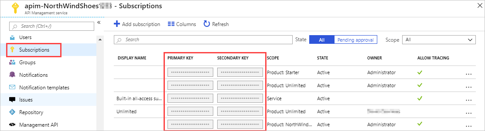

When you publish an API with APIM, you define who can access the API through the gateway.

For your meteorological app, you want to ensure that only customers who have subscribed to your service can access the API and use your forecast data, by issuing subscription keys.

> [!IMPORTANT]
> Subscriptions in this context are completely different to Azure subscriptions used for managing your Azure account.

Here, you'll learn how to use subscription keys to secure your APIs.

## Subscriptions and keys

You can choose to publish your APIs and the information they contain for free but usually, you want to restrict access to users who have paid or organizations with which you have a working relationship. You can control access to your APIs by using a subscription. Subscriptions are used to segment the access levels to an API.

Subscription keys form the authorization to enable access to these subscriptions. Whenever a client makes a request to a protected API, they must include a valid subscription key in the HTTP request or the call will be rejected.

A subscription key is a unique auto-generated key that can be passed through in the headers of the client request or as a query string parameter. The key is directly related to a subscription, which can be scoped to different areas. Subscriptions give you granular control over permissions and policies.

The three main subscription scopes are:

|Scope|Details|
|-----|-------|
| All APIs | Applies to every API accessible from the gateway. |
| Single API | Applies to a single imported API and all of its endpoints. |
| Product | A product is a collection of one or more APIs that you configure in API Management. You can assign APIs to more than one product. Products can have different access rules, usage quotas, and terms of use. So, if you want your partners and suppliers to have different access rights to your **WeatherData** API, assign the API to a product. You use the Azure portal to associate APIs with a product. |
| | |

Applications that call a protected API must include the key in every request.

You can regenerate these subscription keys at any time, for example, if you suspect that a key has been shared with unauthorized users.



Every subscription has two keys - a primary and a secondary. Having two keys makes it easier when you do need to regenerate a key. For example, if you want to change the primary key and avoid downtime, use the secondary key in your apps.

For products where subscriptions are enabled, clients must supply a key when making calls to APIs in that product. Developers can obtain a key by submitting a subscription request. If you approve the request, you must send them the subscription key securely, for example, in an encrypted message. This step is a core part of the API Management workflow.

## Call an API with the subscription key

Applications must include a valid key in all HTTP requests when they make calls to API endpoints that are protected by a subscription. Keys can be passed in the request header, or as a query string in the URL.

The default header name is **Ocp-Apim-Subscription-Key**, and the default query string is **subscription-key**.

To test out your API calls, you can use the developer portal, or command-line tools, such as **curl**. Here's an example of a `GET` request using the developer portal, which shows the subscription key header:

:::image type="content" source="../media/2-key-header-portal.png" alt-text="Call API from developer portal." loc-scope="other"::: <!-- no-loc -->

Here's how you can pass a key in the request header using **curl**:

```bash
curl --header "Ocp-Apim-Subscription-Key: <key string>" https://<apim gateway>.azure-api.net/api/path
```

Here's an example **curl** command that passes a key in the URL as a query string:

```bash
curl https://<apim gateway>.azure-api.net/api/path?subscription-key=<key string>
```

If the key is not passed in the header, or as a query string in the URL, you'll get a **401 Access Denied** response from the API gateway.
