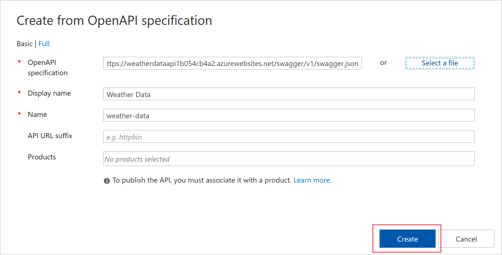
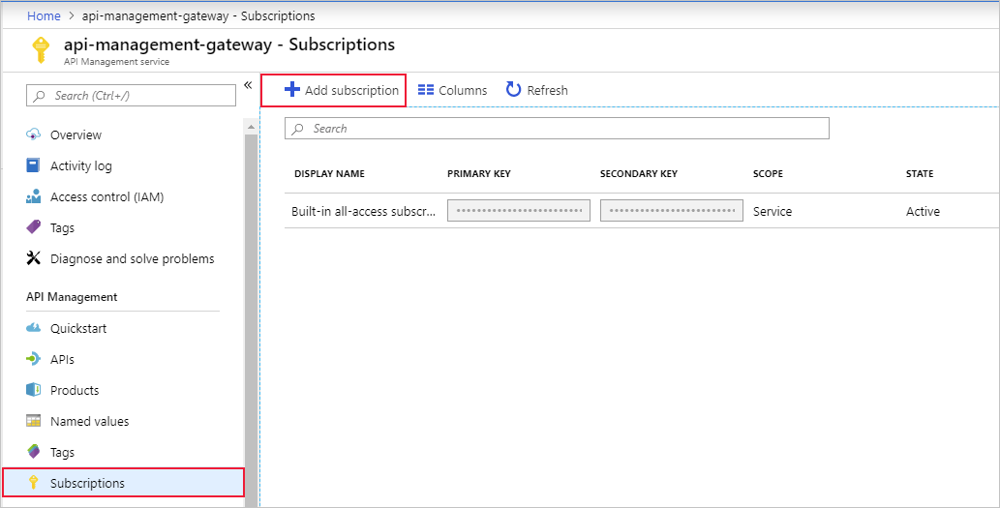
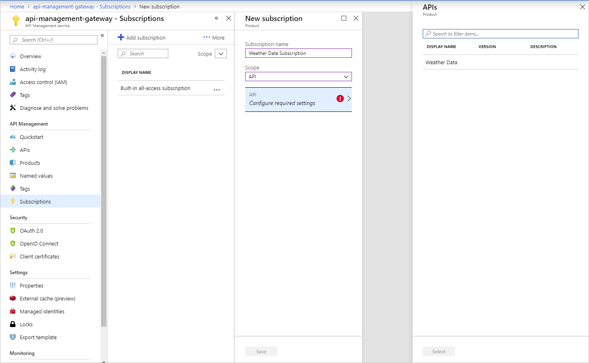

You can use the Azure API Management user interface in the Azure portal to create subscriptions and obtain subscription keys for use in client apps.

Suppose your weather company has decided to make its meteorological data available to clients that subscribe and pay for this service. The critical requirement is to only allow access to clients that are allocated a key. As lead developer, you need to create an API gateway. You'll use the gateway to publish a RESTful Weather API that exposes an OpenAPI endpoint. You will then secure the endpoint and allocate a client key.

In this unit, you will:

- Publish a RESTful Weather API
- Deploy an API Management gateway
- Expose the Weather API through the gateway endpoint
- Restrict access based on a subscription key

## Deploy the Weather Web API

You have developed a .NET Core app that returns weather information. The app includes Swashbuckle to generate OpenAPI documentation.

To save time, let's start by running a script to host our API in Azure. The script performs the following steps:

- Create an Azure App Service plan in the free tier
- Create a Web API within an Azure App Service, configured for Git deployment from a local repo
- Set account-level deployment credentials for our app
- Configure Git locally
- Deploy our Web API to our App Service instance

1. Run the following git clone command in the Cloud Shell to clone the repo that contains the source for our app, as well as our setup script from GitHub.

    ```bash
    git clone https://github.com/MicrosoftDocs/mslearn-control-authentication-with-apim.git
    ```

1. Navigate into the repo folder locally by running the following cd command.

    ```bash
    cd mslearn-control-authentication-with-apim
    ```

1. As its name suggests, `setup.sh` is the script you will run to create our API. It will generate a public web app that exposes an OpenAPI interface.

    ```bash
    bash setup.sh
    ```

    The script takes about a minute to run. When the script finishes, it displays two URLs that you can use to test the app deployment. Observe that during deployment, all dependencies needed for our app to run are automatically installed on the remote App Service.

1. To test that our app deployed correctly, copy and paste the first URL from the Cloud Shell output into your favorite browser. The browser should display the Swagger UI for our app and declare the following RESTful endpoints:

    - **api/weather/{latitude}/{longitude}**, which returns meteorological data for the current day at the specified latitude and longitude (double values).
    - **api/weather/{date}/{latitude}/{longitude}**, which returns meteorological data for the specified day (date value) at the specified latitude and longitude (double values).

    

1. Finally, copy the last URL from the Cloud Shell output. This location is the Swagger JSON URL. You'll need it later in this exercise.

## Deploy an API gateway

The next step in this exercise is to create an API gateway in the Azure portal. In the next exercise, you'll use this gateway to publish your API.

1. Sign into the [Azure portal](https://portal.azure.com/learn.docs.microsoft.com?azure-portal=true) using the same account you activated the sandbox with.

1. On the Azure portal menu, or from the **Home** page, select **Create a resource**.

1. In the search bar, enter **API Management**, and from the **API Management** panel, select **Create**. The **Create API Management** panel appears.

1. On the **Basics** tab, enter the following values for each setting.

    | Setting | Value |
    | --- | --- |
    | **Project details** |
    | **Subscription** | Concierge Subscription |
    | **Resource group** | Select the existing resource group **<rgn>[sandbox resource group name]</rgn>**. |
    | **Instance details** |
    | **Region** | Select from one of the following: North Central US, West US, West Europe, North Europe, Southeast Asia, and Australia East. The Consumption tier used in this exercise is only available in these regions. |
    | **Resource name** | Enter `apim-WeatherData<random number>`; the random number is to ensure that the name is globally unique. Make a note of this API gateway name. You will need it later to make requests. |
    | **Organization name** | Enter `Weather-Company`. |
    | **Administrator email** | Enter your own email address. |
    | **Pricing tier** |
    | **Pricing tier** | From the dropdown, select `Consumption` |
    | | |

1. Select **Review + create**, and then select **Create** after validation passes.

    > [!NOTE]
    > You're using the **Consumption** tier because it is much faster to create while testing. The overall experience is very similar to the other pricing tiers.

## Import the API

After deployment has completed, import the Weather API into the API Management gateway.

1. On the Azure portal menu, or from the **Home** page, select **All resources**, and then select your API gateway.

1. In the nav bar, under **APIs**, select **APIs**.

1. On the **Add a new API** panel, select **OpenAPI**.

1. On the **Create from OpenAPI specification** panel, in the **OpenAPI specification** textbox, paste the Swagger JSON URL that you saved earlier in the exercise. When you tab out of the box, some of the other fields will be populated for you. This data is imported from the OpenAPI specification that Swagger created.

1. Leave the other settings at their defaults, and then select **Create**.

    

## Add a subscription key to access the Weather API

The final step is to add a subscription key for the weather API.

1. In the left nav bar, under **APIs**, select **Subscriptions**, and then from the top menu bar, select **Add subscription**.

    

1. In the **New subscription** panel, enter the following details, and then select **Save**.

    | Setting | Value |
    | --- | --- |
    | **Name** | Enter  `weather-data-subscription` |
    | **Display name** | Enter `Weather Data Subscription` |
    | **Allow tracing** | Select `No` |
    | **Scope** | API |
    | **API** | Select the Weather Data API from the list |

    

1. Select **Save**.

1. Finally, copy the first key from the newly added subscription to your clipboard. You will need this key for the next step.

## Test the subscription key

Now the API is secured with a key, and we can test the API with and without a key.

1. To make a request without passing a subscription key, in the Cloud Shell, copy and paste the following cURL command, and substitute the name of the API gateway that you previously created.

   ```bash
   curl -X GET https://[Name Of Gateway].azure-api.net/api/Weather/53/-1
   ```

   This command should return a 401 Access Denied error, similar to the following.

   ```json
   { "statusCode": 401, "message": "Access denied due to missing subscription key. Make sure to include subscription key when making requests to an API." }
   ```

1. Finally, add the subscription key to the request, and rerun it. Remember to substitute the name of the API gateway.

   ```Azure Cloud Shell
   curl -X GET https://[Name Of Gateway].azure-api.net/api/Weather/53/-1 \
     -H 'Ocp-Apim-Subscription-Key: [Subscription Key]'
   ```

   This command should result in a successful response similar to the following.

   ```json
   {"mainOutlook":{"temperature":32,"humidity":34},"wind":{"speed":11,"direction":239.0},"date":"2019-05-16T00:00:00+00:00","latitude":53.0,"longitude":-1.0}
   ```
