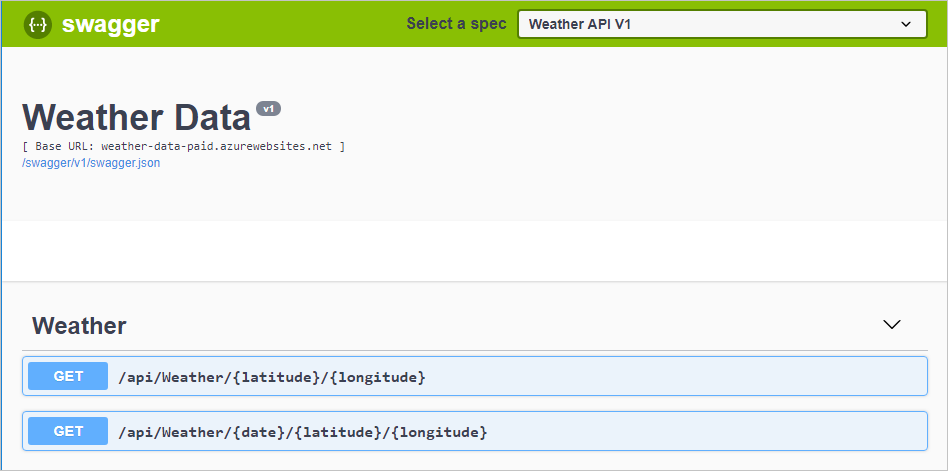

You can use the Azure API Management user interface in the Azure portal to create subscriptions and obtain subscription keys for use in client apps.

Suppose your weather company has decided to make its meteorological data available to clients that subscribe and pay for this service. The critical requirement is to only allow access to clients that are allocated a key. As lead developer, you need to create an API gateway. You'll use the gateway to publish a RESTful Weather API that exposes an OpenAPI endpoint. You'll then secure the endpoint and allocate a client key.

In this unit, you'll:

- Publish a RESTful Weather API
- Deploy an API Management gateway
- Expose the Weather API through the gateway endpoint
- Restrict access based on a subscription key

[!include[](../../../includes/azure-exercise-subscription-prerequisite.md)]

## Deploy the Weather Web API

You've developed a .NET Core app that returns weather information. The app includes Swashbuckle to generate OpenAPI documentation.

To save time, let's start by running a script to host our API in Azure. The script performs the following steps:

- Create an Azure App Service plan in the free tier
- Create a Web API within an Azure App Service, configured for Git deployment from a local repo
- Set account-level deployment credentials for our app
- Configure Git locally
- Deploy our Web API to our App Service instance

1. Sign in to the [Azure portal](https://portal.azure.com/).

1. In the Azure taskbar, select the Cloud Shell icon to open Azure Cloud Shell.

    :::image type="content" source="../media/3-cloud-shell-icon.png" alt-text="Screenshot of Cloud Shell icon in taskbar.":::

1. Run the following git clone command in Azure Cloud Shell to clone the repo that contains the source for our app, and our setup script from GitHub.

    ```bash
    git clone https://github.com/MicrosoftDocs/mslearn-control-authentication-with-apim.git
    ```

1. Go to the repo folder directory locally by running the following cd command.

    ```bash
    cd mslearn-control-authentication-with-apim
    ```

1. As its name suggests, `setup.sh` is the script you'll run to create our API. It will generate a public web app that exposes an OpenAPI interface.

    ```bash
    bash setup.sh
    ```

    The script has seven parts and takes about a minute to run. Observe that, during deployment, all dependencies needed for our app to run are automatically installed on the remote App Service.

    When the script has finished, it outputs two URLS, a Swagger URL, and an Example URL. You can use these URLs to test the app deployment.

1. To test that our app deployed correctly, copy and paste the Swagger URL from Azure Cloud Shell output into your favorite browser. The browser should display the Swagger UI for our app, and declare the following RESTful endpoints:

    - **api/weather/{latitude}/{longitude}**, which returns meteorological data for the current day given the specified latitude and longitude (double values).
    - **api/weather/{date}/{latitude}/{longitude}**, which returns meteorological data for the specified day (date value) at the specified latitude and longitude (double values).

    

1. Finally, copy and save the Example URL from Azure Cloud Shell output. This location is the Swagger JSON URL. You'll need it later in this exercise.

## Deploy an API gateway

The next step in this exercise is to create an API gateway in the Azure portal. In the next exercise, you'll use this gateway to publish your API.

1. Sign into the [Azure portal](https://portal.azure.com/learn.docs.microsoft.com?azure-portal=true).

1. On the Azure resource menu or from the **Home** page, under **Azure services**, select **Create a resource**. The **Create a resource** pane appears.

1. In the resource menu, select **Integration**, and in the results, select **API Management**. The **Install API Management gateway** pane appears.

1. On the **Basics** tab, enter the following values for each setting.

    | Setting | Value |
    | --- | --- |
    | **Project details** |
    | Subscription | Select your subscription.|
    | Resource group | Select a new or existing resource group. A resource group is a logical container that holds related resources for an Azure solution.  |
    | **Instance details** |
    | Region | Select an available region. |
    | Resource name | Enter `apim-WeatherData<random number>`; the random number is to ensure that the name is globally unique. Make a note of this resource name; it will be the API gateway name that you'll need it later in this exercise. |
    | Workspace name | Enter `Weather-Company`. |
    | Administrator email | The email address to receive all system notifications. |
    | **Pricing tier** |
    | Pricing tier | From the dropdown list, select `Consumption`. |
    | | |

1. Select **Review + create**, and after validation passes, select **Create**.

    > [!NOTE]
    > The Consumption tier provides fast deployment for testing and has a pay-for-use pricing model. The overall API management experience is similar to the other pricing tiers.

You can view the progress of the deployment, along with the resources that are being created.

## Import the API

After deployment has completed, import the Weather API into the API Management gateway by using the following procedure.

1. Select **Go to resource**. The Overview pane of the **API Management service** for your resource appears.

1. In the left menu pane, under **APIs**, select **APIs**. The **APIs** pane for your API Management service appears, with template selections for creating/displaying an API.

1. Under **Create from definition**, select **OpenAPI**. The **Create from OpenAPI specification** dialog box appears.

1. In the **OpenAPI specification** field, paste the Swagger JSON URL that you saved earlier in the exercise. When you press <kbd>Enter</kbd> or select a different area of the dialog box, other fields will be populated for you. This data is imported from the OpenAPI specification that Swagger created.

1. Accept the defaults for all the other settings, and then select **Create**.

    :::image type="content" source="../media/3-import-the-api.png" alt-text=" Screenshot of dialog box with swagger.json url highlighted." lightbox="../media/3-import-the-api.png":::

The Design tab of the Weather Data API displays all operations, which consists of two GET operations.

## Add a subscription key to access the Weather API

The final step is to add a subscription key for the Weather Data API.

1. In the left menu pane, under **APIs**, select **Subscriptions**. The **Subscriptions** pane for your API Management service appears.

1. On the top menu bar, select **Add subscription**. The **New subscription** pane appears.

    :::image type="content" source="../media/3-subscriptions.png" alt-text="Screenshot showing how to add a new subscription.":::

1. Enter the following values for each setting.

    | Setting | Value |
    | --- | --- |
    | Name | `weather-data-subscription` |
    | Display name | `Weather Data Subscription` |
    | Allow tracing | No checkmark |
    | Scope | From the dropdown list, select **API**. |
    | API | From the dropdown list, select **Weather Data**. |

1. Select **Create**. The **Subscriptions** pane lists two subscriptions, *Built-in all-access subscription* and your *Weather Data Subscription*.

1. At the end of the *Weather Data Subscription* row, select the ellipsis, and in the context menu select **Show/hide keys**. The Primary and Secondary key values show.

1. Copy the *Primary key* from Weather Data Subscription to your clipboard and save it in something like Notepad. You'll need this key in the next step.

## Test the subscription key

The API is secured with a key. Now, we'll test the API without and with the key to demonstrate secure access.

1. Make a request without passing a subscription key. In Azure Cloud Shell, run the following cURL command. Substitute the *[Name Of Gateway]* placeholder with the resource name for the API gateway (apim-WeatherDataNNNN) that you created in the previous task.

   ```bash
   curl -X GET https://[Name Of Gateway].azure-api.net/api/Weather/53/-1
   ```

   This command has no subscription key and should return a 401 Access Denied error, similar to the following.

   ```json
   { "statusCode": 401, "message": "Access denied due to missing subscription key. Make sure to include subscription key when making requests to an API." }
   ```

1. Now, run the following command. Substitute the *Name Of Gateway* placeholder with the resource name for the API gateway (apim-WeatherDataNNNN). Also, substitute the *Primary Key* placeholder with the primary key you copied from the show/hide step.

   ```Azure Cloud Shell
   curl -X GET https://[Name Of Gateway].azure-api.net/api/Weather/53/-1 \
     -H 'Ocp-Apim-Subscription-Key: [Primary Key]'
   ```

   If you included the closing quote, this command should result in a successful response similar to the following code.

   ```json
   {"mainOutlook":{"temperature":32,"humidity":34},"wind":{"speed":11,"direction":239.0},"date":"2019-05-16T00:00:00+00:00","latitude":53.0,"longitude":-1.0}
   ```
