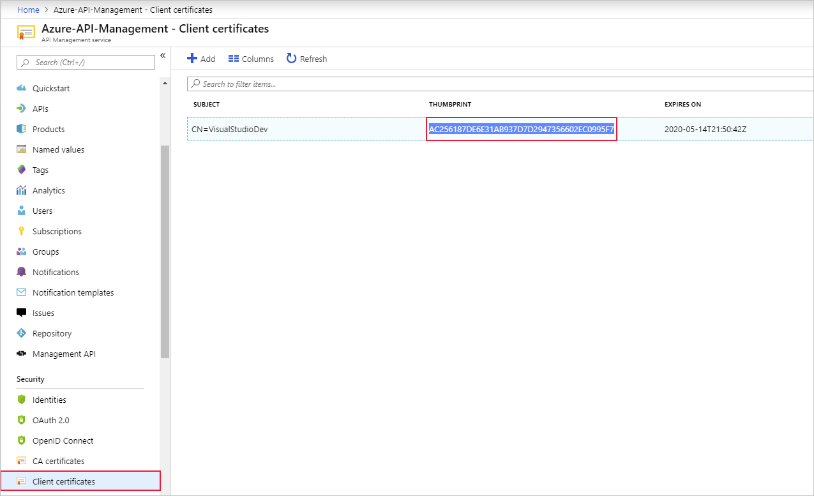

You configure API Management to accept client certificates by using inbound policies.

Suppose your weather company has decided to secure its API through certificate authentication for certain clients. They already use certificate authentication within other systems. This setup will allow clients to use their existing certificates to authenticate themselves against the API Management gateway.

In this unit you will:

- Create a self-signed certificate
- Upload the client certificate to the API Management gateway
- Edit the inbound policy to allow only clients with the specified certificate in their request
- Call the API Management gateway and pass the certificate by using `curl`

## Create Self-Signed Certificate

Firstly, you will use the Cloud Shell to create a self-signed certificate, which you will use for the authentication between the client and the API Management gateway:

```PowerShell
$pwd = '<enter-a-password>'
$ApiGatewayName = '<name-of-your-gateway>'
$pfxFilePath = 'selfsigncert.pfx'
openssl req -x509 -sha256 -nodes -days 365 -newkey rsa:2048 -keyout privateKey.key -out selfsigncert.crt -subj /CN=localhost
openssl pkcs12 -export -out $pfxFilePath -inkey privateKey.key -in selfsigncert.crt -password pass:$pwd
```

## Export the certificate as bytes

Next, we will export the certificate as a `Byte[]` array, to prepare it for the upload into the API Management gateway. Run the following commands in the Cloud Shell:

```PowerShell
$flag = [System.Security.Cryptography.X509Certificates.X509KeyStorageFlags]::Exportable
$collection = New-Object System.Security.Cryptography.X509Certificates.X509Certificate2Collection 
$collection.Import($pfxFilePath, $pwd, $flag)
$pkcs12ContentType = [System.Security.Cryptography.X509Certificates.X509ContentType]::Pkcs12
$clearBytes = $collection.Export($pkcs12ContentType, $pwd)
```

## Add the certificate to the gateway

You will now upload the self-signed certificate into the gateway. Run the following commands in the cloud shell:

```PowerShell
$ApiMgmtContext = New-AzApiManagementContext  -ResourceGroupName "<resource-group>"  -ServiceName $ApiGatewayName
New-AzApiManagementCertificate -Context $ApiMgmtContext -PfxBytes $clearBytes -PfxPassword $pwd
```

## Edit inbound policy to only allow requests with a valid certificate

Now, create the authentication policy within the API Management gateway:

1. Sign into the [Azure portal](https://portal.azure.com/learn.docs.microsoft.com?azure-portal=true) using the same account you activated the sandbox with.
1. In the left menu, click **All Resources**, and then select your API gateway.
1. Under **API management**, click **Client Certificates**.
1. You will see a single certificate. Highlight and copy the thumbprint for the next steps:

    

1. Click **APIs**, select **Weather Data**, and then click the **Inbound processing** policies button.

    

1. Add the following policy expression into the inbound node of the policy file, replacing the ```desired-thumbprint``` with the thumbprint you copied in step 4:

    ```XML
    <inbound>
        <choose>
            <when condition="@(context.Request.Certificate == null || context.Request.Certificate.Thumbprint != "desired-thumbprint")" >
                <return-response>
                    <set-status code="403" reason="Invalid client certificate" />
                </return-response>
            </when>
        </choose>
        <base />
    </inbound>
    ```

1. Click **Save**

## Call the gateway and pass the client certificate

Finally, you can test the new authentication policy. You can test with the certificate and without it. Firstly, you will convert the PFX certificate to PEM format for use with cURL. Run the following command within the Azure Cloud Shell:

```PowerShell
openssl pkcs12 -in selfsigncert.pfx -out selfsigncert.pem –nodes
```

1. In the Azure Cloud Shell, to test the API with the certificate, copy and paste the following cURL command, using the subscription key from the first exercise:

    ```PowerShell
    curl -X GET `
      https://[gateway-name].azure-api.net/api/Weather/53/-1 `
      -H 'Ocp-Apim-Subscription-Key: [subscription-key]' `
      --cert-type pem `
      --cert selfsigncert.pem
    ```

    This command should result in a successful response similar to below:

    ```json
    {"mainOutlook":{"temperature":32,"humidity":34},"wind":{"speed":11,"direction":239.0},"date":"2019-05-16T00:00:00+00:00","latitude":53.0,"longitude":-1.0}
    ```

1. To test the API without the certificate, run the following command within the Cloud Shell

    ```PowerShell
    curl -X GET `
      https://[api-gateway-name].azure-api.net/api/Weather/53/-1
      -H 'Ocp-Apim-Subscription-Key: [Subscription Key]'
    ```

    This command should return a 403 Client certificate error, and no data will be returned.