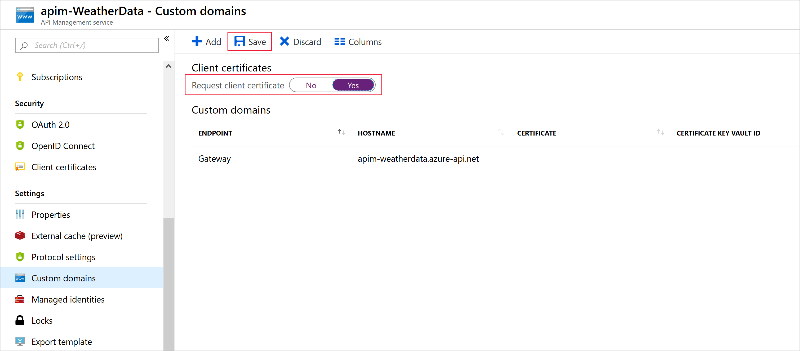
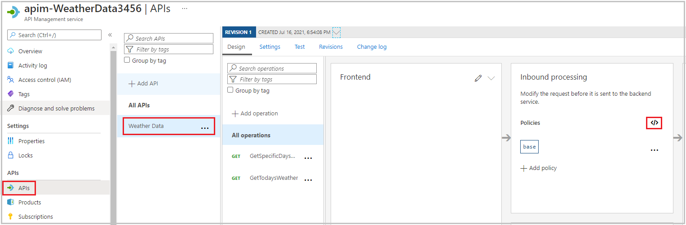

You configure API Management to accept client certificates by using inbound policies.

Suppose your weather company has decided to secure its API through certificate authentication for certain clients who already use certificate authentication in other systems. This setup will allow those clients to use existing certificates to authenticate themselves against the API Management gateway.

In this unit, you'll:

- Create a self-signed certificate
- Configure the gateway to request client certificates
- Get the thumbprint for the certificate
- Edit the inbound policy to allow only clients with the specified certificate in their request
- Call the API Management gateway and pass the certificate by using `curl`

> [!NOTE]
> This exercise uses the resources that you set up in the previous exercise.

## Create self-signed certificate

First, use Cloud Shell to create a self-signed certificate, which you'll then use for authentication between the client and the API Management gateway.

1. To create the private key and the certificate, run the following commands in Cloud Shell.

    ```bash
    pwd='Pa$$w0rd'
    pfxFilePath='selfsigncert.pfx'
    openssl req -x509 -sha256 -nodes -days 365 -newkey rsa:2048 -keyout privateKey.key -out selfsigncert.crt -subj /CN=localhost
    ```

    To make this example easy to follow, the preceding commands include the password used to secure the private key. Whenever you generate a private key for your own use, make sure you generate a secure password and control access to it appropriately.

1. Now, convert the certificate to PEM format, which the `curl` tool can use, by running these commands:

    ```bash
    openssl pkcs12 -export -out $pfxFilePath -inkey privateKey.key -in selfsigncert.crt -password pass:$pwd
    openssl pkcs12 -in selfsigncert.pfx -out selfsigncert.pem -nodes
    ```

    When you're prompted for a password, enter **Pa$$w0rd**, and then press <kbd>Enter</kbd>.

## Configure the gateway to request client certificates

Because you're using the Consumption tier for API Management, you must configure the gateway to accept client certificates. Follow these steps.

1. From the Azure portal that is already open, select your API Management service (apim-WeatherDataNNNN).

1. In the left menu pane, under **Deployment and infrastructure**, select **Custom domains**. The **Custom domains** pane for your API Management service appears.

1. For **Request client certificate*, select **Yes**, and on the top menu bar, select **Save**.

    

## Get the thumbprint for the certificate

In this section, you'll configure API Management to accept a request only if it has a certificate with a certain thumbprint (fingerprint). Let's get that thumbprint from the certificate.

> [!NOTE]
> An SSL certificate thumbprint is also known as an SSL certificate fingerprint.

1. In Cloud Shell, run the following code.

    ```bash
    Fingerprint="$(openssl x509 -in selfsigncert.pem -noout -fingerprint)"
    Fingerprint="${Fingerprint//:}"
    echo ${Fingerprint#*=}
    ```

1. Copy the complete output (a hexadecimal string) and paste this fingerprint value into a text file.

## Edit inbound policy to only allow requests with a valid certificate

Now, create the authentication policy in the API Management gateway.

1. In the Azure portal, select your API Management service. If necessary, in the Azure resource menu, or from the **home** page, select **All resources**, and then select your API Management service.

1. In the left menu pane, under **APIs**, select **APIs**. The **APIs** pane for your API Management service appears.

1. In the secondary menu, select **Weather Data**.

1. In the **Inbound processing** box, select the **</>** icon to open **Policies code editor**. The HTML code for the policies node displays.

    

1. Replace the `<inbound>` node of the policy file with the following XML, substituting the fingerprint you copied earlier for the `desired-fingerprint` placeholder:

    ```XML
    <inbound>
        <choose>
            <when condition="@(context.Request.Certificate == null || context.Request.Certificate.Thumbprint != "desired-fingerprint")" >
                <return-response>
                    <set-status code="403" reason="Invalid client certificate" />
                </return-response>
            </when>
        </choose>
        <base />
    </inbound>
    ```

1. Select **Save**.

## Call the gateway and pass the client certificate

You can now test the new authentication policy with and without the certificate.

1. To test the API without the certificate, run the following command in Cloud Shell, replacing the placeholder values with your API gateway name and subscription key.

    ```PowerShell
    curl -X GET https://[api-gateway-name].azure-api.net/api/Weather/53/-1 \
      -H 'Ocp-Apim-Subscription-Key: [Subscription Key]' 
    ```

    This command should return a 403 Client certificate error, and no data will be returned.

1. In Cloud Shell, to test the API with the certificate, copy and paste the following cURL command, using the primary subscription key from the first exercise (you can also obtain this primary key from the Subscriptions pane for your WeatherData API Management service). Remember to include your API gateway name.

    ```PowerShell
    curl -X GET https://[api-gateway-name].azure-api.net/api/Weather/53/-1 \
      -H 'Ocp-Apim-Subscription-Key: [subscription-key]' \
      --cert-type pem \
      --cert selfsigncert.pem
    ```

    This command should result in a successful response displaying weather data similar to the following.

    ```json
    {"mainOutlook":{"temperature":32,"humidity":34},"wind":{"speed":11,"direction":239.0},"date":"2019-05-16T00:00:00+00:00","latitude":53.0,"longitude":-1.0}
    ```
