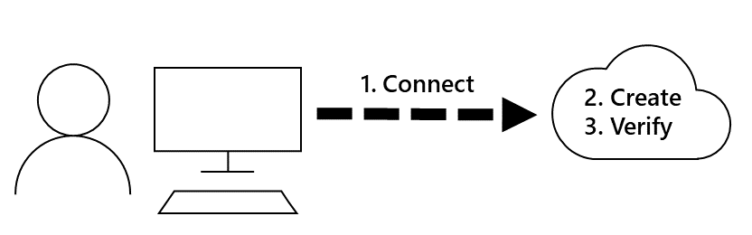

## Motivation
The Azure CLI lets you write commands and execute them immediately. Recall that the overall goal in the software development example is to deploy new builds of a web app for testing. The first step is to create a resource group. Remember that the goal here is to create these resources using a local installation of the Azure CLI. 

This unit shows you how to use the Azure CLI to log in to your Azure subscription and create a new resource.

## What Azure resources can be managed using the Azure CLI?
The Azure CLI lets you control nearly every aspect of every Azure resource. You can work with resource groups, storage, virtual machines, Azure Active Directory, containers, machine learning, and so on.

Commands in the CLI are structured in groups and subgroups. Each group represents a service provided by Azure, and the subgroups divide commands for these services into logical groupings. For example, the **storage** group contains subgroups including **account**, **blob**, **storage**, and **queue**.

So, how do you find the particular commands you need? One way is to use **az find**. For example, if you want to find commands that might help you manage a storage **blob**, you'd use the following find command:

```bash
az find -q blob
```

If you already know the name of the command you want, the **--help** argument for that command may be more useful. You get detailed information on the command, and for a command group, a list of the available subcommands. So, with our storage example, here's how you can get a list of the subgroups and commands for managing blob storage

```bash
az storage blob --help
```

## How to create an Azure resource
When creating a new Azure resource, there are typically three steps: connect to your Azure subscription, create the resource, and verify that creation was successful (see below).



Each step corresponds to a different Azure CLI command.

### Connect
Since you're working with a local install of the Azure CLI, you'll need to authenticate before you can execute Azure commands, by using the Azure CLI **login** command. 

```bash
az login
```

The Azure CLI will then attempt to use your default browser and to open an Azure sign in page. If this doesn't work, you'll need to follow the command line instructions and enter an authorization code at [https://aka.ms/devicelogin](https://aka.ms/devicelogin).

After you've signed in with your Azure account credentials, you'll be connected to your Azure subscription. 

### Create
As you'll often need to create a new resource group, before you create the actual resource you (such as a Web App, database, or VM), we'll use this as an example.

The Azure CLI **group create** command creates a resource group. You must specify a name and location. The name must be unique within your subscription. The location determines where the metadata for your resource group will be stored (which may be important to you for compliance reasons). You use can use strings like "West US", "North Europe", or "West India" to specify the location; alternatively, you can use single word equivalents, such as westus, northeurope, or westindia. The core syntax is:

```bash
az group create --name <name> --location <location>
```

### Verify
For many Azure resources, Azure CLI provides a **list** subcommand to view resource details. For example, the Azure CLI **group list** command lists your Azure resource groups. This is useful here to verify whether creation of the resource group was successful:

```bash
az group list
```

To get a more concise view, you can format the output as a simple table:

```bash
az group list --output table
```

## Summary
For simple tasks, Azure CLI commands can be run one at a time, such when connecting to Azure to create a resource group. In the next unit, you'll go through the steps for deploying a Web App into a new resource group. After you've tested the Azure CLI commands used to deploy the app, you can easily combine these into a script for ease of execution.