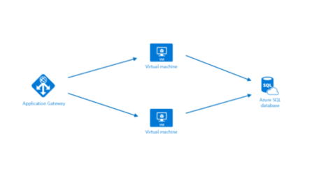

Let's imagine that you've been asked to build a system on Azure. You're very early in the project and your leadership has asked for an estimate of what it might cost to run over the next 12 months. You already know that Azure pricing is fully transparent, and that you're billed monthly for only the services that you use. How would you go about getting that estimate without deploying services and letting them run for some time, or without manually pricing out each service from the Azure service pricing pages? What if there were a tool you could use to not only get an estimate, but easily export and share with your team?

## Introducing the Azure Pricing Calculator

To make estimates easy for customers to create, Microsoft has developed the Azure Pricing Calculator. The Azure Pricing Calculator is a free web-based tool that takes as input the services you choose, allows you to modify properties and options of the service, and will output the costs per service and total cost for the full estimate.

In another browser window or tab, go to the [Azure Pricing Calculator](https://azure.microsoft.com/en-us/pricing/calculator/) so we can walk through what it does and how it works. On the pricing calculator page you'll see 3 tabs:

- **Products:** This is where you'll do most of your activity. This tab has all the Azure services listed and is where you'll add/remove services to formulate your estimate.
- **Estimates:** This tab has all of your previously saved estimates here. We'll go through this in a bit.
- **FAQ:** Just as it says, this tab has answers to some frequently asked questions.

The Products tab is where we'll do most of our work, so make sure you're on that tab. You'll see the full listing of service categories down the left hand side, and clicking on any of the categories will display the services in that category. There's also a search box where you can search through all services for the service you're looking for. Clicking on the service will add that service to your estimate. You can just add one service, or you can add as many as you need, including multiples of the same service (multiple virtual machines for example). Once you've added the services you want to price, scrolling down on the page will show you customizable details for that service that apply to pricing. For instance, on virtual machines, you can select details such as the region, OS, and instance size, all of which will impact the pricing for the VM. You'll see a sub-total for the service, and scrolling further down you'll see a full total for all services included in the estimate. Along with the full total, you'll see buttons where you can export, save and share the estimate.

## Estimate a solution

From our original example, let's imagine this system that will run on two Azure VMs and will connect to an Azure SQL DB. We'd also like to have a layer 7 firewall in place to ensure we have enhanced load balancing capabilities. We can use the Azure Pricing Calculator to figure out what this will cost, and export our estimate to share with the team.

Make sure you have a clean calculator with nothing listed in the estimate. If you have anything presently in your estimate, click the trash can icon for delete all at the estimate level to remove all services from your estimate. Now, let's add the following services to the estimate by clicking on them:

- Virtual Machines
- Azure SQL Database
- Application Gateway

We can configure the details of each so we can get a solid estimate of our costs. We'll use the West US region for all resources.

**Virtual Machines**
This is an ASP.NET application, so we'll need to use a Windows OS VM. This application doesn't require a massive amount of computing power, so select the D2v3 instance size. We'll need two virtual machines and they will run all the time (730 hours/month). We're going to use premium SSD storage for these VMs, and will require just one disk per VM of size P10, for a total of two disks. 

**Azure SQL Database**
For the database we're going to provision a single database under the vCore model. This will be a General Purpose, Gen 4 database with 4 vCores. We'll need 32 GB of storage, and will be retaining an average of 16 GB of storage. Our retention policy will be 8 weeks, 12 months and 5 years.

**Application Gateway**
For Application Gateway we're going to use the Web Application Firewall tier so we have some protection for our environment, and we're going to go with just two instances, as our load isn't going to be user high. We expect to process 1 TB of data.

Looking through your estimate, you should see a summary cost for each service you've added, and a full total for the entire estimate. In this case, your estimate should be in the neighborhood of $1,350.00 per month.

## Share and save your estimate

We now have an estimate for our solution. We can now save this estimate so we can come back to it at a later time (and make adjustments if necessary), export it to Excel for further analysis, and share the estimate via a URL. 

To export the estimate, click Export at the bottom of the estimate. This will download your estimate in Excel xlsx format, and will include all the services you'd added to your estimate.

We can either share the Excel spreadsheet or we can click on the Share button in the calculator. This gives you back a URL that you can use to share this estimate. Anyone with this link will be able to access it, making it easy to share with your team.

If you are logged in with your Azure account, you can save the estimate so you can come back to it later. Go ahead and click the Save button. If you are logged in you should see a notification that your estimate was saved. If you aren't logged in you'll see a message to log in to save your estimate. Once you've saved the estimate, scroll back up to the top of the page and select the Estimates tab you'll see your estimate there. You can then select it to pull it back up, or delete it if you no longer need it.

## Summary

What we've been able to do here is arrive at a cost estimate for a set of Azure services without spending anything more than a few minutes time. We didn't have to create anything, and we've got a fully sharable estimate that we can do further analysis or modifications on in the future. You can not only use this to create estimates for systems where you know the specific services you plan to use, but can also use this to compare how different services might impact your overall costs (SQL Server on a VM vs. Azure SQL Database). Now let's take a look at how we can get insight into costs for services we've already deployed.