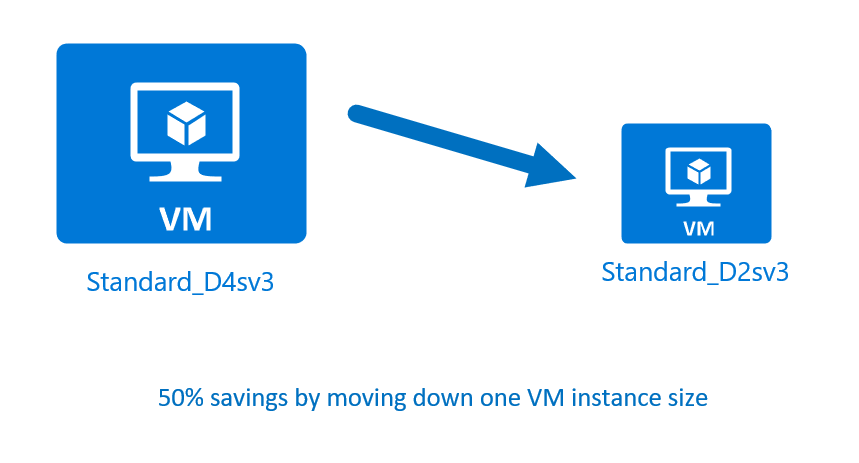
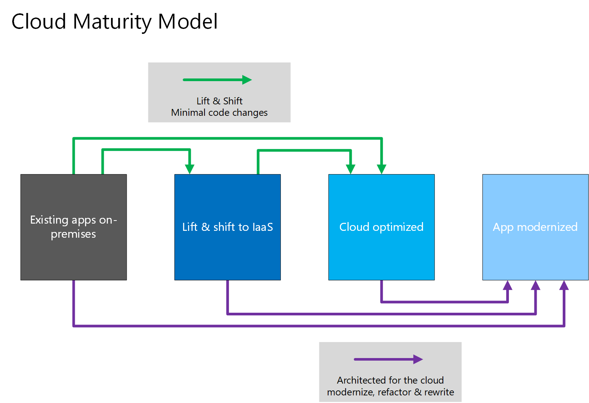

We have looked through how to get estimates for environments you'd like to build, and walked through some tools to get details on where we're spending money and project future expenses. Our next challenge is to look at how to reduce those infrastructure costs.

## Use Reserved Instances

If you have VM workloads that are static and predictable in nature - particularly ones that run 24x7x365, using reserved instances is a fantastic way to potentially save up to 70% depending on the VM size.

Reserved instances are purchased in one or three-year terms, with payment required for the full term up front. Once purchased, Microsoft matches up the reservation to running instances, and decrements the hours from your reservation. Reservations can be purchased through the Azure Portal and since reserved instances are a compute discount, they are available for both Windows and Linux VMs.

## Right-size underutilized virtual machines

Recall from our previous discussion, Cost Management, and Advisor may recommend right-sizing or shutting down VMs. Right-sizing a virtual machine is the process of resizing it to a proper size. Let's imagine you have a server running as a domain controller that is sized as a **Standard_D4sv3**, but your VM is sitting at 90% idle the vast majority of the time. By resizing this VM to a Standard_D2s_v3,** you'd reduce your compute cost by 50% (costs are linear and double for each size larger in the same series). In this case, you might even benefit from changing the instance series to go to a less expensive VM series.

Oversized virtual machines are a common unnecessary expense on Azure, and one that is easily fixed. You can change the size of a VM through the Azure portal, PowerShell, or the Azure CLI.

> [!NOTE]
> Resizing a VM requires that it be stopped, resized, and then restarted. This may take a few minutes depending on how significant the size change is. Plan for an outage, or shift your traffic to another instance while you perform this task.

## Deallocate virtual machines in off hours

If you have virtual machine workloads that are only used during certain periods of time, but are running them every hour of every day, you're wasting money. These VMs are great candidates to shut down when not in use, and start back up on a schedule, saving you compute costs while the VM is deallocated.

This approach is a great strategy for development environments. It's often the case that development may happen only during business hours, giving you the flexibility to deallocate these systems in the off hours, stopping your compute costs from accruing. Azure now has an [automation solution](https://docs.microsoft.com/en-us/azure/automation/automation-solution-vm-management) fully available for you to leverage in your environment.

You can also use the Auto-shutdown feature on a virtual machine to schedule automated shutdowns.

## Delete unused virtual machines

 piece of advice may sound obvious but if you aren't using a service, you should shut it down. It's not uncommon to find non-production or proof of concept systems left around following a project that is no longer needed. Regularly review your environment and work to identify these systems. Shutting down these systems can have a multifaceted benefit by not only saving you on infrastructure costs, but also potential savings on licensing and operations.

## Migrate to PaaS or SaaS services

Lastly, as you move workloads to the cloud, a natural evolution is to start with Infrastructure-as-a-service (IaaS) services and then move them to Platform-as-a-service (PaaS) as appropriate, in an iterative process. 

PaaS services typically provide a substantial savings in both resource and operational costs. The challenge is that, depending on the type of service, varying levels of effort will be required to move to these services from both a time and resource perspective. You may be able to easily move a SQL Server database to Azure SQL DB, but it may take substantially more effort to move your multi-tier application to a container or serverless based architecture. It's a good practice to continuously evaluate the architecture of your applications to determine if there are efficiencies to be gained through PaaS services. 

Azure makes it easy to test these services out with little risk, giving you the ability to try out new architecture patterns relatively easily. That said, it's typically a longer journey and may not be of immediate help if you're looking for quick wins from a cost savings perspective. The Azure Architecture Center is a great place to get ideas for transforming your application, as well as best practices across a wide array of architectures and Azure services.

