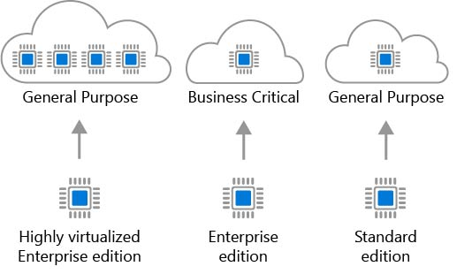

Licensing can dramatically impact your cloud spending as well. There are some best practices that you can leverage to reduce your spending. Let's take a look at them.

## Azure Hybrid Benefit for Windows Server

Many customers have made an investment in Windows Server licenses and would like to leverage this investment on Azure. The Azure Hybrid Benefit gives customers usage rights for Virtual Machines on Azure. When applied to virtual machines in Azure, you will not be charged for the Windows Server license and will instead be billed at the Linux rate. To be eligible for this benefit, current Windows licenses must be covered by Software Assurance. Each 2-processor license or each set of 16-core licenses are entitled to two instances of up to 8 cores, or one instance of up to 16 cores. The Azure Hybrid Benefit for Standard Edition licenses can only be used once either on-premises or in Azure. Datacenter Edition benefits allow for simultaneous usage both on-premises and in Azure. Most customers are typically licensed by core, so you'll use that model for your calculation. 

If you have questions about what licenses you have, you can reach out to your license reseller or your Microsoft account team to get more information. Applying this benefit is easy and can be done at deployment time for new VMs and can be enabled or disabled at any time on existing VMs. This benefit (especially when combined with reserved instances) can provide substantial license savings.

## Azure Hybrid Benefit for SQL Server

Azure Hybrid Benefit for SQL Server helps you maximize the value from your current licensing investments and accelerate your migration to the cloud. Azure Hybrid Benefit for SQL Server is an Azure-based benefit that enables you to use your SQL Server licenses with active Software Assurance to pay a reduced rate.

You may apply this benefit even if the Azure resource is active, but the reduced rate will be applied from the time you select it in the portal. No credit will be issued retroactively.

**SQL Database vCore-based options**

For Azure SQL Database, the Azure Hybrid Benefit works as follows:

- If you have Standard edition per core licenses with active Software Assurance, you can get 1 vCore in the General Purpose service tier for every 1 license core you own on-premises
- If you have Enterprise edition per core licenses with active Software Assurance, you can get 1 vCore in the Business Critical service tier for every 1 license core you own on-premises. Note: The Azure Hybrid Benefit for SQL Server for the Business Critical service tier is only available to customers who have Enterprise edition licenses.
- If you have highly-virtualized Enterprise edition per core licenses with active Software Assurance, you can get 4 vCores in the General Purpose service tier for every 1 license core you own on-premises. This is a unique virtualization benefit available only on Azure SQL Database.

For SQL Server in Azure Virtual Machines, the Azure Hybrid Benefit works as follows:

- If you have Enterprise edition per core licenses with active Software Assurance, you can get 1 core of SQL Server Enterprise edition in Azure Virtual Machines for every 1 license core you own on-premises
- If you have Standard edition per core licenses with active Software Assurance, you can get 1 core of SQL Server Standard edition in Azure Virtual Machines for every 1 license core you own on-premises

For SQL Server workloads this can make a dramatic impact on your Azure spending.

## Use Dev/Test subscription offers

The Enterprise Dev/Test and Pay-As-You-Go Dev/Test offers are a benefit you can take advantage of to save costs on your non-production environments. This benefit gives you several discounts, most notably for Windows workloads, eliminating license charges and only billing you at the Linux rate for virtual machines. This also applies to SQL Server, and any other Microsoft software that is covered under Visual Studio subscription (formerly known as MSDN). There are a few requirements for this benefit, one being that it's only for non-production workloads, and another being that any users of these environments (excluding testers) must be covered under Visual Studio subscription. In short, for non-production workloads, this allows you save money on your Windows, SQL Server and other Microsoft Virtual Machine workloads.
Below are the full details of each offer. If you are a customer on an Enterprise Agreement, you'd leverage the Enterprise Dev/Test offer, and if you a customer without an Enterprise Agreement and are instead using PAYG accounts, you'd leverage the Pay-As-You-Go Dev/Test offer.
https://azure.microsoft.com/en-us/offers/ms-azr-0148p/
https://azure.microsoft.com/en-us/offers/ms-azr-0023p/

## Bring your own SQL Server license

If you are a customer on an Enterprise Agreement and already have an investment in SQL Server licenses and they have freed up as part of moving resources to Azure, you can provision BYOL images off the Azure Marketplace, giving you the ability to take advantage of these unused licenses and reduce your Azure VM cost. You've always been able to do this by provisioning a Windows VM and manually installing SQL Server, but this simplifies the creation process by leveraging Microsoft certified images. Take a look at the following blog post from the initial announcement, and you'll find these marketplace images available for you today to take advantage of.

https://azure.microsoft.com/en-us/blog/easily-bring-your-sql-server-licenses-to-azure-vms/

## Use SQL Server Developer Edition

As of April 1, 2016, Microsoft has made SQL Server Developer Edition a free product for non-production use. This is yet another way you can save on Azure costs for your non-production environments. On the Azure Marketplace you can find SQL Server 2016 and SQL Server 2017 images for Developer Edition, which will eliminate the additional cost for SQL Server. Developer Edition has all the same features that Enterprise Edition has, but for non-production workloads you can save dramatically on your licensing costs. For full licensing information, take a look at the following links. Bottom line, for non-production workloads that use SQL Server you should look closely at taking advantage of this offer.

https://docs.microsoft.com/en-us/azure/virtual-machines/windows/sql/virtual-machines-windows-sql-server-pricing-guidance

## Use constrained instance sizes for database workloads

Many customers have requirements for high memory, storage or I/O bandwidth, but low CPU core counts. Based on this popular request Microsoft has made available the most popular VM sizes (DS, ES, GS, and MS) available in new sizes which constrain the vCPU count to one half or one quarter of the original VM size, while maintaining the same memory, storage and I/O bandwidth. Since database products like SQL Server and Oracle are licensed per-CPU, this allows customers to reduce licensing cost but still maintain the high performance their database requires. 

https://azure.microsoft.com/en-us/blog/announcing-new-azure-vm-sizes-for-more-cost-effective-database-workloads/
