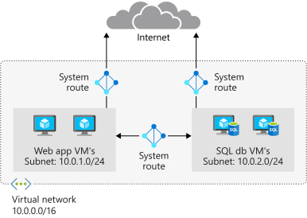
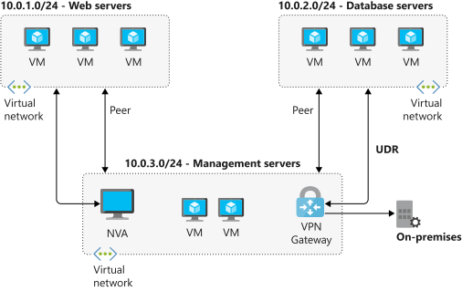
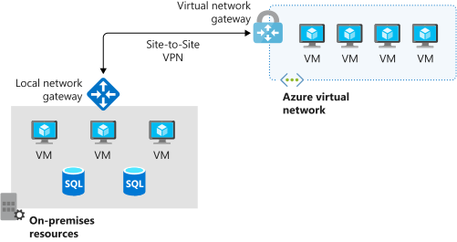

As part of the project to control the flow of traffic within your virtual network, you need to understand the purpose and benefits of custom routes, and how to configure them to direct the flow of traffic through a network virtual appliance (NVA).

## Azure routing

Network traffic in Azure is automatically routed across Azure subnets, virtual networks, and on-premises networks. This routing is controlled by system routes, which are assigned by default to each subnet in a virtual network. These system routes enable any Azure virtual machine that is deployed to a virtual network to communicate with all other Azure virtual machines in the same or different subnets in that virtual network. These virtual machines are also potentially accessible from on-premises through a hybrid network or the Internet.

You can't create or delete system routes, but you can override the system routes by adding custom routes to control the flow of traffic to the next hop.

Every subnet has these default system routes:

|Address prefixes  |Next hop type |
|---------|---------|
|Unique to the virtual network | Virtual network |
|0.0.0.0/0 | Internet |
|10.0.0.0/8 | None |
|172.16.0.0/12 | None |
|192.168.0.0/16 | None |
|100.64.0.0/10 | None |

The **next hop type** shows the network path taken by traffic sent to each address prefix. The hop type can be one of:

- **Virtual Network** - A route is created in the address prefix, which represents each address range created at the virtual network level. If there are multiple addresses ranges specified, then multiple routes are created for each address range.
- **Internet** - The default system route of 0.0.0.0/0 routes any address range to the Internet unless you override Azure's default route with a custom route.
- **None** - Any traffic routed to the hop type of **None** is dropped, and doesn't get routed outside the subnet. By default, the following IP v4 private address prefixes are created: 10.0.0.0/8, 172.16.0.0/12, 192.168.0.0/16. The shared address space prefix, 100.64.0.0/10 is also added with a next hop of None. All these address ranges are considered to be not globally routable.

The diagram below gives an overview of system routes and how traffic flows between subnets and the internet by default. You can see from the diagram that traffic flows freely between the two subnets and the Internet.

Within Azure, there are additional system routes. Azure will create these routes if you enable the following capabilities:

- Virtual network peering
- Service chaining
- Virtual Network Gateway
- VirtualNetworkServiceEndpoint

### Virtual network peering and service chaining

Both of these capabilities allow virtual networks within Azure to be connected together to allow virtual machines to communicate with each other, either within the same region or across regions. This in turn creates additional routes within the default route table. Service chaining enables you to override these routes by creating user-defined routes between peered networks.

The diagram below shows two virtual networks with peering configured, but with user-defined routes configured to route traffic through an NVA or a VPN Gateway.

### Virtual Network Gateway
  
Use a virtual network gateway to send encrypted traffic between Azure and on-premises over the internet, and to send encrypted traffic between Azure networks. A virtual network gateway contains routing tables and gateway services.

### VirtualNetworkServiceEndpoint

Virtual network endpoints extend your private address space in Azure by providing a direct connection to your Azure resources. This process will restrict the flow of traffic and allow your Azure virtual machines to access the Storage account directly from the private address space and deny access from a public virtual machine. As you enable service endpoints, Azure will create routes in the route table to direct this traffic.

## Custom routes

System routes may make it easy for you to quickly get your environment up and running, but there will be many scenarios in which you'll want to control the flow of traffic within your network more closely. For example, you might want to route traffic through a network virtual appliance or third-party firewall. This is possible with custom routes.

You have two options for implementing custom routes. You can create a user-defined route, or use Border Gateway Protocol (BGP) to exchange routes between Azure and on-premises networks.

### User-defined routes

You use a user-defined route to override the default system routes so that traffic can be routed through firewalls or network virtual appliances. For example, you might have a network with two subnets, and you want to add a virtual machine in the perimeter network to be used as a firewall. You create a user-defined route so that traffic passes through the firewall and doesn't go directly between the subnets.

When creating user-defined routes, you can specify these next hop types:

- **Virtual appliance** - A virtual appliance is typically a firewall device, used to analyze or filter traffic entering or leaving your network. You can specify the private IP address of a NIC attached to a virtual machine so that IP forwarding can be enabled, or you can provide the private IP address of an internal load balancer.
- **Virtual network gateway** - With this next hop type, you can indicate when you want routes for a specific address routed to a virtual network gateway. The virtual network gateway is specified as a VPN for next hop type.
- **Virtual Network** - Use this next hop type to override the default system route within a virtual network.
- **Internet** - Use this next hop type to route traffic to a certain address prefix to be routed out to the internet
- **None** - Use this next hop type when you want to drop traffic to a specified address prefix.

With user-defined routes, you aren't able to specify virtual network peering (*VirtualNetworkServiceEndpoint*) as the next hop type.

### Border gateway protocol

A network gateway in your on-premises network can exchange routes with a virtual network gateway in Azure by using border gateway protocol (BGP). BGP is the standard routing protocol that is normally used to exchange routing and information between two or more networks.  BGP is used to transfer data and information between different host gateways, such as the Internet, or autonomous systems.

You typically use BGP to advertise on-premises routes to Azure when you are connected to an Azure datacenter through Azure Express Route. You can also configure BGP if you connect to an Azure virtual network using a VPN site-to-site connection. The diagram below shows a topology with paths that can transit data between Azure VPN Gateway and on-premises networks

BGP offers network stability because routers can quickly change connections to send packets if a connection path goes down.

## Route selection and priority

If multiple routes are available in a route table, Azure uses the route with the longest prefix match to determine which route to take. For example, if a message is being sent to the IP address 10.0.0.2, but two routes are available with the 10.0.0.0/16 and 10.0.0.0/24 prefixes, Azure will select the route with the 10.0.0.0/24 prefix as it is more specific. The longer the route prefix, the shorter the list of IP addresses available through that prefix, so this algorithm can home in on the intended address more quickly. You cannot configure two or more user-defined routes with the same address prefix.

If multiple routes have the same address prefix, then Azure selects the route based on its type, in the following order of priority:

- User-defined routes
- BGP routes
- System routes
