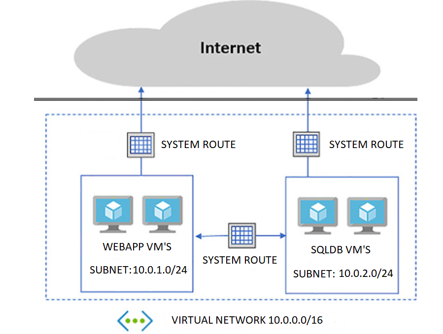
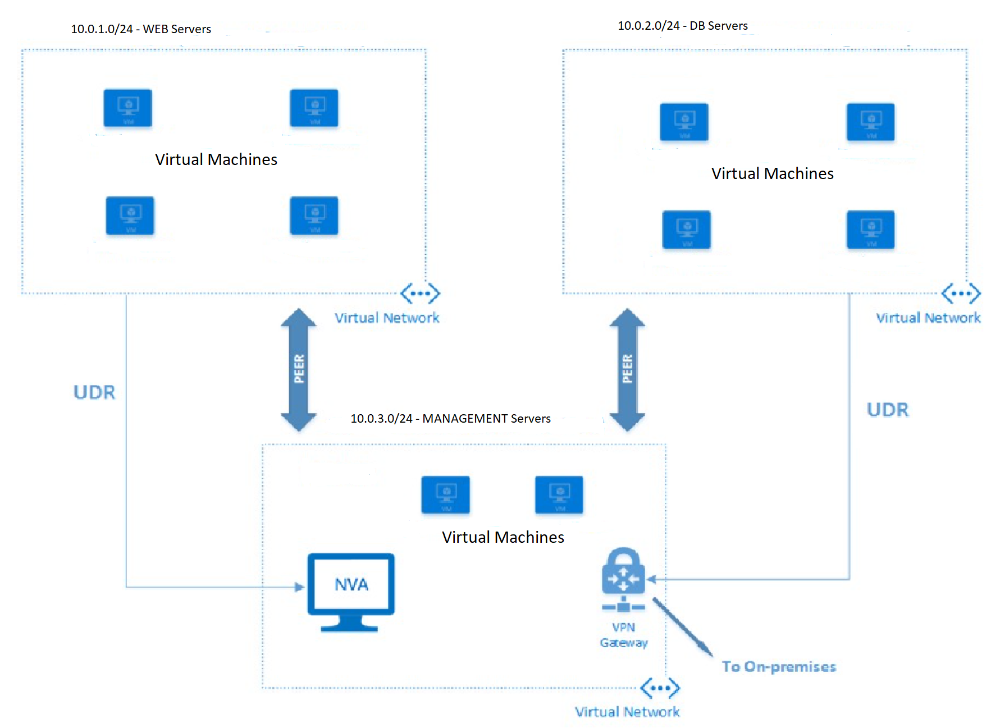
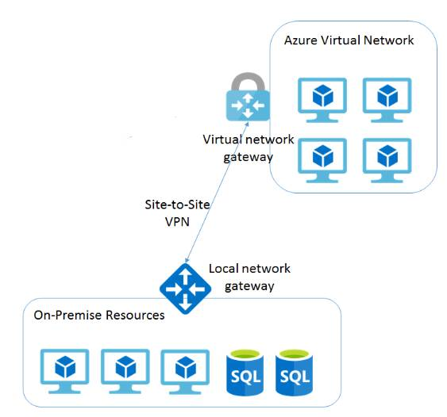
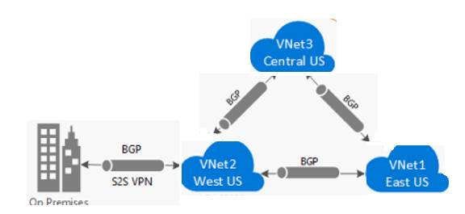

As part of the project to control the flow of traffic within your virtual network, you need to understand the purpose and benefits of custom routes, and how to configure them to direct the flow of traffic through a network virtual appliance (NVA).

## Azure Routing

By default, network traffic in Azure is automatically routed across Azure subnets, virtual networks, and on-premises networks. This routing is controlled by system routes, which are assigned by default to each subnet in a virtual network. This means that, by default, any Azure virtual machine that is deployed to a virtual network can communicate with all other Azure virtual machines in the same or different subnets in that virtual network. These virtual machines are also potentially accessible from on-premises through a hybrid network or the Internet.

You can't create or delete system routes, but you can override the system routes by adding custom routes to control the flow of traffic to the next hop.

Every subnet has these default system routes:

|Address prefixes  |Next hop type |
|---------|---------|
|Unique to the virtual network    | Virtual network |
|0.0.0.0/0     | Internet        |
|10.0.0.0/8     | None        |
|172.16.0.0/12 | None |
|192.168.0.0/16 | None        |
|100.64.0.0/10 | None        |

The **next hop type** shows the network path taken by traffic sent to each address prefix. The hop type can be one of:

- **Virtual Network**. A route is created in the address prefix, which represents each address range created at the virtual network level. If there are multiple addresses ranges specified, then multiple routes are created for each address range.
- **Internet**. The default system route of 0.0.0.0/0 routes any address range to the Internet unless you override Azure's default route with a custom route.
- **None**. Any traffic routed to the hop type of **None** is dropped, and doesn't get routed outside the subnet. By default, the following IP v4 private address prefixes are created: 10.0.0.0/8, 172.16.0.0/12, 192.168.0.0/16. The shared address space prefix, 100.64.0.0/10 is also added with a next hop of None. All these address ranges are considered to be not globally routable.

You can replace this default address prefixes by assigning your own address range, and Azure will replace one of the defaults prefixes with the one you specify with a hop type of **Virtual network**.

The diagram below gives an overview of system routes and how traffic flows between subnets and the internet by default. You can see from the diagram that traffic flows freely between the two subnets and the Internet.

Within Azure, there are additional system routes. Azure will create these routes if you enable the following capabilities:

- Virtual network peering
- Service chaining

   Both of these capabilities allow virtual networks within Azure to be connected together to allow virtual machines to communicate with each other, either within the same region or across regions.  This in turn creates additional routes within the default route table.  Service chaining enables you to override these routes by creating user-defined routes (UDRs) between peered networks.

   The diagram below shows two virtual networks with peering configured, but with UDRs configured to route traffic through an NVA or a VPN Gateway.

   

- Virtual Network Gateway
  
   Use a virtual network gateway to send encrypted traffic between Azure and on-premises over the internet, and to send encrypted traffic between Azure networks. A virtual network gateway contains routing tables and gateway services.

   

- VirtualNetworkServiceEndpoint

   Use Virtual Network endpoints extend your private address space in Azure by providing a direct connection to your Azure resources. This process will restrict the flow of traffic and allow your Azure virtual machines to access the Storage account directly from the private address space and deny access from a public virtual machine.  

   For every default route that is created there's an address space and next hop type associated with that route, which Azure will use to route the traffic

System routes may make it easy for you to quickly get your environment up and running, but there will be many scenarios in which you'll want to control the flow of traffic within your network more closely. For example, you might want to route traffic through a network virtual appliance, or third-party firewall or router. This is possible with user-defined routes.

## Custom Routes

You have two options for implementing custom routes. You can create a user-defined route, or use Border Gateway Protocol (BGP) to exchange routes between Azure and on-premises networks.

### User-defined routes

You use a user-defined route to override the default system routes so that traffic can be routed through firewalls or network virtual appliances. For example, you might have a network with two subnets, and you want to add a virtual machine in the perimeter network to be used as a firewall. You create a user-defined route so that traffic passes through the firewall and doesn't go directly between the subnets.

When creating user-defined routes, you can specify these next hop types:

- **Virtual appliance**. A virtual appliance is typically a firewall device, used to analyze or filter traffic entering or leaving your network. You can specify the private IP address of a NIC attached to a virtual machine so that IP forwarding can be enabled, or you can provide the private IP address of an internal load balancer.
- **Virtual network gateway**. With this hop type, you can indicate when you want routes for a specific address routed to a virtual network gateway. The virtual network gateway is specified as a VPN for next hop type.
- **Virtual Network**. Use this hop type to override the default system route within a virtual network.
- **Internet**. Use this hop type to route traffic to a certain address prefix to be routed out to the internet
- **None**. Use this hop type when you want to drop traffic to a specified address prefix.

With user-defined routes, you aren't able to specify virtual network peering, *VirtualNetworkServiceEndpoint*, as the next hop type.

### Border gateway protocol

A network gateway in your on-premises network can exchange routes with a virtual network gateway in Azure by using border gateway protocol (BGP).

BGP is a routing protocol used to exchange routing information between two or more networks. With BGP, there's no need to configure routes manually.

The diagram below shows a topology with paths that can transit between Azure VPN Gateway and on-premises networks

Use BGP to advertise on-premises routes to Azure, whether you connect using Express Route or by using a VPN. These routes are added to the routing table in Azure with **Virtual network gateway** as the next hop type. THis type of routing supplants custom routes.

BGP (Border Gateway Protocol) is the standard routing protocol that is normally used to exchange routing and information between two or more networks.  BGP is used to transfer data and information between different host gateways such as the Internet or autonomous systems. BGP discovers prefixes (prefixes are subnets, for example, 10.0.0.0/16) from various networks by enabling connections from multiple gateways, which allows BGP gateways to learn of routes from other BGP peers.  These routes are then used to transfer data between gateways or routers.

BGP offers network stability because routers can quickly change connections to send packets if a connection path goes down. BGP makes routing decisions based on paths, rules, or network policies. Each BGP router/gateway manages a local routing table to direct packets in transit, but this is used in conjunction with a routing table called routing information base (RIB). The Routing information base (RIB) contains route information from externally connected BGP peers and internal peers.
BGP works with Azure Virtual Networks and communicates with Azure VPN Gateways and your on-premise VPNs.  This allows both Azure VPNs and on-premise VPNs to exchange routes between each other so that they inform the gateways on the availability and reachability of these routes. However, before enabling the BGP feature, you should make sure the VPN devices support BGP.

## Route priority

All routes have an assigned priority. This is a numeric value, specified when you add the route to the routing table. The lower this value, the higher the priority. In the event of two conflicting routes occurring in routing table, the route with the highest priority (lowest numeric value) will be used.