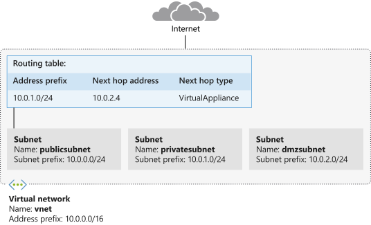

As part of your security strategy, you want to control how network traffic is routed across your Azure infrastructure. You'll use a network virtual appliance to help secure and monitor traffic. You want to ensure communications between front-end public servers and internal private servers are always routed through the appliance.

You'll configure the network so that all traffic flowing from the *publicsubnet* to the *privatesubnet* subnet will be routed through a network virtual appliance. To make this happen, you'll create a custom route for *publicsubnet*, to route this traffic to the *dmzsubnet* subnet. Later, you'll deploy a network virtual appliance to *dmzsubnet*.  



In this exercise, you'll create the route table, custom route, and subnets. You'll then associate the route table with a subnet.

[!include[](../../../includes/azure-sandbox-activate.md)]

## Create a route table and custom route

The first task is to create a new routing table, and then add a custom route for all traffic intended for the *privatesubnet* subnet.

1. In the Cloud Shell window on the right, run the following command to create a route table.

    ```azurecli
    az network route-table create \
        --name publictable \
        --resource-group <rgn>[sandbox resource group name]</rgn> \
        --disable-bgp-route-propagation false
    ```

1. Run the following command in the Cloud Shell to create a custom route.

    ```azurecli
    az network route-table route create \
        --route-table-name publictable \
        --resource-group <rgn>[sandbox resource group name]</rgn> \
        --name productionsubnet \
        --address-prefix 10.0.1.0/24 \
        --next-hop-type VirtualAppliance \
        --next-hop-ip-address 10.0.2.4
    ```

## Create a virtual network and subnets

The next step is to create the *vnet* virtual network, and the three subnets that you need: *publicsubnet*, *privatesubnet*, and *dmzsubnet*.

1. Run the following command to create the *vnet* virtual network, and the *publicsubnet* subnet.

    ```azurecli
    az network vnet create \
        --name vnet \
        --resource-group <rgn>[sandbox resource group name]</rgn> \
        --address-prefix 10.0.0.0/16 \
        --subnet-name publicsubnet \
        --subnet-prefix 10.0.0.0/24
   ```

1. Run the following command in the Cloud Shell to create the *privatesubnet* subnet.

    ```azurecli
    az network vnet subnet create \
        --name privatesubnet \
        --vnet-name vnet \
        --resource-group <rgn>[sandbox resource group name]</rgn> \
        --address-prefix 10.0.1.0/24
     ```

1. Run the following command to create the *dmzsubnet* subnet.

    ```azurecli
    az network vnet subnet create \
        --name dmzsubnet \
        --vnet-name vnet \
        --resource-group <rgn>[sandbox resource group name]</rgn> \
        --address-prefix 10.0.2.0/24
    ```

1. You should now have three subnets. Run the following command to show all the subnets in the  *vnet* virtual network.

    ```azurecli
    az network vnet subnet list \
        --resource-group <rgn>[sandbox resource group name]</rgn> \
        --vnet-name vnet \
        --output table
    ```

## Associate the route table with the public subnet

The final step in this exercise is to associate the route table with the *publicsubnet* subnet.

1. Run the following command to associate the route table to the public subnet.

    ```azurecli
    az network vnet subnet update \
        --name publicsubnet \
        --vnet-name vnet \
        --resource-group <rgn>[sandbox resource group name]</rgn> \
        --route-table publictable
    ```
