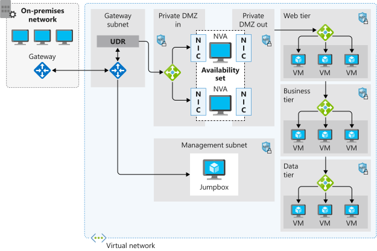

A network virtual appliance is a virtual appliance that consists of various layers such as firewall, WAN optimizer, application delivery controllers, routers, load balancers, IDS/IPS, and proxies.  From the Azure Marketplace, you can deploy network virtual appliances from independent software vendors such as Check Point, Barracuda, Sophos, Watchguard, and Sonicwall. You can use a network virtual appliance to filter inbound traffic to a virtual network and block malicious requests, or requests made from unexpected resources.

In the example retail organization scenario, you must work with the security and network team to implement a secure environment where all incoming traffic is scrutinized and unauthorized traffic is blocked from passing onto the internal network. You want to secure both virtual machine networking and Azure services networking as part of your company's network security strategy. Your goal is to prevent unwanted or unsecured network traffic from reaching key systems.

As part of the network security strategy, you must be able to control the flow of traffic within your virtual network. You need to understand the role of a network virtual appliance, and the benefits you can gain by controlling the flow of traffic with an Azure network through the network virtual appliance.

## Network virtual appliance

Network virtual appliances (NVA) are virtual machines, normally running Linux, which can control the flow of network traffic by controlling routing. You typically use them to manage traffic flowing from a DMZ environment to other networks or subnets.

An NVA often includes various protection layers, like a firewall, WAN optimizer, application delivery controllers, routers, load balancers, proxies, SD-WAN edge, and more.

Firewall appliances can be deployed into a virtual network in different configurations. You can put a firewall appliance in a DMZ subnet in the virtual network, or if you want more control of security, you can implement a micro-segmentation approach.

With the micro-segmentation approach you can create dedicated subnets for the firewall, and then deploy web applications and other services in other subnets. All traffic is routed through the firewall and inspected by the NVAs. You enable forwarding on the virtual appliance network interfaces to pass traffic that is accepted on to the appropriate subnet.

Micro-segmentation allows the firewall to inspect all packets both at layer 4, and for application-aware appliances, layer 7. When you deploy an NVA to Azure, it acts as a router, forwarding requests between the subnets on the virtual network.

Some NVAs require multiple network interfaces. One network interface is normally dedicated to the management network for the appliance, while additional network interfaces manage and control the traffic processing. Once you’ve deployed the NVA, you may then configure the appliance to route the traffic through the proper interface.

### User-defined routes

For most environments, the default system routes already defined by Azure are enough to get your environments up and running. In certain cases you should create a routing table, and add custom routes. Some examples are:

- Access to the internet via on-premises network using forced tunneling.
- Using virtual appliances to control traffic flow

If necessary, you can define multiple routing tables in Azure. The same routing table can be associated with one or more subnets, but one subnet can only be associated with a one routing table.

## Network virtual appliances in a highly available architecture

By routing traffic through an NVA, it becomes a critical piece of your infrastructure. Any failures will directly impact the ability of your services to communicate, so it's important to include a highly available architecture in your NVA deployment. There are several methods of achieving high availability when using NVAs. You can find more information about using NVAs in highly available scenarios in the *Learn more* section at the end of this module.
