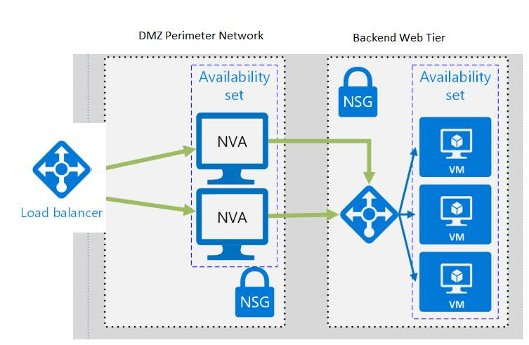
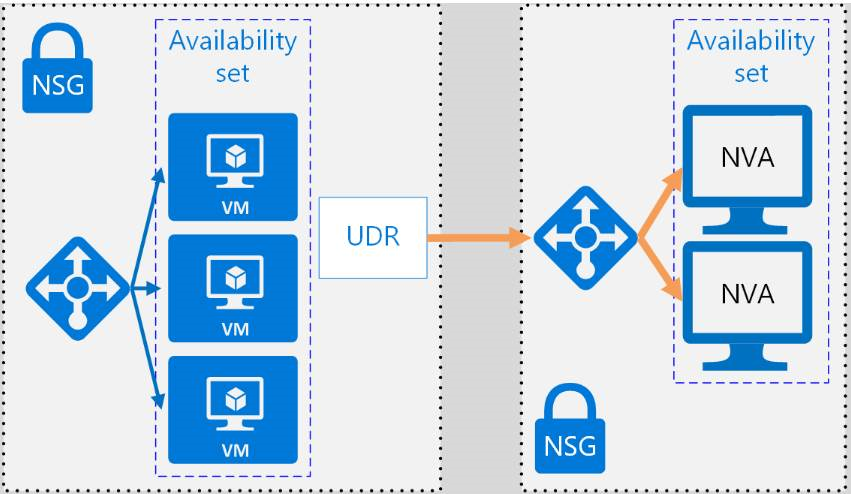
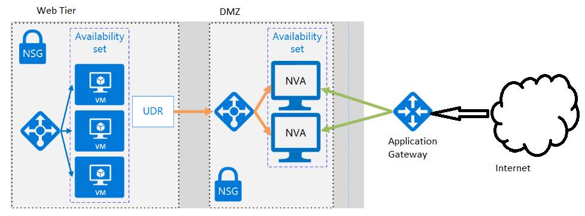
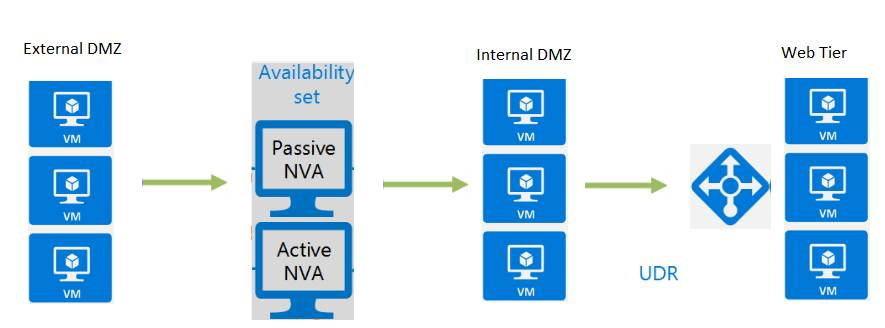
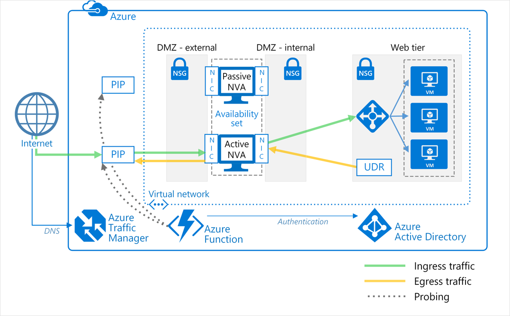

<!-- TODO this unit needs proper intro, scenario etc. see the guidance writing intros in the PDF docs-->
## Motivation

Fashion Corp the retail giant were recently the victims of  online cyber attacks when they suffered the loss of customer information such as name, address and credit card details. Malicious actors infiltrated vulnerabilities in the retailer’s network infrastructure, resulting in the loss of Customers confidential information.  

Your role as the Solution Architect is to work with the security and network team to implement a secure environment where all incoming traffic is scrutinized and unauthorized traffic is blocked from passing onto the internal network.
You want to secure both virtual machine networking and Azure services networking as part of your company's network security strategy. Your goal is to prevent unwanted or unsecured network traffic from being able to reach key systems.

As part of the network security strategy, you want to design your network where you control the flow of traffic within your virtual network.  You need to understand the role of a network virtual appliance (NVA) and the benefits you can gain by controlling the flow of traffic with an Azure network through the NVA.

<!-- TODO this unit needs a good edit for flow, clarity, and level of detail -->
What is the purpose and role of an NVA?

## Network virtual appliance

A Network virtual appliance (NVA) is a virtual appliance that consists of various layers such as firewall, WAN optimizer, application delivery controllers, routers, load balancers, IDS/IPS and proxies.  From the Azure MarketPlace you can deploy network virtual appliances from independent software vendors such as Check Point, Barracuda, Sophos, Watchguard and Sonicwall.

When you deploy a Virtual appliance, Azure ensures that all inbound network traffic is routed through the Network Virtual Appliance.

NVAs are Virtual machines normally running Linux which can control the flow of network traffic by controlling routing, normally from a DMZ environment to other networks or subnets.

A network virtual appliance (NVA) involves various layers like firewall, WAN optimizer, application delivery controllers, routers, load balancers, proxies, SD-WAN edge, and more.

Firewall appliance's can be deployed into a virtual network in different configurations, you can put it on an DMZ subnet in the virtual network or if you want more control of security, implement a micro-segmentation approach.
With the micro-segmentation approach you can create dedicated subnets for the firewall, deploy web applications and other services in other subnets.  You can then enable forwarding on the virtual appliance NICs (Network Interfaces).
You can configure routing tables to the subnets to force all traffic through the inspection of the virtual appliances.
Micro-segmentation allows the firewall to inspect all packets both at Layer-4 and Layer-7 (in the case of application-aware appliances).
In an ideal scenario, you would implement high-availability for network virtual appliances. Instead of deploying just a single appliance, you would deploy a cluster of them for high-availability.

There are 2 types of Virtual appliances you can deploy:

-   User defined routing

    -   In this configuration the virtual appliance is used as a router between the subnets on the virtual network

-   Port Mirroring

    -   All traffic entering or leaving a monitored port is sent to a virtual appliance for analysis

Depending on the virtual appliance you deploy, some instances may require multiple vNICs (virtual network adapters). 
One network adapter is normally dedicated to the management network for the appliance, while additional adapters manage and control the traffic processing. 
Once you’ve deployed the network virtual appliance, you may then configure the appliance for user defined routing, port mirroring or both. 

**User defined routing**

For most environments, the default system routes already defined by Azure are enough to get your environments up and running. However, in certain cases you would need to create a routing table and add one or more routes.  Some examples are:
- Access to the internet via on-premise network using Force tunneling.
- Using Virtual appliances to control traffic flow

For both of these scenarios, you need to create a routing table and add user-defined routes to the table. If required multiple routing tables can be defined in Azure and the same routing table can be associated with one or more subnets but  one subnet can only be associated to a one routing table. 

**Port mirroring**

With Port Mirroring, you configure traffic that is directed to the virtual network of your virtual machine to mirror th virtual network on the virtual Appliance.  In this scenario you would deploy two VMs, one VM running as the appliance and the second VM running with mirroring configured. 
The virtual appliance needs to network interfaces, one of which is used for management. After enabling port mirroring as a destination on the Appliciance Ethernet card, it will not  receive any traffic which may be destined for the IP interface configured on that VM.

Below diagram represents a DMZ network between on-premises and Azure, with NVAs to control incoming traffic

## Network Virtual appliance in a highly available architecture

An NVA can be implemented in a DMZ in many forms, for example you can deploy an NVA to check all inbound and outbound traffic and only allowing traffic through if they meet a certain security requirement.

You can deploy more than one NVA in an availability set to provide high availability, meaning if one NVA fails the second NVA is still online to service the inbound and outbound traffic rules

<!-- TODO too many short bullet lists from here onwards -->
To configure NVAs in a highly available architecture, deploy more that one NVA in an Availability Set.  

The architectures listed below describe the resources and configuration required to deploy highly available NVA's.

**Ingress with layer 7 NVAs**

| Benefits | Considerations |
| ------| --------    | --------------- |
| All NVAs are Active | Both NVAs are active in this design, so traffic flow from the load balancer is sent to both NVAs. Can be used only when traffic originates from outside Azure. This solution requires different NVAs for traffic coming from Azure and another set for traffic received externally, like the Internet. Designed specifically for Layer 7 traffic such as HTTP / HTTPS traffic.  NVAs in this design need to terminate traffic which is for the Web tier

**Egress with layer 7 NVAs**

| Benefits | Considerations |
| ------| --------    | --------------- |
| All NVAs are Active |NVAs that are deployed in this architecture need to be able to terminate connections and implement SNAT (source network address translation). Traffic from Azure is routed to an internal load balancer and the load balancer forwards the requests to the NVAs which then forward the traffic out to the internet.  This solution is designed for HTTP / HTTPS traffic.

**Ingress-egress with layer 7 NVAs**

| Benefits | Considerations |
| ------| --------    | --------------- |
| All NVAs are Active |Requires one set of NVAs to service traffic from internet and another set to service Azure traffic. In this model, you can combine both ingress and egress for layer 7 traffic for HTTP & HTTPS.  This architecture is designed to allow the NVAs to process incoming traffic from the Application layer as well as outgoing traffic from the backend Web tier VMs.

**PIP-UDR switch with layer 4 NVAs**
| Benefits | Considerations |
| ------| --------    | --------------- |
| Active / Passive Setup | In this architecture, you have one active NVA and a standby NVA.  If the active NVA fails, the standby NVA is made active, and the UDR and PIP are changed to point to the now active NVA.  This process is either done manually or automated by a monitoring service or some daemon.  The NVA's in this model can handle all traffic for both ingress and egress.

**PIP-UDR NVAs without SNAT**
| Benefits | Considerations |
| ------| --------    | --------------- |
| Active / Passive Setup |This architecture should be deployed when the NVA's do not support SNAT (SNAT hides the original source client IP address), however failover in this solution between and active and passive NVA is automated. This solution involves deploying a single set of NVAs.

## Knowledge test objectives

-   What benefits can an NVA provide?

-   Explain the 2 options available for deploying an NVA

## Reference links

Deploy highly available network virtual appliances: <https://docs.microsoft.com/en-us/azure/architecture/reference-architectures/dmz/nva-ha>

Deploy a basic NVA: <https://docs.microsoft.com/en-us/azure/virtual-network/tutorial-create-route-table-portal>

Implement a DMZ between Azure and the Internet: <https://docs.microsoft.com/en-us/azure/architecture/reference-architectures/dmz/secure-vnet-dmz>
