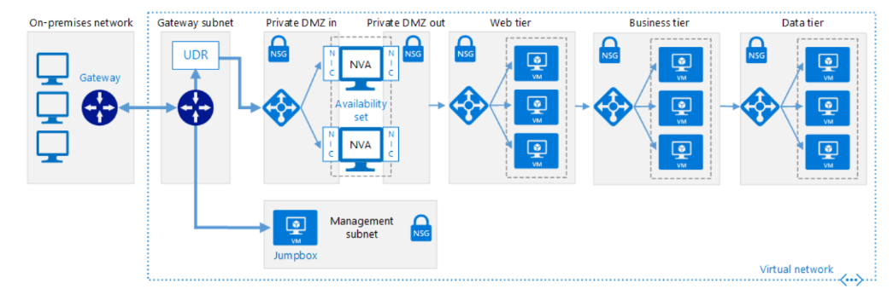

A network virtual appliance (NVA) is a virtual appliance that consists of various layers such as firewall, WAN optimizer, application delivery controllers, routers, load balancers, IDS/IPS, and proxies.  From the Azure MarketPlace, you can deploy network virtual appliances from independent software vendors such as Check Point, Barracuda, Sophos, Watchguard, and Sonicwall. You can use an NVA to filter inbound traffic to a virtual network and block malicious requests, or requests made from unexpected resources.

Fashion Corp the retail giant were recently the victims of  online cyber attacks when they suffered the loss of customer information such as name, address, and credit card details. Malicious actors infiltrated vulnerabilities in the retailer’s network infrastructure, resulting in the loss of Customers confidential information.  

Your role as the Solution Architect is to work with the security and network team to implement a secure environment where all incoming traffic is scrutinized and unauthorized traffic is blocked from passing onto the internal network.
You want to secure both virtual machine networking and Azure services networking as part of your company's network security strategy. Your goal is to prevent unwanted or unsecured network traffic from reaching key systems.

As part of the network security strategy, you want to design your network where you control the flow of traffic within your virtual network.  You need to understand the role of a network virtual appliance (NVA), and the benefits you can gain by controlling the flow of traffic with an Azure network through the NVA.

## Network virtual appliance

NVAs are virtual machines, normally running Linux, which can control the flow of network traffic by controlling routing. You typically use them to manage traffic flowing from a DMZ environment to other networks or subnets.

An NVA often includes various protection layers, like a firewall, WAN optimizer, application delivery controllers, routers, load balancers, proxies, SD-WAN edge, and more.

Firewall appliances can be deployed into a virtual network in different configurations. You can put a firewall appliance in a DMZ subnet in the virtual network, or if you want more control of security, you can implement a micro-segmentation approach.

With the micro-segmentation approach you can create dedicated subnets for the firewall, and then deploy web applications and other services in other subnets. All traffic is routed through the firewall and inspected by the NVAs. You  enable forwarding on the virtual appliance NICs (Network Interfaces) to pass traffic that is accepted on to the appropriate subnet.

Micro-segmentation allows the firewall to inspect all packets both at Layer-4 and Layer-7 (in the case of application-aware appliances). In an ideal scenario, you would implement high-availability by deploying a cluster of NVAs.

You can deploy NVAs with two the following configurations:

- *User-defined routing*. In this configuration, the virtual appliance is used as a router between the subnets on the virtual network.

- *Port Mirroring*. In this configuration, all traffic entering or leaving a monitored port is sent to a virtual appliance for analysis.

Some NVAs require multiple vNICs (virtual network adapters). One network adapter is normally dedicated to the management network for the appliance, while additional adapters manage and control the traffic processing. Once you’ve deployed the NVA, you may then configure the appliance for user-defined routing, port mirroring or both.

### User-defined routing

For most environments, the default system routes already defined by Azure are enough to get your environments up and running. In certain cases you should create a routing table, and add custom routes. Some examples are:

- Access to the internet via on-premise network using Force tunneling.
- Using virtual appliances to control traffic flow

If necessary, you can define multiple routing tables in Azure. The same routing table can be associated with one or more subnets, but one subnet can only be associated with a one routing table.

### Port mirroring

With port mirroring, you configure traffic that is directed to the virtual network of your virtual machine to mirror the virtual network on the NVA.  In this scenario, you would have two VMs; one VM running as the NVA and the second VM running with mirroring configured.

The NVA requires two network interfaces, one of which is used for management. After enabling port mirroring as a destination on the NVA's ethernet card, it will not  receive any traffic, which is destined for the IP interface configured on that VM.

The diagram below represents a DMZ network between on-premises and Azure, with NVAs controlling incoming traffic:

## NVAs in a highly available architecture

An NVA can be implemented in a DMZ in many forms. For example, you can deploy an NVA to check all inbound and outbound traffic and only allowing traffic through if it meets certain security requirements.

You can deploy more than one NVA in an availability set to provide high availability. If one NVA fails, another is still online to service the inbound and outbound traffic rules.

You can find more information about using NVAs in highly available scenarios at [Deploy highly available network virtual appliances](https://docs.microsoft.com/azure/architecture/reference-architectures/dmz/nva-ha)