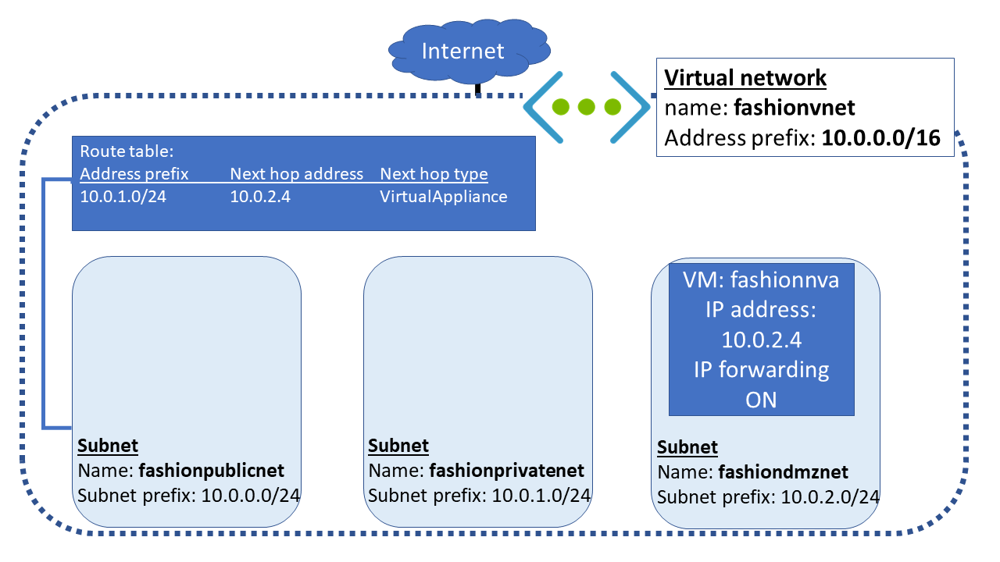

In the next stage of your security implementation, you are going to deploy a network virtual appliance to secure and monitor traffic between your front-end public servers and internal private servers. You need to ensure that the appliance is configured to forward IP traffic. If IP forwarding is not enabled, then traffic that has been routed through your appliance will never be received by its intended destination servers.

You'll now deploy the **fashionnva** network appliance to the **fashiondmznet** subnet. You'll then enable IP forwarding so that traffic from **fashionpublicnet**, and using the custom route, can be forwarded to the **fashionprivatenet** subnet. 



In this exercise, you'll deploy a network virtual appliance. You'll then update the Azure virtual NIC, and the network settings within the appliance, to enable IP forwarding.

## Deploy the network virtual appliance
To build the network virtual appliance, you'll deploy an Ubuntu LTS instance.

1. Run the following command in the Cloud Shell to deploy the appliance, replacing `<password>` with the password you'll use for the admin account.
   ```azurecli
   az vm create \
   --resource-group <rgn>[sandbox resource group name]</rgn> \
   --name fashionnva \
   --vnet-name fashionvnet \
   --subnet fashiondmznet \
   --image UbuntuLTS \
   --admin-username azureuser \
   --admin-password <password>
   ```
1. Run the following command in the Cloud Shell to save the public IP address of the appliance VM to a variable.
   ```azurecli
   NVAIP="$(az vm list-ip-addresses \
   --resource-group <rgn>[sandbox resource group name]</rgn> \
   --name fashionnva \
   --query "[].virtualMachine.network.publicIpAddresses[*].ipAddress" \
   --output tsv)"
   ```

## Enable IP forwarding for the Azure network interface
The next step is to enable IP forwarding for **fashionnva.** When traffic is sent to the NVA, if the traffic which is received by the NVA is for another target, the NVA will then forward or route that traffic to its correct destination.

1. Run the following command in the Cloud Shell to obtain the Id of the NVA network interface.
   ```azurecli
   NICID=$(az vm nic list \
   --resource-group <rgn>[sandbox resource group name]</rgn> \
   --vm-name fashionnva \
   --query "[].{id:id}" --output tsv)
   ```
1. Run the following command in the Cloud Shell to obtain the Name of the NVA network interface. 
   ```azurecli
   NICNAME=$(az vm nic show \
   --resource-group <rgn>[sandbox resource group name]</rgn> \
   --vm-name fashionnva \
   --nic $NICID \
   --query "{name:name}" --output tsv)
   ```
1. Run the following command in the Cloud Shell to enable IP forwarding for the Azure network interface.
   ```azurecli
   az network nic update --name $NICNAME \
   --resource-group <rgn>[sandbox resource group name]</rgn> \
   --ip-forwarding true
   ```

## Enable IP forwarding in the appliance

1. Run the following command in the Cloud Shell to save the public IP address of the NVA VM to a variable.
   ```azurecli
   NVAIP="$(az vm list-ip-addresses \
   --resource-group <rgn>[sandbox resource group name]</rgn> \
   --name fashionnva \
   --query "[].virtualMachine.network.publicIpAddresses[*].ipAddress" \
   --output tsv)"
   ```
1. Run the following command in the Cloud Shell to enable IP forwarding within the NVA.
   ```bash
   ssh -t azureuser@$NVAIP 'sudo sysctl -w net.ipv4.ip_forward=1; exit; bash'
   ```
1. After the `Are you sure you want to continue connecting (yes/no)?` message, type **yes**.
1. Enter the password you used when you created the VM.

