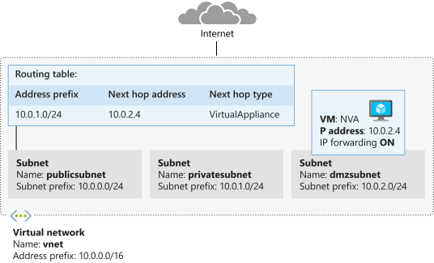

In the next stage of your security implementation, you'll deploy a network virtual appliance to secure and monitor traffic between your front-end public servers and internal private servers. You'll configure the appliance to forward IP traffic. If IP forwarding isn't enabled, then traffic that has been routed through your appliance will never be received by its intended destination servers.

In this exercise, you'll deploy the *nva* network appliance to the *dmzsubnet* subnet. You'll then enable IP forwarding so that traffic from *publicsubnet*, and traffic that uses the custom route, is sent to the *privatesubnet* subnet.



In this exercise, you'll deploy a network virtual appliance. You'll then update the Azure virtual NIC, and the network settings within the appliance, to enable IP forwarding.

## Deploy the network virtual appliance

To build the network virtual appliance, you'll deploy an Ubuntu LTS instance.

1. In the Cloud Shell, run the following command to deploy the appliance. Replace `<password>` with a suitable password of your choice for the *azureuser* admin account.

    ```azurecli
    az vm create \
        --resource-group <rgn>[sandbox resource group name]</rgn> \
        --name nva \
        --vnet-name vnet \
        --subnet dmzsubnet \
        --image UbuntuLTS \
        --admin-username azureuser \
        --admin-password <password>
    ```

1. Run the following commands to retrieve the public IP address of the appliance virtual machine and save it to the variable named `NVAIP`.

    ```azurecli
    NVAIP="$(az vm list-ip-addresses \
        --resource-group <rgn>[sandbox resource group name]</rgn> \
        --name nva \
        --query "[].virtualMachine.network.publicIpAddresses[*].ipAddress" \
        --output tsv)"

    echo $NVAIP
    ```

## Enable IP forwarding for the Azure network interface

The next step is to enable IP forwarding for *nva*. When traffic is sent to the NVA, if the traffic, which is received by the NVA is for another target, the NVA will route that traffic to its correct destination.

1. Run the following command to obtain the ID of the NVA network interface.

    ```azurecli
    NICID=$(az vm nic list \
        --resource-group <rgn>[sandbox resource group name]</rgn> \
        --vm-name nva \
        --query "[].{id:id}" --output tsv)

    echo $NICID
    ```

1. Run the following command to obtain the name of the NVA network interface.

    ```azurecli
    NICNAME=$(az vm nic show \
        --resource-group <rgn>[sandbox resource group name]</rgn> \
        --vm-name nva \
        --nic $NICID \
        --query "{name:name}" --output tsv)

    echo $NICNAME
    ```

1. Run the following command to enable IP forwarding for the network interface.

    ```azurecli
    az network nic update --name $NICNAME \
        --resource-group <rgn>[sandbox resource group name]</rgn> \
        --ip-forwarding true
   ```

## Enable IP forwarding in the appliance

1. Run the following command to save the public IP address of the NVA virtual machine to the variable, `NVAIP`.

    ```azurecli
    NVAIP="$(az vm list-ip-addresses \
        --resource-group <rgn>[sandbox resource group name]</rgn> \
        --name nva \
        --query "[].virtualMachine.network.publicIpAddresses[*].ipAddress" \
        --output tsv)"

    echo $NVAIP
    ```

1. Run the following command to enable IP forwarding within the NVA.

    ```bash
    ssh -t -o StrictHostKeyChecking=no azureuser@$NVAIP 'sudo sysctl -w net.ipv4.ip_forward=1; exit;'
    ```

    When prompted, enter the password you used when you created the virtual machine.
