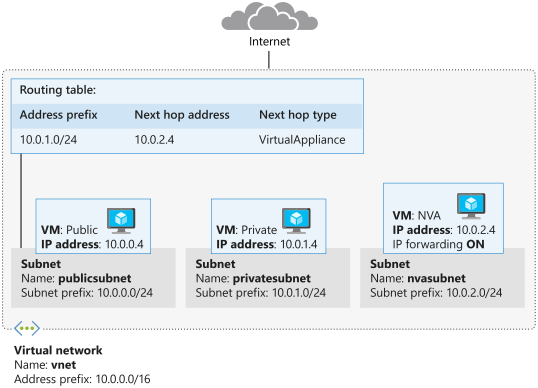
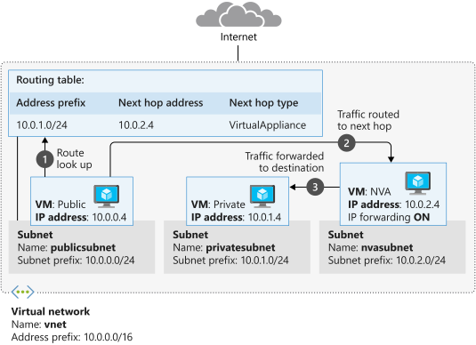
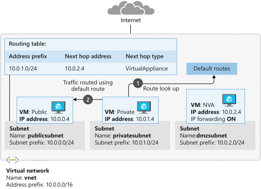

Now that the NVA and virtual machines have been created, you'll route the traffic through the NVA



## Create public and private virtual machines

The next step is to deploy a virtual machine into the public and private subnets.

1. Open the Code editor and create a file named *cloud-init.txt*.

    ```bash
    code cloud-init.txt
    ```

1. Add the following configuration information to the file. This file installs the `inetutils-traceroute` package when you create a new virtual machine. This package contains the `traceroute` utility that you'll use later in this exercise.

    ```Text
    #cloud-config
    package_upgrade: true
    packages:
       - inetutils-traceroute
    ```

1. Press `Ctrl-s` to save the file, and then press `Ctrl-q` close the Code editor.

1. Run the following command in the Cloud Shell to create the *public* virtual machine. Replace `<password>` with a suitable password for the *azureuser* account.

    ```azurecli
    az vm create \
        --resource-group <rgn>[sandbox resource group name]</rgn> \
        --name public \
        --vnet-name vnet \
        --subnet publicsubnet \
        --image UbuntuLTS \
        --admin-username azureuser \
        --no-wait \
        --custom-data cloud-init.txt \
        --admin-password <password>
    ```

1. Run the following command to create the *private* virtual machine. Replace `<password>` with a suitable password.

    ```azurecli
    az vm create \
        --resource-group <rgn>[sandbox resource group name]</rgn> \
        --name private \
        --vnet-name vnet \
        --subnet privatesubnet \
        --image UbuntuLTS \
        --admin-username azureuser \
        --no-wait \
        --custom-data cloud-init.txt \
        --admin-password <password>
    ```

1. Run the following command to check that the virtual machines are running. We're using the Linux `watch` command to run the `az vm list` command periodically, which allows you to monitor the progress.

    ```bash
    watch -d -n 5 "az vm list \
        --resource-group <rgn>[sandbox resource group name]</rgn> \
        --show-details \
        --query '[*].{Name:name, ProvisioningState:provisioningState, PowerState:powerState}' \
        --output table"
    ```

    A **ProvisioningState** of **Succeeded** and a **PowerState** of **VM running** indicates a successful deployment. When all three VMs are running, you're ready to move on. Press `Ctrl-c` to stop the command and continue on with the exercise.

1. Run the following command to save the public IP address of the *public* virtual machine to a variable named `PUBLICIP`.

    ```azurecli
    PUBLICIP="$(az vm list-ip-addresses \
        --resource-group <rgn>[sandbox resource group name]</rgn> \
        --name public \
        --query "[].virtualMachine.network.publicIpAddresses[*].ipAddress" \
        --output tsv)"

    echo $PUBLICIP
    ```

1. Run the following command to save the public IP address of the *private* virtual machine to a variable named `PRIVATEIP`.

    ```azurecli
    PRIVATEIP="$(az vm list-ip-addresses \
        --resource-group <rgn>[sandbox resource group name]</rgn> \
        --name private \
        --query "[].virtualMachine.network.publicIpAddresses[*].ipAddress" \
        --output tsv)"

    echo $PRIVATEIP
    ```

## Test traffic routing through the network virtual appliance

The final step is to use the Linux `traceroute` utility to show how traffic is being routed. You'll use SSH to run the `traceroute` command on each virtual machine. The first test will show the route taken by ICMP packets sent from the *public* virtual machine to the *private* virtual machine. The second test will show the route taken by ICMP packets sent from the *private* virtual machine to the *public* virtual machine.

1. Run the following command to trace the route from *public* to *private*. Enter the password for the *azureuser* account that you specified earlier, when prompted.

    ```bash
    ssh -t -o StrictHostKeyChecking=no azureuser@$PUBLICIP 'traceroute private --type=icmp; exit'
    ```

    If you receive an error stating `bash: traceroute: command not found`, wait a minute and retry the command. The automated installation of `traceroute` can take a minute or two after virtual machine deployment. Once successful, the output should look similar to the following example:

    ```Text
    traceroute to private.kzffavtrkpeulburui2lgywxwg.gx.internal.cloudapp.net (10.0.1.4), 64 hops max
    1   10.0.2.4  0.710ms  0.410ms  0.536ms
    2   10.0.1.4  0.966ms  0.981ms  1.268ms
    Connection to 52.165.151.216 closed.
    ```

    Notice that the first hop is to 10.0.2.4. This address is the private IP address for *nva*. The second hop is to the address of *private* (10.0.1.4). Remember that in the first exercise, you added this route to the route table and linked the table to the *publicsubnet*  subnet. So all traffic from *public* to *private* is being routed through network virtual appliance.

   

1. Run the following command to trace the route from *private* to *public*. Enter the password for the *azureuser* account when prompted.

    ```bash
    ssh -t -o StrictHostKeyChecking=no azureuser@$PRIVATEIP 'traceroute public --type=icmp; exit'
    ```

    You should see the traffic go directly to *public* (10.0.0.4) and not through the NVA, as shown below.

    ```Text
    traceroute to public.kzffavtrkpeulburui2lgywxwg.gx.internal.cloudapp.net (10.0.0.4), 64 hops max
    1   10.0.0.4  1.095ms  1.610ms  0.812ms
    Connection to 52.173.21.188 closed.
    ```

    The *private* virtual machine is using default routes, and traffic is being routed directly between the subnets.

   

You've now configured routing between subnets to direct traffic from the public Internet through the *dmzsubnet* subnet before it reaches the private subnet. You've added a virtual machine acting as an NVA in the *dmzsubnet* subnet. You can implement logic in this NVA to detect potentially malicious requests, and block them before they reach their intended targets.
