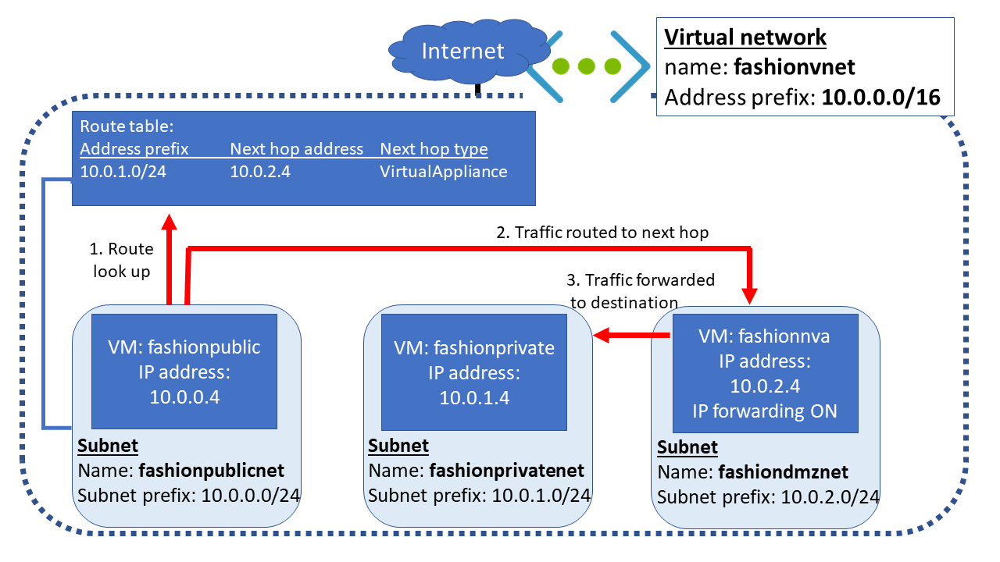
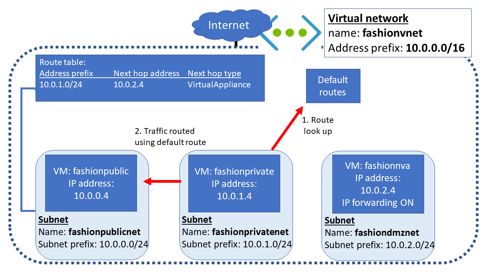

Now that the NVA and virtual machines have been created, you'll route the traffic through the NVA


## Create public and private VMs

The next step is to deploy a VM into the public and private subnets.

1. Open the *Code* editor and create a file named *cloud-init.txt*.

    ```bash
    code cloud-init.txt
    ```

1. Add the following configuration information to the file. This file installs the *inetutils-traceroute* package when you create a new VM. This package contains the *traceroute* utility that you'll use later in this exercise.

    ```Text
    #cloud-config
    package_upgrade: true
    packages:
       - inetutils-traceroute
    ```

1. Press Ctrl-S to save the file, and then press Ctrl+Q close the Code editor.

1. Run the following command in the Cloud Shell to create the public virtual machine. Replace `<password>` with a suitable password for the *azureuser* admin account.

    ```azurecli
    az vm create \
        --resource-group <rgn>[sandbox resource group name]</rgn> \
        --name public \
        --vnet-name vnet \
        --subnet publicsubnet \
        --image UbuntuLTS \
        --admin-username azureuser \
        --admin-password <password> \
        --custom-data cloud-init.txt \
        --no-wait
    ```

1. Run the following command to create the public virtual machine. Replace `<password>` with a suitable password.

    ```azurecli
    az vm create \
        --resource-group <rgn>[sandbox resource group name]</rgn> \
        --name private \
        --vnet-name vnet \
        --subnet privatesubnet \
        --image UbuntuLTS \
        --admin-username azureuser \
        --admin-password <password> \
        --custom-data cloud-init.txt \
        --no-wait
    ```

1. Run the following command to check that the VMs are running. Repeat this command until the status of both VMs is shown as *Running*.

    ```azurecli
    az vm list \
        --resource-group <rgn>[sandbox resource group name]</rgn> \
        --output table \
        --show-details
    ```

1. Run the following command to save the public IP address of the *public* VM to a variable named *PUBLICIP*.

    ```azurecli
    PUBLICIP="$(az vm list-ip-addresses \
        --resource-group <rgn>[sandbox resource group name]</rgn> \
        --name public \
        --query "[].virtualMachine.network.publicIpAddresses[*].ipAddress" \
        --output tsv)"

    echo $PUBLICIP
    ```

1. Run the following command to save the public IP address of the *private* VM to a variable named *PRIVATEIP*.

    ```azurecli
    PRIVATEIP="$(az vm list-ip-addresses \
        --resource-group <rgn>[sandbox resource group name]</rgn> \
        --name private \
        --query "[].virtualMachine.network.publicIpAddresses[*].ipAddress" \
        --output tsv)"

    echo $PRIVATEIP
    ```

## Test traffic routing through the network virtual appliance

The final step is to use the Linux *traceroute* utility to show how traffic is being routed. You'll use SSH to run the *traceroute* command on each VM. The first test will show the route taken by ICMP packets sent from the **public** VM to the **private** VM. The second test will show the route taken by ICMP packets sent from the **private** VM to the **public** VM.

1. Run the following command to trace the route from **public** to **private**. Type *yes* when asked whether you want to continue connecting. Enter the password for the *azureuser* account that you specified earlier, when prompted.

    ```bash
    ssh -t azureuser@$PUBLICIP 'traceroute private --type=icmp; exit'
    ```

    The output should look similar to the following example:

    ```Text
    traceroute to private.kzffavtrkpeulburui2lgywxwg.gx.internal.cloudapp.net (10.0.1.4), 64 hops max
    1   10.0.2.4  0.710ms  0.410ms  0.536ms
    2   10.0.1.4  0.966ms  0.981ms  1.268ms
    Connection to 52.165.151.216 closed.
    ```

    Notice that the first hop is to 10.0.2.4. This address is the private IP address for **nva**. The second hop is to the address of **private** (10.0.1.4). Remember that in the first exercise, you added this route to the route table and linked the table to the **publicsubnet**  subnet. So all traffic from **public** to **private** is being routed through network virtual appliance.

   

1. Run the following command to trace the route from **private** to **public**. Again, type *yes*, and enter the password for the *azureuser* account when prompted.

    ```bash
    ssh -t azureuser@$PRIVATEIP 'traceroute public --type=icmp; exit'
    ```

    You should see the traffic go directly to **public** (10.0.0.4) and not through the NVA, as shown below.

    ```Text
    traceroute to public.kzffavtrkpeulburui2lgywxwg.gx.internal.cloudapp.net (10.0.0.4), 64 hops max
    1   10.0.0.4  1.095ms  1.610ms  0.812ms
    Connection to 52.173.21.188 closed.
    ```

    The **private** VM is using default routes, and traffic is being routed directly between the subnets.

   

You've now configured routing between subnets to direct traffic from the public Internet through the `dmzsubnet` subnet before it reaches the private subnet. You've added a VM acting as an NVA in the `dmzsubnet` subnet. You can implement logic in this NVA to detect potentially malicious requests, and block them before they reach their intended targets.