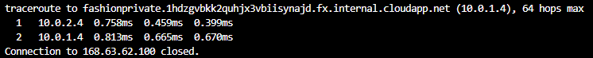
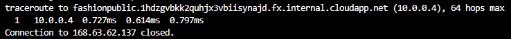

Now that the NVA and Virtual machines have been created, we now need to route the traffic through the NVA


## Create public and private VMs
The next step is to deploy a VM into the public and private subnets.

1. Run the following command in the Cloud Shell to create the public virtual machine, replacing `<password>` with the password you'll use for the admin account.
   ```azurecli
   wget -N http://raw.githubusercontent.com/dscoombes/routes/master/cloud-init.txt && \
   az vm create \
   --resource-group <rgn>[sandbox resource group name]</rgn> \
   --name fashionpublic \
   --vnet-name fashionvnet \
   --subnet fashionpublicnet \
   --image UbuntuLTS \
   --admin-username azureuser \
   --admin-password <password> \
   --custom-data cloud-init.txt \
   --no-wait
   ```
1. Run the following command in the Cloud Shell to create the public virtual machine, replacing `<password>` with the password you'll use for the admin account.
   ```azurecli
   az vm create \
   --resource-group <rgn>[sandbox resource group name]</rgn> \
   --name fashionprivate \
   --vnet-name fashionvnet \
   --subnet fashionprivatenet \
   --image UbuntuLTS \
   --admin-username azureuser \
   --admin-password <password> \
   --custom-data cloud-init.txt \
   --no-wait
   ```
1. Run the following command in the Cloud Shell to check that the VMs are running.
   ```azurecli
   az vm list \
   --resource-group <rgn>[sandbox resource group name]</rgn> \
   --output table \
   --show-details
   ```
1. Run the following command in the Cloud Shell to save the public IP address of the fashionpublic VM to a variable.
   ```azurecli
   PUBLICIP="$(az vm list-ip-addresses \
   --resource-group <rgn>[sandbox resource group name]</rgn> \
   --name fashionpublic \
   --query "[].virtualMachine.network.publicIpAddresses[*].ipAddress" \
   --output tsv)"
   ```
1. Run the following command in the Cloud Shell to save the public IP address of the fashionprivate VM to a variable.
   ```azurecli
   PRIVATEIP="$(az vm list-ip-addresses \
   --resource-group <rgn>[sandbox resource group name]</rgn> \
   --name fashionprivate \
   --query "[].virtualMachine.network.publicIpAddresses[*].ipAddress" \
   --output tsv)"
   ```

## Test traffic routing through the network virtual appliance
The final step is to use the Linux trace route utility to test how traffic is being routed. You'll use SSH to run a trace route command on each VM. The first test will show the route taken by ICMP packets sent from **fashionpublic** to **fashionprivate**. The second test will show the route taken by ICMP packets sent from **fashionprivate** to **fashionpublic**.

1. Run the following command in the Cloud Shell to trace the route from **fashionpublic** to **fashionprivate**.
   ```bash
   ssh -t azureuser@$PUBLICIP 'traceroute fashionprivate --type=icmp; exit; bash'
   ```
1. You will notice that the first hop is to 10.0.2.4. That is the private IP address for **fashionnva**. The second hop is to the address of **fashionprivate** (10.0.1.4).

   

1. Remember that in the first exercise, you added this route to the route table and linked the table to the **fashionpublicnet**  subnet. So all traffic from **fashionpublic** to **fashionprivate** is being routed through network virtual appliance.

   


1. Run the following command in the Cloud Shell to trace the route from **fashionprivate** to **fashionpublic**.
   ```bash
   ssh -t azureuser@$PRIVATEIP 'traceroute fashionpublic --type=icmp; exit; bash'
   ```
1. You should see the traffic go directly to **fashionpublic** (10.0.0.4) and not through the appliance. 

   

1. This is because the **fashionprivate** VM is using default routes, and traffic is being routed directly between the subnets.

   