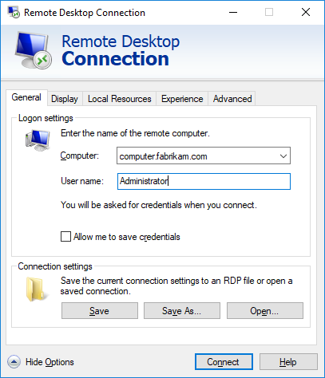

## Motivation

<!-- I really don't think this has anything to do with VMs. This is about RDP, which makes it not really an Azure thing and more of a Windows thing. I would cut this whole page. Also, I don't think a lot of what you are saying about RDP is true for Azure VMs. Azure VMs are Gen 1 Hyper-V VMs and a lot of the RDP features aren't supported. --> 
As network administrator at a data analysis company, you're responsible for connecting to Virtual Machines in Azure and checking that they are properly configured. You'll do that using a Remote Desktop Protocol (RDP) client to connect to the VM's Windows user interface.

## What is Remote Desktop Protocol?

Remote Desktop Protocol or RDP provides remote connectivity to the UI of Windows-based computers. RDP enables you to sign in to a remote physical or virtual Windows computer and control that computer as if you were seated at the console.

Note: Windows Hyper-V in Windows Server 2016 and Windows 10 uses RDP to connect to virtual machines running on the hypervisor.

An RDP connection enables you to carry out the vast majority of operations that you can do seated at the console of a physical computer, with the exception of some power- and hardware-related functions.

An RDP connection requires an RDP client. Microsoft provides RDP clients for the following operating systems:

* Windows
* iOS
* MacOS
* Android

There are also open-source Linux clients, such as Remmina that enable you to connect to a Windows PC from an Ubuntu distribution.

Windows 10 includes an RDP client.

## What functionality does an RDP connection support?

With an RDP connection, you can interact with the UI. However, you can also connect to other services on the remote computer. These services include:

* Printer connections, enabling the remote computer to print to your local print device.
* Audio playback, where audio can play either on the local computer or on the remote device.
* Audio recording, where you can record audio from the local computer and direct that sound to the remote device.
* Ports, which you can redirect to the ports on the local computer.
* Drives, including mapped network drives, where these drives will appear as connected to the remote computer.
* Video capture devices, such as integrated web cams.
* Other supported plug and play devices.

Not all these features are supported in Azure, as there are restrictions on what physical assets are available on that platform. For example, only software printers can be redirected across an RDP connection from an Azure-hosted VM to the connecting client's print devices.

## Configure network settings for RDP access to Virtual Machines

Connections to Azure VMs can be made in three ways:

1. Directly to the public IP address of the VM
2. Through a virtual private network (VPN) connection
3. Through an ExpressRoute connection

A public IP address can either be permanently allocated or dynamic. You also need to ensure that you have access to the VM's public address on port 3389 (RDP). This provision may require negotiation with the team managing your organization's firewall security, setting up a rule to your VM's public IP address on port 3389.

Dynamic public IP addresses get reallocated every time the VM restarts. Static addresses are persistent, but cost more.

To connect through a VPN, your local network must have an active VPN connection to Microsoft Azure.

The ExpressRoute link approach manages connectivity to the VM. This approach also provides the lowest latency and highest bandwidth connection.

[!Note] Regardless of which option you use to connect to Azure, you need to ensure the virtual machine is accessible over RDP, typically on the default port 3389. You can configure the VM so it can be accessed from only your own client IP address.  Connecting to a VM over port 3389 on a public IP address is only recommended for test environments. In production environments, use options 2 or 3

## How do you connect to a VM in Azure using RDP?

Connecting to a VM in Azure using RDP is a simple process. In the Azure Portal, you go to the properties of your VM, and at the top, click **Connect**. This action downloads a preconfigured .RDP file that Windows then opens in the RDP client. You can choose to connect over the public IP address of the VM in the RDP file. Alternatively, if you are connecting over VPN or ExpressRoute, you can select the internal IP address. You can also select the port number for the connection.

If you are using a static public IP address for the VM, then you can save the .RDP file to your desktop. If you are using dynamic IP addressing, the .RDP file only remains valid while the VM is running; if you stop and restart it, you must download another .RDP file.

[!Note] You can also enter the public IP address of the VM into the Windows RDP client and click Connect.

When you connect, you will typically receive two warnings. These are:

* Publisher warning - caused by the .RDP file not being publicly signed.
* Certificate warning - caused by the machine certificate not being trusted

In test environments, these warnings can be ignored. In production environments, the .RDP file could be signed using RDPSIGN.EXE and the machine certificate placed in the client's Trusted Root Certification Authorities store.

## Summary

You now can connect to a Windows VM by using RDP. In the following exercise, you will use RDP to connect to a VM, then install a server role on that computer.
