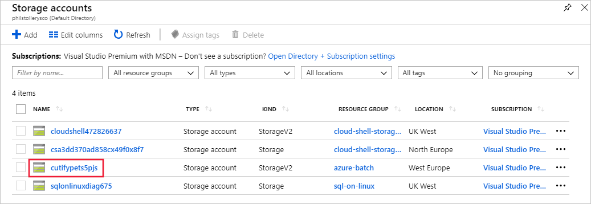
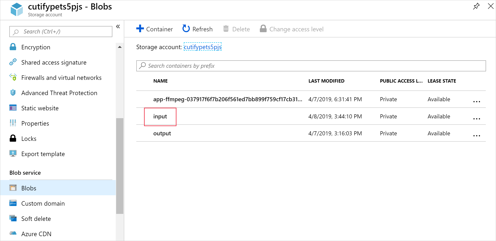
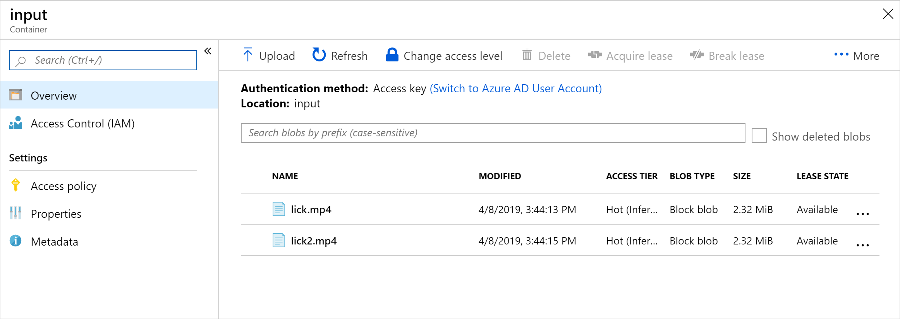

[!include[](../../../includes/azure-exercise-subscription-prerequisite.md)]

The Azure Storage library allows you to programmatically control file storage in an Azure Storage account.

In this exercise, we'll enhance our app to upload videos to blob storage. 

## Add the storage account connection details

1. In the Cloud Shell, add the Azure Blob storage NuGet package.

    ```bash
    dotnet add package Microsoft.Azure.Storage.Blob
    ```

1. Edit the `Program.cs` file in the editor:

    ```bash
    code Program.cs
    ```

1. Add the following using statements to the top of **Program.cs** to include the libraries our storage work needs. 

    ```csharp
    using Microsoft.Azure.Storage.Blob;
    using Microsoft.Azure.Storage;
    using System.IO;
    ```

     `Microsoft.Azure.Storage.Blob` and `Microsoft.Azure.Storage` give the app access to the Azure Storage account.
    `System.IO` gives the app access to the file system for file handling.

1. Add variables for the Azure Storage credentials to the `Program` class in **Program.cs**.

    ```csharp
    // Storage account credentials
    private const string envVarStorage = "STORAGE_NAME";
    private const string envVarStorageKey = "STORAGE_KEY";
    private static string storageAccountName;
    private static string storageAccountKey;
    ```

## Create an input and output container

1. Replace `Main()` in **Program.cs** with the following update, which adds code to manage the storage account. 

    ```csharp
    static async Task Main(string[] args)
    {
        // Read the environment variables to allow the app to connect to the Azure Batch and Azure Storage accounts
        batchAccountUrl = Environment.GetEnvironmentVariable(envVarBatchURI);
        batchAccountName = Environment.GetEnvironmentVariable(envVarBatchName);
        batchAccountKey = Environment.GetEnvironmentVariable(envVarKey);
        storageAccountName = Environment.GetEnvironmentVariable(envVarStorage);
        storageAccountKey = Environment.GetEnvironmentVariable(envVarStorageKey);

        // Show the user the accounts they are attaching to
        Console.WriteLine("BATCH URL: {0}, Name: {1}, Key: {2}", batchAccountUrl, batchAccountName, batchAccountKey);
        Console.WriteLine("Storage Name: {0}, Key: {1}", storageAccountName, storageAccountKey);

        // Construct the Storage account connection string
        string storageConnectionString = String.Format("DefaultEndpointsProtocol=https;AccountName={0};AccountKey={1}",
                            storageAccountName, storageAccountKey);

        // Retrieve the storage account
        CloudStorageAccount storageAccount = CloudStorageAccount.Parse(storageConnectionString);

        // Create the blob client, for use in obtaining references to blob storage containers
        CloudBlobClient blobClient = storageAccount.CreateCloudBlobClient();

        // Use the blob client to create the containers in blob storage
        const string inputContainerName = "input";
        const string outputContainerName = "output";

        await CreateContainerIfNotExistAsync(blobClient, inputContainerName);
        await CreateContainerIfNotExistAsync(blobClient, outputContainerName);

        // RESOURCE FILE SETUP
        // Add *.mp4 files into the \<solutiondir>\InputFiles folder.

        string inputPath = Path.Combine(Environment.CurrentDirectory, "InputFiles");
        List<string> inputFilePaths = new List<string>(
            Directory.GetFileSystemEntries(inputPath, "*.mp4", SearchOption.TopDirectoryOnly));

        // Upload data files.
        // Upload the data files using UploadResourceFilesToContainer(). This data will be
        // processed by each of the tasks that are executed on the compute nodes within the pool.
        List<ResourceFile> inputFiles = await UploadFilesToContainerAsync(blobClient, inputContainerName, inputFilePaths);

        // Obtain a shared access signature that provides write access to the output container to which
        // the tasks will upload their output.
        string outputContainerSasUrl = GetContainerSasUrl(blobClient, outputContainerName, SharedAccessBlobPermissions.Write);

        // The batch client requires a BatchSharedKeyCredentials object to open a connection
        var sharedKeyCredentials = new BatchSharedKeyCredentials(batchAccountUrl, batchAccountName, batchAccountKey);
        var batchClient = BatchClient.Open(sharedKeyCredentials);
    
        // Create the Batch pool, which contains the compute nodes that execute tasks.
        await CreateBatchPoolAsync(batchClient, PoolId);
    }
    ```

    In the above code, a `CloudStorageAccount` object is created to enable the app to create a blob client. The client is used to create the storage containers, upload the files, and give access to the job to write to the output container.

## Create storage containers for the input and output of files

1. Add the following method, `CreateContainerIfNotExistAsync()`  to create a container with the given name.

    ```csharp
    private static async Task CreateContainerIfNotExistAsync(CloudBlobClient blobClient, string containerName)
    {
        CloudBlobContainer container = blobClient.GetContainerReference(containerName);
        await container.CreateIfNotExistsAsync();
        Console.WriteLine("Creating container [{0}].", containerName);
    }
    ```

    The above code uses the `CloudBlobClient` created in the `Main` method to create containers.

## Process the list of all the files to upload

1. Add the following method, `UploadFilesToContainerAsync()` to upload a list of input files to the container.

    ```csharp
    private static async Task<List<ResourceFile>> UploadFilesToContainerAsync(CloudBlobClient blobClient, string inputContainerName, List<string> filePaths)
    {
        List<ResourceFile> resourceFiles = new List<ResourceFile>();

        foreach (string filePath in filePaths)
        {
            resourceFiles.Add(await UploadResourceFileToContainerAsync(blobClient, inputContainerName, filePath));
        }

        return resourceFiles;
    }
    ```

    The above code uses the created list of file paths to call a method to upload them, and store the produced ResourceFile reference for use by the Batch job.

## Upload the files

1. Add a method to upload the local files to Azure storage.

    ```csharp
    private static async Task<ResourceFile> UploadResourceFileToContainerAsync(CloudBlobClient blobClient, string containerName, string filePath)
    {
        Console.WriteLine("Uploading file {0} to container [{1}]...", filePath, containerName);

        string blobName = Path.GetFileName(filePath);
        var fileStream = System.IO.File.OpenRead(filePath);

        CloudBlobContainer container = blobClient.GetContainerReference(containerName);
        CloudBlockBlob blobData = container.GetBlockBlobReference(blobName);
        await blobData.UploadFromFileAsync(filePath);

        // Set the expiry time and permissions for the blob shared access signature. In this case, no start time is specified,
        // so the shared access signature becomes valid immediately
        SharedAccessBlobPolicy sasConstraints = new SharedAccessBlobPolicy
        {
            SharedAccessExpiryTime = DateTime.UtcNow.AddHours(2),
            Permissions = SharedAccessBlobPermissions.Read
        };

        // Construct the SAS URL for the blob
        string sasBlobToken = blobData.GetSharedAccessSignature(sasConstraints);
        string blobSasUri = String.Format("{0}{1}", blobData.Uri, sasBlobToken);

        return ResourceFile.FromUrl(blobSasUri, blobName);
    }
    ```

    The above code uses the `CloudBlobClient` to asynchronously upload the files. It builds a resource file that gets added to a list that will be used by the task added in the next exercise.

## Enable access to the output folder

1. Create a Shared Access Signature (SAS) reference to the output container for tasks to write their files to.

    ```csharp
    private static string GetContainerSasUrl(CloudBlobClient blobClient, string containerName, SharedAccessBlobPermissions permissions)
    {
        // Set the expiry time and permissions for the container access signature. In this case, no start time is specified,
        // so the shared access signature becomes valid immediately. Expiration is in 2 hours.
        SharedAccessBlobPolicy sasConstraints = new SharedAccessBlobPolicy
        {
            SharedAccessExpiryTime = DateTime.UtcNow.AddHours(2),
            Permissions = permissions
        };

        // Generate the shared access signature on the container, setting the constraints directly on the signature
        CloudBlobContainer container = blobClient.GetContainerReference(containerName);
        string sasContainerToken = container.GetSharedAccessSignature(sasConstraints);

        // Return the URL string for the container, including the SAS token
        return String.Format("{0}{1}", container.Uri, sasContainerToken);
    }
    ```

    The above code creates a SAS url with limited access (2 hours) for the task to enable it to write the converted animated GIFs to the Blob storage.

1. Select the ellipses in the top-right corner of the code editor.

1. Select **Close Editor**, and in the dialog select **Save**.

## Test the file uploads


1. In the Cloud Shell, create an InputFiles folder in your app directory. 

    ```bash
    mkdir InputFiles
    ```


1. Run the following `curl` commands in the Cloud Shell to copy a set of sample pet videos from the module's GitHub repo into the local InputFiles folder.

    ```bash
    curl -L https://github.com/MicrosoftDocs/mslearn-apps-and-batch/raw/master/cutifypets/InputFiles/1.mp4 > ./InputFiles/1.mp4
    curl -L https://github.com/MicrosoftDocs/mslearn-apps-and-batch/raw/master/cutifypets/InputFiles/2.mp4 > ./InputFiles/2.mp4
    curl -L https://github.com/MicrosoftDocs/mslearn-apps-and-batch/raw/master/cutifypets/InputFiles/3.mp4 > ./InputFiles/3.mp4
    curl -L https://github.com/MicrosoftDocs/mslearn-apps-and-batch/raw/master/cutifypets/InputFiles/4.mp4 > ./InputFiles/4.mp4
    curl -L https://github.com/MicrosoftDocs/mslearn-apps-and-batch/raw/master/cutifypets/InputFiles/5.mp4 > ./InputFiles/5.mp4
    curl -L https://github.com/MicrosoftDocs/mslearn-apps-and-batch/raw/master/cutifypets/InputFiles/6.mp4 > ./InputFiles/6.mp4
    ```

1. Save the Azure Storage credentials to environment variables. The second command is using the *RESOURCE_GROUP* environment variable that we defined in the **Set up connection details for the application** section of the earlier exercise, **Exercise - Access your Batch account using the .NET client library**. The value is the name of the resource group you selected when you created your Batch account. 

    ```bash
    export STORAGE_NAME=$(az storage account list --query "[?contains(name,'cuti')].name" --output tsv)
    export STORAGE_KEY=$(az storage account keys list --account-name $STORAGE_NAME --query [0].value --output tsv --resource-group $RESOURCE_GROUP)
    ```

1. Build and run the app.

    ```bash
    dotnet run
    ```

1. The program should run and write the following messages to the terminal:

    ```bash
    BATCH URL: [your batch url], Name: [your batch account name], Key: [your batch key]
    Storage Name: [your storage account name], Key: [your storage key]
    Creating container [input].
    Creating container [output].
    Uploading file ~\cutifypets\InputFiles\lick.mp4 to container [input]...
    Uploading file ~\cutifypets\InputFiles\lick2.mp4 to container [input]...
    Creating pool [WinFFmpegPool]...
    ```
    <!-- TODO change output to match all the files that we are having the learner upload -->

## Check the files uploaded using the Azure portal

1. Return to the Azure portal, on the left select Storage accounts, then select the storage account your created in the first exercise.

    

1. In the Azure portal, on the left select Blobs, then select the input folder.

    

1. The folder contains the uploaded videos.

    
