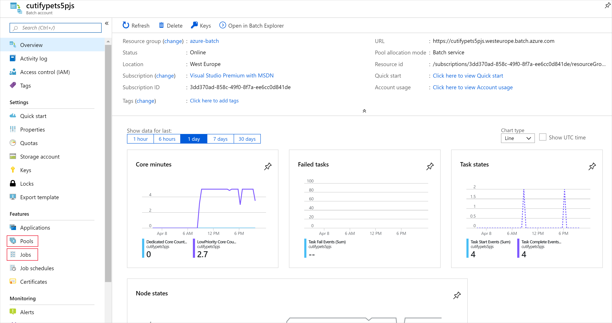
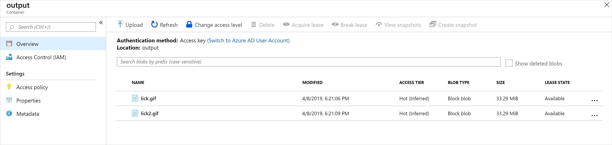

The Azure batch client API allows you to programmatically control all the components of an Azure Batch account.

Continuing to enhance your companies console app, you'll now add all the components needed to convert the videos you uploaded in the last exercise.

[!include[](../../../includes/azure-exercise-subscription-prerequisite.md)]

By the end of this exercise, you'll have a working Batch process that can convert MP4 videos to animated GIFs. The app will add a job to the existing pool, and add and start the video conversion tasks.

## Enhance the code using the batch client

1. In the Cloud Shell, edit the `Program.cs` file in the editor:

    ```bash
    code Program.cs
    ```

1. Add a constant to **Program.cs** for the JobId we'll use in our Batch job. 

    ```csharp
    private const string JobId = "WinFFmpegJob";
    ```

1. Replace these lines in the **Main** method:

    ```csharp
        var batchClient = BatchClient.Open(sharedKeyCredentials);

        // Create the Batch pool, which contains the compute nodes that execute tasks.
        await CreateBatchPoolAsync(batchClient, PoolId);
    ```

    With a using block for the `batchClient`

    ```csharp
    using (BatchClient batchClient = BatchClient.Open(sharedKeyCredentials))
    {
        // Create the Batch pool, which contains the compute nodes that execute the tasks.
        await CreateBatchPoolAsync(batchClient, PoolId);

        // Create the job that runs the tasks.
        await CreateJobAsync(batchClient, JobId, PoolId);

        // Create a collection of tasks and add them to the Batch job.
        await AddTasksAsync(batchClient, JobId, inputFiles, outputContainerSasUrl);
    }
    ```

## Create a job

1. Add this new method, `CreateJobAsync()` to **Program.cs** to create and add a job to the pool.

    ```csharp
    private static async Task CreateJobAsync(BatchClient batchClient, string jobId, string poolId)
    {
            Console.WriteLine("Creating job [{0}]...", jobId);

            CloudJob job = batchClient.JobOperations.CreateJob();
            job.Id = jobId;
            job.PoolInformation = new PoolInformation { PoolId = poolId };

            await job.CommitAsync();
    }
    ```

    The code above uses the batch client to create a job. The method assigns the given job id and information about the pool.

## Add a task

1. With the job created, the last step is to add a task to the job. Add the following method, `AddTaskAsync()`, to **Program.cs**.

    ```csharp
    private static async Task<List<CloudTask>> AddTasksAsync(BatchClient batchClient, string jobId, List<ResourceFile> inputFiles, string outputContainerSasUrl)
    {
        Console.WriteLine("Adding {0} tasks to job [{1}]...", inputFiles.Count, jobId);

        // Create a collection to hold the tasks added to the job
        List<CloudTask> tasks = new List<CloudTask>();

        for (int i = 0; i < inputFiles.Count; i++)
        {
            // Assign a task ID for each iteration
            string taskId = String.Format("Task{0}", i);

            // Define task command line to convert the video format from MP4 to animated GIF using ffmpeg.
            // Note that ffmpeg syntax specifies the format as the file extension of the input file
            // and the output file respectively. In this case inputs are MP4.
            string appPath = String.Format("%AZ_BATCH_APP_PACKAGE_{0}#{1}%", appPackageId, appPackageVersion);
            string inputMediaFile = inputFiles[i].FilePath;
            string outputMediaFile = String.Format("{0}{1}",
                System.IO.Path.GetFileNameWithoutExtension(inputMediaFile),
                ".gif");

            // This is the dos command built by using the ffmpeg application package, the paths from the input container
            string taskCommandLine = String.Format("cmd /c {0}\\ffmpeg-3.4-win64-static\\bin\\ffmpeg.exe -i {1} {2}", appPath, inputMediaFile, outputMediaFile);

            // Create a cloud task (with the task ID and command line) and add it to the task list
            CloudTask task = new CloudTask(taskId, taskCommandLine);
            task.ResourceFiles = new List<ResourceFile> { inputFiles[i] };

            // Task output file will be uploaded to the output container in Storage.
            List<OutputFile> outputFileList = new List<OutputFile>();
            OutputFileBlobContainerDestination outputContainer = new OutputFileBlobContainerDestination(outputContainerSasUrl);
            OutputFile outputFile = new OutputFile(outputMediaFile,
                                                    new OutputFileDestination(outputContainer),
                                                    new OutputFileUploadOptions(OutputFileUploadCondition.TaskSuccess));
            outputFileList.Add(outputFile);
            task.OutputFiles = outputFileList;
            tasks.Add(task);
        }

        // Call BatchClient.JobOperations.AddTask() to add the tasks as a collection rather than making a
        // separate call for each. Bulk task submission helps to ensure efficient underlying API
        // calls to the Batch service.
        await batchClient.JobOperations.AddTaskAsync(jobId, tasks);

        return tasks;
    }
    ```

    This final method does all the complex actions of the app. A task is added to the job for each file that has been uploaded. The task takes the form of a shell command. The app (`ffmpeg`) has been installed on each node at a specific location because we used an application package. The Batch service stores that location in an environment variable on the node so that it can be accessed via:

    `%AZ_BATCH_APP_PACKAGE_ffmpeg#3.4%`

    Using this approach it's easy to upload and increment newer versions of the `ffmpeg` app. The command looks into the zip folder, and executes:

    `ffmpeg.exe -i input-filename output-filename`

    For the best performance, the tasks are added as a list to the `batchClient.JobOperations.AddTaskAsync`. This is more efficient than making a separate call for each file.

## Test the console app

1. Select the ellipses in the top-right corner of the code editor.

1. Select **Close Editor**, and in the dialog select **Save**.

1. In the integrated terminal, build and run the app.

    ```bash
    dotnet run
    ```

1. The below messages are written to the terminal.

    ```bash
    Creating container [input].
    Creating container [output].
    Uploading file ~\cutifypets\InputFiles\3.mp4 to container [input]...
    Uploading file ~\cutifypets\InputFiles\2.mp4 to container [input]...
    Uploading file ~\cutifypets\InputFiles\4.mp4 to container [input]...
    Uploading file ~\cutifypets\InputFiles\1.mp4 to container [input]...
    Uploading file ~\cutifypets\InputFiles\5.mp4 to container [input]...
    Uploading file ~\cutifypets\InputFiles\6.mp4 to container [input]...
    Creating pool [WinFFmpegPool]...
    Creating job [WinFFmpegJob]...
    Adding 2 tasks to job [WinFFmpegJob]...
    ```

1. The console app closes as soon as it has added the tasks. In Azure, the pool, nodes, job, and tasks are created. There's nothing monitoring what's happening within the app as it has exited. To see the current status of the conversion, and check the results, return to the Azure portal.

1. In the Azure portal, on the **Dashboard** select the Batch account beginning `cutify`.

    

1. The health dashboard is shown on the Overview page, from here you can check the status of the current running job and the pool of nodes.

1. On the left, select **Jobs**, select **WinFFmpegJob**. On this page, you'll see the current status of the tasks.

1. When the tasks have completed, on the left select **Storage accounts**, then select the storage account your created in the first exercise.

1. On the left select **Blobs**, then select the **output** folder.

    

1. The folder contains the converted animated gif files.

    

1. Download a file to check the cutest pet video.

    <!-- TODO replace the above with the cutest pet video -->
