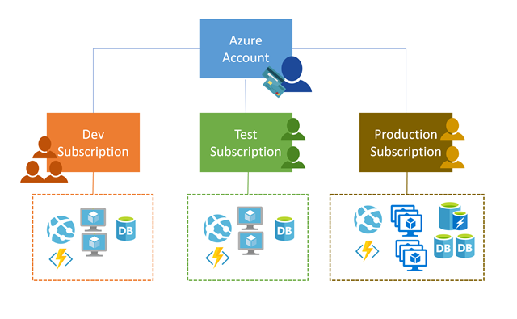

You can create multiple subscriptions under a single Azure account. This is particularly useful for businesses because _access control_ and _billing_ occur at the **subscription level**, not the account level.

## Access management

You can create separate subscriptions on your Azure account to reflect different organizational structures. For example, you could limit engineering to lower-cost resources, while allowing the IT department a full range. This design allows you to manage and control access to the resources that users provision within each subscription.

> [!IMPORTANT]
> Subscriptions are also bound to some hard limitations. For example, the maximum number of Express Route circuits per subscription is 10. Those limits should be considered as you create subscriptions on your account. If there is a need to go over those limits in particular scenarios, then additional subscriptions may be needed.

## Billing

One bill is generated for every Azure subscription on a monthly basis. The payment is charged automatically to the associated account credit or debit card within 10 days after the billing period ends. On your credit card statement, the line item would say **MSFT Azure**. 

> [!NOTE]
> Subscriptions are billed independently, but the _account owner_ is responsible for payment. In the case of "Pay-as-you-go" subscriptions, the account credit card will be charged for all associated subscriptions.

You can analyze your bill in the Azure portal - this will provide access to all your invoices, as well as a cost analysis breakdown of what got charged each month.

You can set spending limits on each subscription to ensure you aren't surprised at the end of the month. Reports can be generated by subscriptions, if you have multiple internal departments and need to do "chargeback," a possible scenario is to create subscriptions by department or project.