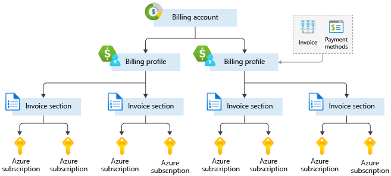

With Azure, you only pay for what you use. You’ll receive a monthly invoice with payment instructions provided. You may organize your invoice into line items that make sense to you and meet your budget and cost tracking needs. You also can get set up for multiple invoices. Let’s take a look at how this works.

## Azure subscription

When you sign up, an Azure subscription is created by default. An Azure subscription is a logical container used to provision resources in Azure. It holds the details of all your resources like virtual machines (VMs), databases, and more. When  you create an Azure resource like a VM, you identify the subscription it belongs to.  As you use the VM, the usage of the VM is aggregated and billed monthly.

## Create additional Azure subscriptions

You might want to create additional subscriptions for resource or billing management purposes. For example, you might choose to create additional subscriptions to separate:

- **Environments**: When managing your resources, you can choose to create subscriptions to set up separate environments for development and testing, security, or to isolate data for compliance reasons. This is particularly useful because resource access control occurs at the subscription level.
- **Organizational structures**: You can create subscriptions to reflect different organizational structures. For example, you could limit a team to lower-cost resources, while allowing the IT department a full range. This design allows you to manage and control access to the resources that users provision within each subscription.
- **Billing**: You might want to also create additional subscriptions for billing purposes. Because costs are first aggregated at the subscription level, you might want to create subscriptions to manage and track costs based on your needs. For instance, you might want to create a subscription for your production workloads and another subscription for your development and testing workloads.

You might also need additional subscriptions due to:
- **Subscription limits**: Subscriptions are bound to some hard limitations. For example, the maximum number of Express Route circuits per subscription is 10. Those limits should be considered as you create subscriptions on your account. If there is a need to go over those limits in particular scenarios, then you might need additional subscriptions.

## Customize billing to meet your needs

If you have multiple subscriptions, you can organize them into invoice sections. Each invoice section is a line item on the invoice that shows the charges incurred that month.  For example, you might need a single invoice for your organization but want to organize charges by department, team, or project.

Depending on your needs, you can set up multiple invoices within the same billing account. To do this, create additional billing profiles. Each billing profile has its own monthly invoice and payment method.

The following diagram shows an overview of how billing is structured. If you've signed up for Azure or if your organization has an Enterprise Agreement, your billing might be set up differently.

