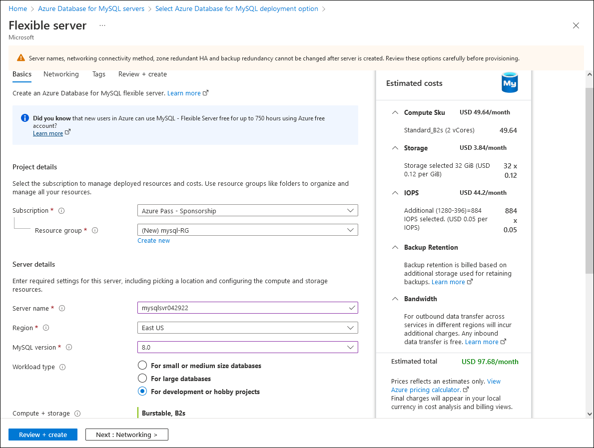
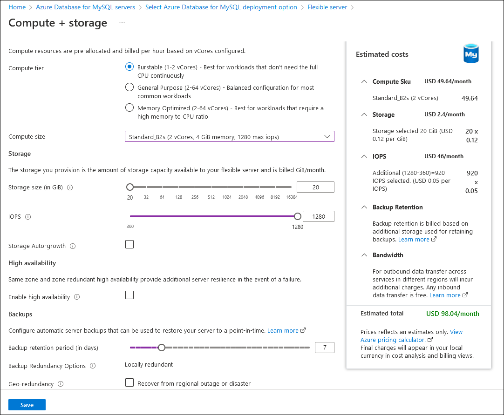
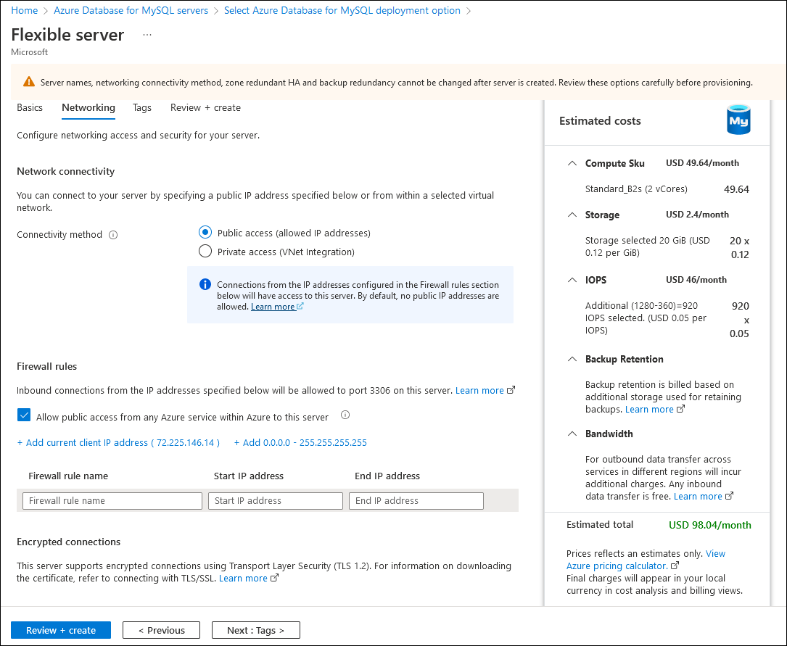

Now that you’ve reviewed the deployment and connectivity options of Azure Database for MySQL, you want to test the process of provisioning a server and validate its availability by connecting to it. In this unit, you’ll step through a sample deployment and connect to the server by using the mysql.exe utility from the Azure Cloud Shell.

> [!NOTE]
> Be aware you might incur costs in your Azure Subscription when you run this exercise.

### Task 1: Deploy Azure Database for MySQL Flexible Server

Use the following procedure to deploy an Azure Database for MySQL Flexible Server from the Azure portal:

1. From your computer, open a web browser window and navigate to the Azure portal at https://portal.azure.com.

2. Use the **Search resources, services, and docs** text box to search for and select **Azure Database for MySQL**.

3. On the **Azure Database for MySQL servers** page, select **Create**.

4. On the **Select Azure Database for MySQL deployment option** page, select **Flexible server** as the deployment option.

5. On the **Flexible server** page, on the **Basics** tab, enter the information in the following table.

   | **Setting**                  | **Value**                          | **Description**                                              |
   | ---------------------------- | ---------------------------------- | ------------------------------------------------------------ |
   | **Subscription**             | The name of  your subscription     | Enter the name  of the Azure subscription that you want to use for your server. |
   | **Resource group**           | mysql-RG                           | Enter the  name of a new or existing resource group to host the deployment. |
   | **Server name**              | <server_name>                      | Enter any  valid and globally unique name that will identify your flexible server. The fully  qualified name of the server consists of this name followed by the suffix mysql.database.azure.com.  The server name can contain only lowercase letters, numbers, and the hyphen  (-) character. It must contain between 3 and 63 characters. |
   | **Region**                   | The name of  an Azure region       | Enter the name  of the Azure region that will host your server. Select any region that  supports Azure Database for MySQL Flexible Server deployment, and that is close  to the location of the computer you use to run this exercise. |
   | **MySQL version**            | 8.0                                | Enter the MySQL  major version your app will be using.       |
   | **Workload type**            | For  development or hobby projects | Enter the  intended workload type, which determines the VM SKU to host the server. |
   | **Availability zone**        | No preference                      | This is the  setting that allows you to specify an availability zone where the server will  be deployed. Your choice is typically based on the zone hosting the  application tier. |
   | **Enable high availability** | Not selected                       | This is the  setting that determines whether you want to have a replica server  automatically provisioned in another availability zone (for zonal  deployments). This option requires the choice of either **General Purpose** or **Memory Optimized** VM SKUs  compute tier). |
   | **Admin username**           | <server_name>                      | Enter any  valid user name, which will be configured as the admin account for the MySQL  server instance. Do not use azure_superuser, admin, administrator, root,  guest, or public. |
   | **Password**                 | <server_name>                      | Enter any  valid password that is assigned to the admin account. It must contain between  8 and 128 characters, and include characters from three of the following  categories: English uppercase letters, English lowercase letters, numbers (0  through 9), and non-alphanumeric characters (such as !, $, #, %). |

   

6. On the **Basics** tab, select the **Configure server** link.

7. On the **Compute + Storage** page, configure the following settings, and then select **Save**:

   a. From the **Compute** **size** drop-down list, select **Standard_B1s (1 vCore, 1 GiB memory, 400 max iops)**.

   b. Leave the **Storage size (in GB)** set to **20**.

   c. Leave the value of **IOPS** set to **360**.

   d. Ensure that the **Backup retention period (in days)** is set to **7**.

   e. Clear the **Recover from regional outage or disaster** checkbox.

8. On the **Compute + Storage** page, select **Save**.

   

9. On the **Basics** tab of the **Flexible server** page, select **Next: Networking >**.

10. On the **Networking** tab of the **Flexible server** page, configure the following settings:

    a. Ensure that **Connectivity method** is set to **Public access (allowed IP address)**.

    b. Select the **Allow public access from any Azure service within Azure to this server** checkbox.

    c. Select the **+ Add current client IP address** link.

         

11. On the **Networking** tab of the **Flexible server** page, select **Review + create**.

12. On the **Review + create** page, review the settings you configured, and then select **Create**.

13. Wait for the provisioning process to complete. This might take about 10 minutes.

14. When the deployment is complete, on the **Overview** page, select **Go to resource** to navigate to the page for the newly deployed Azure Database for MySQL Flexible server.

15. On the Azure Database for MySQL Flexible server page, in the navigation menu, in the **Settings** section, select **Databases**, and then select **Add**.

16. In the **Create database** pane, in the **Name** text box, enter **testdb**, accept the default character stet and collation values, and then select **Save**.

> [!NOTE]
> Retain the resources you deployed in Task 1 because you’ll use them Task 2 also.

### Task 2: Connect to Azure Database for MySQL Flexible Server

From the Azure Cloud Shell in the Azure portal, use the following procedure to connect to and query the newly deployed Azure Database for MySQL Flexible server:

1. From your computer, in the web browser window displaying the Azure portal, navigate to the page of the Azure Database for MySQL flexible server you deployed in the previous task of this exercise.

2. In the **Overview** pane, note the value of **Server name**. You will need this fully qualified server name to establish a connection.

3. To verify that your network configuration will allow connectivity from Azure Cloud Shell, in the vertical menu, in the **Settings** section, select **Networking**.

4. On the **Networking** page, verify that the **Allow public access from any Azure service within Azure to this server** checkbox is selected.

5. Open a browser tab in the same web browser window and navigate to https://shell.azure.com.

   > [!NOTE]
   > If this is the first time you’re using Cloud Shell and you’re presented with the message **You have no storage mounted**, select the subscription you’re using in this exercise, and then select **Create storage**.

6. If required, in the Cloud Shell pane, switch to the **Bash** option using the drop-down menu in the toolbar.

7. In the Cloud Shell pane, run the following command to download the public certificate used by the server:

   ```
   wget --no-check-certificate https://dl.cacerts.digicert.com/DigiCertGlobalRootCA.crt.pem
   ```

8. Next, run the following command to connect to the server, replacing the <server_name> placeholder with the name of your server, and the <user_name> placeholder with the name of the admin account you specified when provisioning the server in the previous task:

   ```
   mysql -h <server_name>.mysql.database.azure.com -u <user_name> -p --ssl=true --ssl-ca=DigiCertGlobalRootCA.crt.pem
   ```
   
9. When prompted, enter the password that you assigned to the admin account you specified when provisioning the server in the previous task.

   > [!NOTE]
   > When connecting to your flexible server by using Azure Cloud Shell, you need to specify the --ssl=true parameter (rather than --ssl-mode=REQUIRED). The reason for this is that Azure Cloud Shell uses the mysql.exe client from MariaDB distribution, and not the mysql client from Oracle's distribution (which requires the --ssl-mode parameter).

10. You should be presented with the **MySQL [(none)]** prompt. This verifies that the connection was successful.

11. Next, from the **MySQL [(none)]** prompt, run the following command to list databases hosted by the server:

   ```sql
   SHOW DATABASES;
   ```

12. Verify that the list includes the four pre-created databases (information_schema, mysql, performance_schema, and sys) and the testdb that you created in the previous task.

13. From the **MySQL [(none)]** prompt, run the following command to switch to the testdb database:

   ```sql
   use testdb;
   ```

14. From the **MySQL [(testdb)]** prompt, run the following command to create a sample table in the testdb database:

   ```sql
   CREATE TABLE table1 (id int NOT NULL, val int,txt varchar(200));
   ```
   
15. From the **MySQL [(testdb)]** prompt, run the following command to add a row of data into the newly created table:

   ```sql
   INSERT INTO table1 values (1,100,'text1');
   ```

16. From the **MySQL [(testdb)]** prompt, run the following command to display the newly added data:

   ```sql
   SELECT * FROM table1;
   ```
   
17. To exit the connection, at the **MySQL [(testdb)]** prompt, enter quit.

### Task 3: Clean up resources

To delete the Azure Database for MySQL server resource you provisioned in this exercise, you can simply delete its resource group. To do so, complete the following steps:

1. Close the Azure Cloud Shell browser tab.

2. In the Azure portal, on the page displaying the Azure Database for MySQL flexible server, in the vertical menu, select **Overview**.

3. On the **Overview** pane, next to the Resource group label, select the **mysql-RG** link.

4. On the **mysql-RG** page, select the **Delete resource group** toolbar entry.

5. When prompted to confirm, in the **TYPE THE RESOURCE GROUP NAME** text box, enter the name of the resource group, and then select **Delete**.
