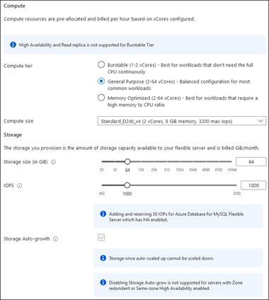
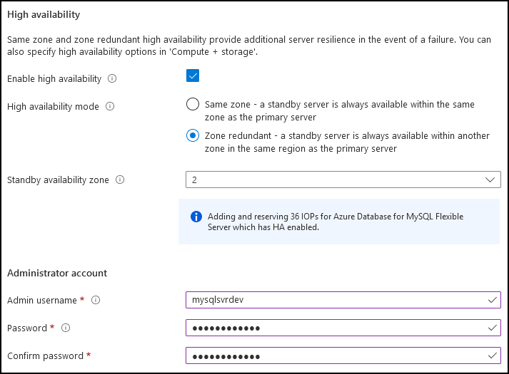
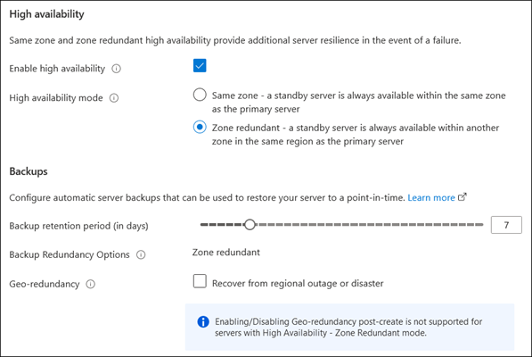
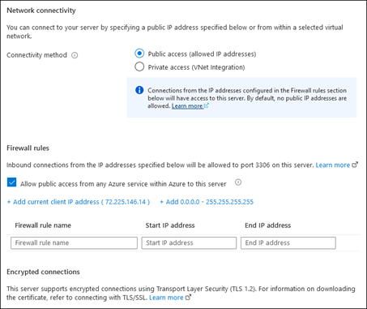

Having a general understanding of Azure Database for MySQL Flexible Server capabilities helps you identify the optimal deployment settings for your web-based app’s development, testing, and production environments. Some of the decisions you need to make—such as selecting the target Azure region, zone redundant high availability, or backup redundancy for highly available deployments with zone redundant mode should be part of the design stage. Others, such as the allocation of compute and storage resources, are driven by the usage patterns that typically change over time.

> [!NOTE]
> After you create the server, you cannot change its name, networking connectivity method, zone redundant high-availability, and backup redundancy for highly available deployments with zone redundant mode. You should review these options carefully before deploying your server.

In addition, you need to be aware of the dependencies between some configuration settings. In particular:

- Disabling storage auto-grow isn't supported for servers with high availability enabled.
- High availability isn't supported in the Burstable tier, although you can also deploy the server into a specific availability zone.

### How to deploy an Azure Database for MySQL Flexible Server

You can use several different deployment methods to provision an Azure Database for MySQL Flexible Server. While you can use fully automated deployments, the most straightforward deployment is the one you set up using the Azure portal graphical user interface (GUI). A portal-based deployment allows you to configure a range of server settings divided into four groups: Basics, Compute and storage, Networking, and Tags. Each group and its corresponding settings options are presented on its own page:

- The **Basics** page. Use the settings on this page to configure:

  - Project details. The name of the target subscription and resource group.

  - Server details. The name of the server, target Azure region, the MySQL version, the compute tier, and the number of the availability zone.

    

  - Administrator account. The administrator username and password.

- The **Compute + storage** page. Access this page from the **Configure server** link on the **Basics** page, and then use it to configure:

  - Compute. The compute tier and compute size options.

  - Storage. The storage size (in GiB), the number of IOPS, and the Storage Auto-growth option.

    

  - High availability. The high availability mode (same zone or zone redundant).

    

  - Backups. The backup retention period and the backup geo-redundancy option.

    

- Networking. From this page, you can select the connectivity method. Depending on your choice, you can also allow public access from any Azure service, configure firewall rules, or set up VNet integration.

   
  
- Tags. Use this page to add key-value pairs that define metadata for the deployed resource.

The provisioning process automatically creates information_schema, mysql, performance_schema, and sys databases.

### How to connect to an Azure Database for MySQL Flexible Server

Before you attempt to connect to the server, ensure that you take into account the network configuration you implemented during deployment. For example, if you decide to connect from Azure Cloud Shell, then enable the **Allow public access from any Azure service within Azure to this server** option of the server firewall. When connecting from an on-premises application server or an internet-connected device, add your public IP address to the list of firewall exceptions. For connections from Azure VMs or containerized workloads running in Azure, consider enabling private access. In addition, you should verify that the network you’re connecting from allows outbound traffic to Azure over TCP port 3306, which Azure Database for MySQL Flexible Server requires.

Encryption, which is enabled by default for new deployments, is another consideration. You’ll need to download the public certificate installed on the server and use it when establishing a connection over TLS 1.2.

After you address the networking and certificate requirements, you should be able to connect to the Azure Database for MySQL Flexible Server and query it in several different ways, including using:

- Azure CLI (az mysql)
- mysql.exe command line utility
- MySQL Workbench graphical tool
- Many programming languages, such as Python, PHP, C#, C++, Java, JavaScript, and Ruby.

> [!NOTE]
> For more information about connecting to Azure Database for MySQL Flexible Server programmatically, see [Microsoft Learn](/?azure-portal=true).
