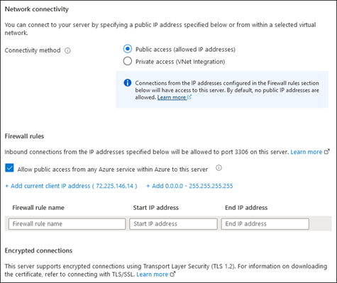

In this unit, examine how Azure Database for MySQL can help with building a resilient, performant, and easy to maintain data store for your web-based app. Considering the expected business criticality and high demand, you’re interested in its ability to scale both compute and storage resources. You also want to ensure that as a managed service, Azure Database for MySQL minimizes management and maintenance overhead, allowing you to focus on software development instead.

### What are the core capabilities of Azure Database for MySQL?

*Azure Database for MySQL* is a managed relational database as a service (DaaS) offering. With its Flexible Server deployment option, Azure Database for MySQL provides full compatibility with drivers and tools supported by MySQL Community Server 5.7 and MySQL Community Server 8.0.

*Azure Database for MySQL* is optimized for scenarios that:

- Require granular control over compute and storage configurations.
- Depend on predictable performance.
- Demand high availability and business continuity.
- Benefit from cost optimization.

In addition, Flexible Server supports secure connectivity from the internet by helping protect its public endpoint with a built-in firewall. It also allows for private connectivity within Azure through virtual network (VNet) integration.

#### Compute

*Azure Database for MySQL Flexible Server* is available in three compute tiers, with each tier geared towards a specific use case:

- Burstable (for development or hobby projects)
- General Purpose (for medium and large production workloads)
- Business Critical (for high-performance databases workloads)

The specific tier name is derived from the series name of the Azure VM Stock Keeping Unit (SKU) that’s hosting the managed MySQL Server deployment. Within each tier, you can choose among several different VM sizes, each offering a different number of vCores (ranging from 1 to 64) and the amount of memory (ranging from 4 gigabytes (GB) to about 500 GB).

The Burstable compute tier utilizes the B series VMs, General Purpose relies on Dds_v4 VMs, and Memory Optimized runs on Standard Eds_v4 VMs.

You access the tier options from the Azure portal’s **Flexible server Compute+ storage** page, **Compute** section.

:::image type="content" source="../media/2-mysql-compute-tier-sizes.png" alt-text="Screenshot of the Compute section of the Compute+storage page displaying the Memory Optimized compute tier’s compute sizes options." border="true":::

#### Storage

At the time, of provisioning a server or at any point afterwards you can increase the amount of the storage allocated, up to the limit of 16,384 gibibytes (GiB). which is equivalent to 16 tebibytes (TiB). The lower limit of 20 GiB and the upper limit are the same regardless of the compute tier and size. In addition, storage sizing is independent of the compute tier and size you chose. You also have the option of enabling storage autogrowth.

> [!NOTE]
> You cannot decrease the amount of storage again after you increase it.

> [!NOTE]
> *Azure Database for MySQL* uses this storage for database files, temporary files, transaction logs, and MySQL server logs.

Regardless of the storage size, you can also scale up and down the desired limit of Input/Output operations per second (IOPS). The upper limit of available IOPS is dependent on the compute tier and size, with the upper limit reaching 20,000 IOPS for the largest available size of the Memory Optimized VM SKU. You can use this functionality at any time to accommodate dynamically changing resource requirements.

#### Network connectivity

Azure Database for MySQL Flexible Server supports the following two connectivity methods:

- Public access via an external endpoint, which you must explicitly allow by using firewall rules:

  - For external traffic, you must specify an individual IP address or an IP address range from which the traffic is allowed.

  - For traffic originating from Azure, you need to allow public access from any Azure service.

- Private access from designated Azure virtual networks, which uses the VNet integration support. If you enable this option, the server automatically blocks connections originating from the internet.

> [!NOTE]
> You should use the **Allow public access from any Azure service within Azure to this server** option only in development and testing scenarios. This is because it allows connections from IP addresses allocated to any Azure resource, including connections from other customers’ subscriptions.

> [!NOTE]
> To enable private access, you must implement custom Domain Name Service (DNS) name resolution. For details regarding this implementation, refer to [Microsoft Learn](/?azure-portal=true).

The server by default enforces Transport Layer Security (TLS 1.2) to help protect incoming network communication. While it's possible to allow unencrypted connections after the server is provisioned, we don’t recommend this option.

You access the network connectivity options from the Azure portal’s **Flexible server deployment** page, **Networking** tab.

#### High availability

Azure Database for MySQL - Flexible Server supports high availability with automatic failover. This availability helps ensure that you never lose committed data as a result of localized failures. Once enabled, the platform automatically provisions and manages a standby replica.

There are two high-availability architectural models, depending on the replica’s placement:

- Within a single availability zone (zone-redundant HA architecture), with both the primary and standby replica residing in the same availability zone.
- Across multiple availability zones (same-zone HA architecture), with the primary and standby replica located in separate availability zones of your choice.

The single availability option is intended for scenarios in which minimizing latency between the application and the database tier is of utmost importance. By deploying your application into the same availability zone as the database server, you ensure that a failover of the primary instance doesn't negatively affect the latency. Conversely, using separate zone-redundant availability zones for the primary and standby replica maximizes resiliency. This method is recommended for greater protection against failures of individual data centers in the same Azure region.

#### Business continuity

Azure Database for MySQL - Flexible Server automatically creates point-in-time backups of its databases and retains them in the locally redundant storage for up to 35 days. When configuring backup, you can choose between the locally redundant and geo-redundant backup redundancy options. The latter allows you to recover from an outage affecting an entire Azure region.

Azure Database for MySQL also supports managed maintenance windows intended for automated server patching, which facilitates business continuity. By specifying a custom patching schedule, you can minimize the effect of a temporary downtime resulting from the server restart.

#### Cost optimization

Azure Database for MySQL - Flexible Server offers numerous cost-optimization capabilities:

- Granular control over compute and storage configuration. You can configure most server configuration options independently of each other, which allows you to optimize your deployment costs, based on your objectives and its intended use case. For example, you can adjust your individual options for:

  - Compute SKU

  - The amount of storage

  - Its IOPS

  - The backup retention period
To configure these options, go to the Azure portal’s **Flexible server deployment** page, **Compute + storage** tab.

- The ability to stop and start the server on-demand. The compute tier billing is stopped as soon as you stop the server. This ability can help you to minimize costs during development, testing, and for production workloads with a reliably predictable schedule.

- The choice of the Burstable compute tier. The Burstable Azure VM SKU offers competitive pricing for workloads characterized by low CPU utilization, with occasional CPU usage spikes.

- Support for the reserved instance discount. This option allows you to save more than 60 percent of the original, nondiscounted cost by committing to either a 1-year or 3-year purchase plan. Such an arrangement is suitable for production workloads with predictable, long-term compute capacity requirements.

- The option to use the Azure free account to evaluate Flexible Server at no cost for 12 months with monthly limits of up to:

  - 750 hours of Burstable B1MS instance, enough hours to run a database instance continuously each month.

  - 32-GB storage and 32-GB backup storage.