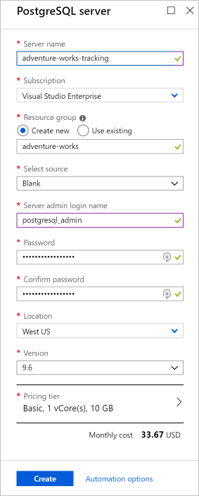
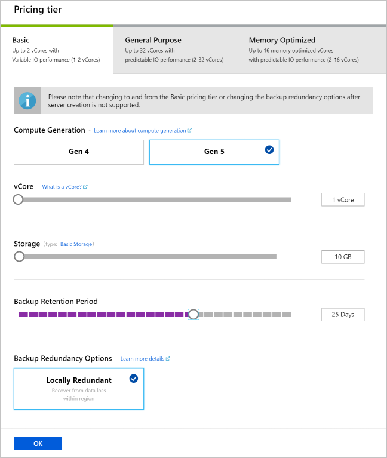

The Azure portal allows you to manage and scale PostgreSQL database servers. You decide to create an Azure Database for PostgreSQL server to store runner performance data. Based on historic captured data volumes, you know your server storage requirements should be set at 10 GB. To support your processing requirements, you need compute Gen 5 support with 1 vCore. You also know that you typically store backups for 25 days.

[!include]

Sign into the [Azure portal](https://portal.azure.com/triplecrownlabs.onmicrosoft.com?azure-portal=true) using the same account you activated the sandbox with. 

You'll see the Azure resource creation and management menu on your left and the dashboard filling the rest of the screen.

## Create an Azure Database for PostgreSQL server

After you sign in, you'll see the default Dashboard displayed. You have a couple of options available to you to create an Azure Database for PostgreSQL server. From the Dashboard, you can either:

- Select the **All services** option and then search for **Azure Database for PostgreSQL server**. This screen will display any configured servers that are already in your account. From here, you select **Add**, which will take you to the new server creation blade.

**or**

- Select the **Create a resource** option, which will present you with Azure Marketplace resource options. From here, you select the **Databases** option and choose **Azure Database for PostgreSQL**.

### Configure the server

You'll now see the PostgreSQL server create blade, similar to the following illustration.

> [!NOTE]
> You'll need to remember some details as you create the PostgreSQL server. For example, the username and password to access the server. You'll use this information to connect to your server later.

1. Choose a unique name for the server. Recall that then name must be all lowercase and can have numbers and hyphens.

1. Select a subscription. Check to be sure this field is set to the subscription that you want to use.

1. You now have the option to create or reuse an existing resource group. Select **Use existing** and choose "<rgn>[Sandbox resource group name]</rgn>" from the dropdown. You'll use this group for the rest of this module.

1. Select the source of your new server. For this lab, you'll leave the option set to _Blank_. Recall that you can change the option to _Back up_ if you want to restore an existing server backup.

1. Choose a login name to use as an administrator login for the new server. Recall that the admin login name can't be azure_superuser, azure_pg_admin, admin, administrator, root, guest, or public. It can't start with pg_. Remember or write down the name for future use.

1. Choose a password to use with the above administrator login name. Recall,= that our password must include characters from three of the following categories:
   - English uppercase letters
   - English lowercase letters
   - Numbers (0 through 9)
   - Non-alphanumeric characters (!, $, #, %, and so on)

1. Retype the password to confirm your password.

1. Choose a location for your server. You'll want to choose a location closest to you from the following list.

    [!include]

1. You'll now select the version of your server. Select the latest version of PostgreSQL.

1. As the second to last step, select the **Pricing tier** option.

    Recall that you need to configure your server with specific storage and compute options:

    - 10 GB of disk storage
    - Compute Generation 5 support
    - Retention period of 25 days

    Click **Pricing tier** to access the pricing tier blade and make the following changes:

    - Choose the **Basic** option tab.
    - Choose the **Gen 5 Computation Generation** option.
    - Choose 1 vCore from the **vCore** slider. Notice how the changes in the slider affect the **Price Summary**.
    - Choose 10 GB from the **Storage** slider. If you're having trouble sliding to exactly 10 GB, you can use the left and right cursor keys on your keyboard to get a precise value.
    - Choose 25 Days from the **Backup Retention Period** slider.
    - Leave the Backup Redudancy Options set to **Locally Redundant**.

    

1. Check out the price summary on the right side. It provides a cost-breakdown for the server along with an estimated monthly cost.

1. Click **OK** after you're satisfied with your selection to commit your selections and close the pricing tier options.

1. All that's left now is to review the values you entered and click **Create**. Creation can take several minutes. You can select the Notifications icon (a bell) at the top of the Azure portal screen to monitor progress.

You now have a PostgreSQL server available. In the next unit, you'll see how to create the same server using the Azure CLI.
