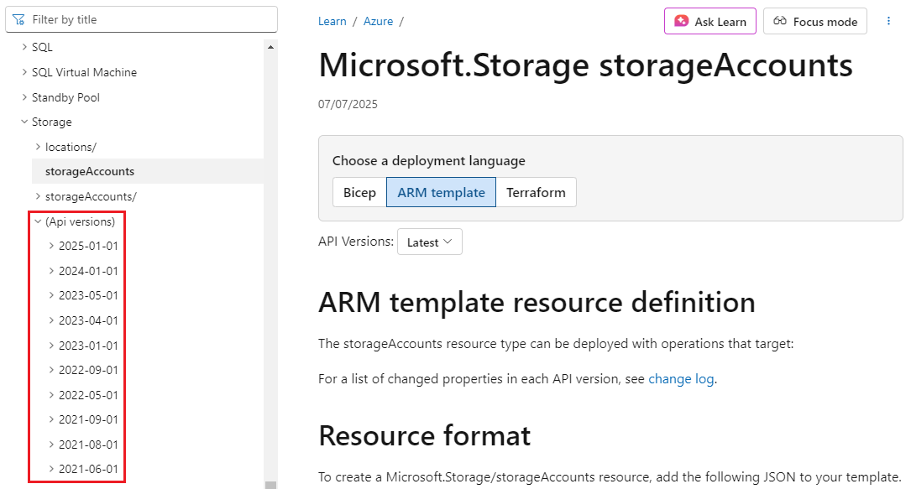
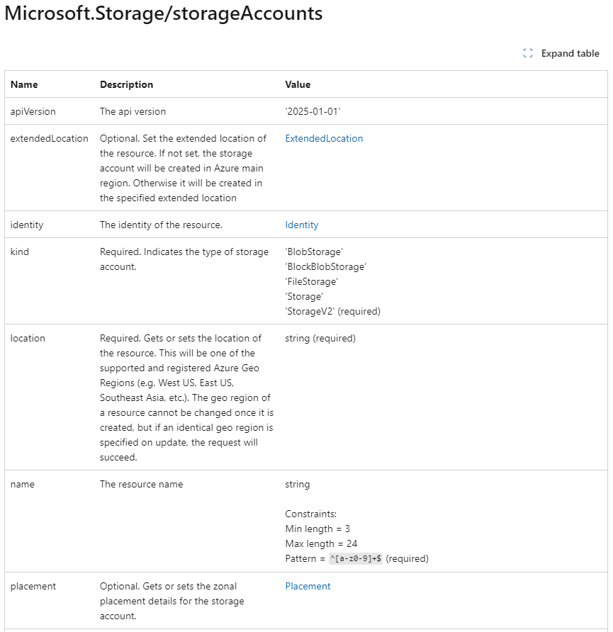

In this unit, you'll learn about using Azure Resource Manager templates (ARM templates) to implement infrastructure as code. You'll survey the sections of an ARM template, learn how to deploy your ARM template to Azure, and delve into detail on the *resources* section of the ARM template.

## What is infrastructure as code?

*Infrastructure as code* allows you to describe, through code, the infrastructure that you need for your application.

With infrastructure as code, you can maintain both your application code and everything you need to deploy your application in a central code repository. The advantages to infrastructure as code are:

- Consistent configurations
- Improved scalability
- Faster deployments
- Better traceability

This video explains infrastructure as code:

> [!VIDEO https://channel9.msdn.com/Blogs/One-Dev-Minute/What-is-Infrastructure-as-Code--One-Dev-Question/player?format=ny]

## What is an ARM template?

ARM templates are JavaScript Object Notation (JSON) files that define the infrastructure and configuration for your deployment. The template uses a *declarative syntax*. The declarative syntax is a way of building the structure and elements that outline what resources will look like without describing the control flow. Declarative syntax is different than *imperative syntax*, which uses commands for the computer to perform. Imperative scripting focuses on specifying each step in deploying the resources.

ARM templates allow you to declare what you intend to deploy without having to write the sequence of programming commands to create it. In an ARM template, you specify the resources and the properties for those resources. [Azure Resource Manager](/azure/azure-resource-manager/management/overview?azure-portal=true) then uses that information to deploy the resources in an organized and consistent manner.

### Benefits of using ARM templates

ARM templates allow you to automate deployments and use the practice of infrastructure as code (IaC). The template code becomes part of your infrastructure and development projects. Just like application code, you can store the IaC files in a source repository and version it.

ARM templates are *idempotent*, which means you can deploy the same template many times and get the same resource types in the same state.

Resource Manager orchestrates deploying the resources so they're created in the correct order. When possible, resources will also be created in parallel, so ARM template deployments finish faster than scripted deployments.

  :::image type="content" source="../media/2-template-processing.png" alt-text="Diagram showing a mapping of the template processing procedure. There's only one call to process a template as opposed to several calls to process scripts." border="false":::

Resource Manager also has built-in validation. It checks the template before starting the deployment to make sure the deployment will succeed.

If your deployments become more complex, you can break your ARM templates into smaller, reusable components. You can link these smaller templates together at deployment time. You can also nest templates inside other templates.

In the Azure portal, you can review your deployment history and get information about the state of the deployment. The portal displays values for all parameters and outputs.

You can also integrate your ARM templates into continuous integration and continuous deployment (CI/CD) tools like [Azure Pipelines](https://azure.microsoft.com/services/devops/pipelines?azure-portal=true), which can automate your release pipelines for fast and reliable application and infrastructure updates. By using Azure DevOps and ARM template tasks, you can continuously build and deploy your projects.

### ARM template file structure

When you're writing an ARM template, you need to understand all the parts that make up the template and what they do. ARM template files are made up of the following elements:

| Element        | Description |
| -------------- | --- |
| **schema** | A required section that defines the location of the JSON schema file that describes the structure of JSON data. The version number you use depends on the scope of the deployment and your JSON editor. |
| **contentVersion** | A required section that defines the version of your template (such as 1.0.0.0). You can use this value to document significant changes in your template to ensure you're deploying the right template. |
| **apiProfile** | An optional section that defines a collection of API versions for resource types. You can use this value to avoid having to specify API versions for each resource in the template. |
| **parameters** | An optional section where you define values that are provided during deployment. These values can be provided by a parameter file, by command-line parameters, or in the Azure portal. |
| **variables** | An optional section where you define values that are used to simplify template language expressions. |
| **functions** | An optional section where you can define [user-defined functions](/azure/azure-resource-manager/templates/template-user-defined-functions?azure-portal=true) that are available within the template. User-defined functions can simplify your template when complicated expressions are used repeatedly in your template. |
| **resources** | A required section that defines the actual items you want to deploy or update in a resource group or a subscription. |
| **output** | An optional section where you specify the values that will be returned at the end of the deployment. |

## Deploy an ARM template to Azure

You can deploy an ARM template to Azure in one of the following ways:

- Deploy a local template
- Deploy a linked template
- Deploy in a continuous deployment pipeline

This module focuses on deploying a local ARM template. In future Learn modules, you'll learn how to deploy more complicated infrastructure and how to integrate with Azure Pipelines.

To deploy a local template, you need to have either [Azure PowerShell](/powershell/azure/install-az-ps) or the [Azure CLI](/cli/azure/install-azure-cli?azure-portal=true) installed locally.

First, sign in to Azure by using the Azure CLI or Azure PowerShell.

# [Azure CLI](#tab/azure-cli)

```azurecli
az login
```

# [PowerShell](#tab/azure-powershell)

```azurepowershell
Connect-AzAccount
```

---

Next, define your resource group. You can use an already-defined resource group or create a new one with the following command. You can obtain available location values from: `az account list-locations` (CLI) or `Get-AzLocation` (PowerShell). You can configure the default location using `az configure --defaults location=<location>`.

# [Azure CLI](#tab/azure-cli)

```azurecli
az group create \
  --name {name of your resource group} \
  --location "{location}"
```

# [PowerShell](#tab/azure-powershell)

```azurepowershell
New-AzResourceGroup `
  -Name {name of your resource group} `
  -Location "{location}"
```

---

To start a template deployment at the resource group, use either the Azure CLI command [az deployment group create](/cli/azure/deployment/group#az-deployment-group-create) or the Azure PowerShell command [New-AzResourceGroupDeployment](/powershell/module/az.resources/new-azresourcegroupdeployment).

> [!TIP]
> The difference between `az deployment group create` and `az group deployment create` is that `az group deployment create` is an old command to be deprecated and will be replaced by `az deployment group create`. Therefore, we recommend using `az deployment group create` to deploy resources under the resource group scope.

Both commands require the resource group, the region, and the name for the deployment so you can easily identify it in the deployment history. For convenience, the exercises create a variable that stores the path to the template file. This variable makes it easier for you to run deployment commands, because you don't have to retype the path every time you deploy. Here's an example:

# [Azure CLI](#tab/azure-cli)

To run this deployment command, you must have the [latest version](/cli/azure/install-azure-cli) of Azure CLI.

```azurecli
templateFile="{provide-the-path-to-the-template-file}"
az deployment group create \
  --name blanktemplate \
  --resource-group myResourceGroup \
  --template-file $templateFile
```

# [PowerShell](#tab/azure-powershell)

```azurepowershell
$templateFile = "{provide-the-path-to-the-template-file}"
New-AzResourceGroupDeployment `
  -Name blanktemplate `
  -ResourceGroupName myResourceGroup `
  -TemplateFile $templateFile
```

---

Use linked templates to deploy complex solutions. You can break a template into many templates and deploy these templates through a main template. When you deploy the main template, it triggers the linked template's deployment. You can store and secure the linked template by using a SAS token.

A CI/CD pipeline automates the creation and deployment of development projects, which includes ARM template projects. The two most common pipelines used for template deployment are [Azure Pipelines](/training/paths/deploy-applications-with-azure-devops/?azure-portal=true) or [GitHub Actions](/training/paths/automate-workflow-github-actions/?azure-portal=true).

More information on these two types of deployment is covered in other modules.

## Add resources to the template

To add a resource to your template, you'll need to know the resource provider and its types of resources. The syntax for this combination is in the form of *{resource-provider}/{resource-type}*. For example, to add a storage account resource to your template, you'll need the *Microsoft.Storage* resource provider. One of the types for this provider is *storageAccount*. So your resource type will be displayed as *Microsoft.Storage/storageAccounts*. You can use a list of [resource providers for Azure services](/azure/azure-resource-manager/management/azure-services-resource-providers?azure-portal=true) to find the providers you need.

After you've defined the provider and resource type, you need to understand the properties for each resource type you want to use. For details, see [Define resources in Azure Resource Manager templates](/azure/templates?azure-portal=true). View the list in the left column to find the resource. Notice that the properties are sorted by API version.



Here's an example of some of the listed properties from the Storage Accounts page:



For our storage example, your template might look like this:

```json
{
  "$schema": "https://schema.management.azure.com/schemas/2019-04-01/deploymentTemplate.json#",
  "contentVersion": "1.0.0.1",
  "apiProfile": "",
  "parameters": {},
  "variables": {},
  "functions": [],
  "resources": [
    {
      "type": "Microsoft.Storage/storageAccounts",
      "apiVersion": "2019-06-01",
      "name": "learntemplatestorage123",
      "location": "westus",
      "sku": {
        "name": "Standard_LRS"
      },
      "kind": "StorageV2",
      "properties": {
        "supportsHttpsTrafficOnly": true
      }
    }
  ],
  "outputs": {}
}
```
