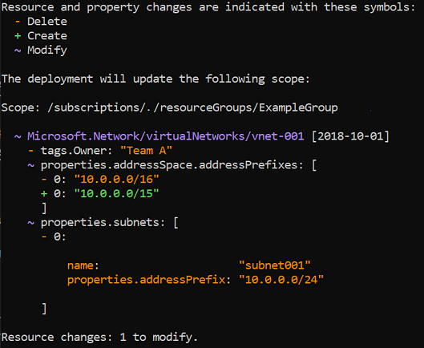

Here, you learn about using Microsoft Azure Resource Manager templates to implement infrastructure as code. You survey the sections of an Azure Resource Manager template, discover how to deploy your template to Azure, and delve into detail on the *resources*, *parameters*, and *outputs* sections of the template.

## What is infrastructure as code

*Infrastructure as code* enables you to describe, through code, the infrastructure that you need for your application.

With infrastructure as code, you can maintain both your application code and everything you need to deploy your application in a central code repository. The advantages to infrastructure as code are:

- Consistent configurations
- Improved scalability
- Faster deployments
- Better traceability

> [!VIDEO https://channel9.msdn.com/Blogs/One-Dev-Minute/What-is-Infrastructure-as-Code--One-Dev-Question/player?format=ny]

## What is an Azure Resource Manager template

Azure Resource Manager (ARM) templates are JavaScript Object Notation (JSON) files that define the infrastructure and configuration for your deployment. The template uses a *declarative syntax*. The declarative syntax is a way of building the structure and elements that outline what resources will look like without describing its control flow. Declarative syntax is different than *imperative syntax*, which uses commands for the computer to perform. Imperative scripting focuses on specifying each step in deploying the resources.

ARM templates allow you declare what you intend to deploy without having to write the sequence of programming commands to create it.  In a template, you specify the resources and the properties for those resources, then the [Azure Resource Manager](https://docs.microsoft.com/azure/azure-resource-manager/management/overview?azure-portal=true) uses that information to deploy the resources in an organized and consistent manner.

### Benefits of using Azure Resource Manager templates

Using ARM templates allows you to automate deployments and use the practice of infrastructure as code (IaC). The template code becomes part of your infrastructure and development projects. Just like application code, you can store the IaC files in a source repository and version it.

Templates are *idempotent*, which means you can deploy the same template many times and get the same resource types in the same state.

The Azure Resource Manager orchestrates the deployment of the resources so they're created in the correct order, and when possible, in parallel, so your deployments finish faster than scripted deployments.

  

Azure Resource Manager also has built in validation and checks the template before starting the deployment to make sure the deployment will succeed.

If your deployments become more complex, you can break your templates into smaller, reusable components and link them together at deployment time. You can also nest one or multiple templates inside other templates.

In the Azure portal, you can review your deployment history and get information about the state of the deployment. You can see all the parameter values passed in, and any output values.

You can also integrate your templates into continuous integration and continuous deployment (CI/CD) tools like [Azure Pipelines](https://azure.microsoft.com/services/devops/pipelines?azure-portal=true), which can automate your release pipelines for fast and reliable application and infrastructure updates. By using Azure DevOps and ARM template tasks, you can continuously build and deploy your projects.

### Template file structure

When writing an ARM template, you need to understand all the parts that make up the template and what they do. The template files are made up of the following elements.

- *schema* - a required section that defines the location of the JSON schema file that describes the structure of JSON data. The version number you use depends on the scope of the deployment and your JSON editor.

- *contentVersion* - a required section that defines the version of your template (such as 1.0.0.0). You can use this value to document significant changes in your template to ensure you're deploying the right template.

- *apiProfile* - an optional section that defines a collection of API versions for resource types.  You can use this value to avoid having to specify API versions for each resource in the template.

- *parameters* -  an optional section where you define values that will be provided when the deployment is executed. These values can be provided by a parameter file, by command-line parameters or in the portal.

- *variables* - an optional section where you define values that are used to simplify template language expressions.

- *functions* - an optional section where you can define [User-defined functions](https://docs.microsoft.com/azure/azure-resource-manager/templates/template-user-defined-functions?azure-portal=true) that are available within the template. You can create your own functions when you have complicated expressions that are used repeatedly in your template.

- *resources* - a required section that defines the actual items you want to deploy, or that you want to update, in a resource group or a subscription.

- *output* section - an optional section where you specify the values that will be returned at the end of the deployment.

## How do I deploy a template to Azure

There are three ways to deploy an ARM template to Azure.

- Deploy a local template
- Deploy a linked template
- Deploy in a continuous deployment pipeline

Deploying a local template requires you to have either [Azure PowerShell](https://docs.microsoft.com/powershell/azure/install-az-ps?view=azps-4.2.0&azure-portal=true) or [Azure CLI](https://docs.microsoft.com/cli/azure/install-azure-cli?view=azure-cli-latest&azure-portal=true) installed locally. You first sign in to Azure using Azure CLI or Azure PowerShell.

# [Azure CLI](#tab/azure-cli)

```azurecli
az login
```

# [PowerShell](#tab/azure-powershell)

```azurepowershell
Connect-AzAccount
```

---

Then, you create a resource group or use an already defined resource group to deploy into. If you need to create a resource group, you can use this command:

# [Azure CLI](#tab/azure-cli)

```azurecli
az group create \
  --name {name of your resource group} \
  --location "{location}"
```

# [PowerShell](#tab/azure-powershell)

```azurepowershell
New-AzResourceGroup `
  -Name {name of your resource group} `
  -Location "{location}"
```

---

To deploy the template, use either the Azure CLI command [az deployment group create](https://docs.microsoft.com/cli/azure/group/deployment?view=azure-cli-latest#az-group-deployment-create?azure-portal=true) or the Azure PowerShell command [New-AzResourceGroupDeployment](https://docs.microsoft.com/powershell/module/az.resources/new-azresourcegroupdeployment?view=azps-4.2.0&azure-portal=true). Specify the resource group and give a name to the deployment so you can easily identify it in the deployment history. For convenience, create a variable that stores the path to the template file. This variable makes it easier for you to run the deployment commands because you don't have to retype the path every time you deploy. Here is an example:

# [Azure CLI](#tab/azure-cli)

To run this deployment command, you must have the [latest version](/cli/azure/install-azure-cli) of Azure CLI.

```azurecli
templateFile="{provide-the-path-to-the-template-file}"
az deployment group create \
  --name blanktemplate \
  --resource-group myResourceGroup \
  --template-file $templateFile
```

# [PowerShell](#tab/azure-powershell)

```azurepowershell
$templateFile = "{provide-the-path-to-the-template-file}"
New-AzResourceGroupDeployment `
  -Name blanktemplate `
  -ResourceGroupName myResourceGroup `
  -TemplateFile $templateFile
```

---

Linked templates are used to deploy complex solutions. You can break a template into many templates, and deploy these templates through a main template. When the main template gets deployed, it triggers the deployment of the linked template. You can store and secure the linked template by using a SAS token.

A continuous integration/continuous deployment (CI/CD) pipeline automates building and deploying development project including Azure Resource Manager template projects. The two most common pipelines used for template deployment are [Azure Pipelines](https://docs.microsoft.com/learn/paths/deploy-applications-with-azure-devops/?azure-portal=true) or [GitHub Actions](https://docs.microsoft.com/learn/paths/automate-workflow-github-actions/?azure-portal=true).

More information on these two types of deployment are covered in other modules.

## How do I add resources to the template

To add a resource to your template, you will need to know the resource provider and its types of resources. The syntax for this combination is in the form of *{resource-provider}/{resource-type}*. For example, to add a storage account resource to your template, you will need the *Microsoft.Storage* resource provider. One of the types for this provider is *storageAccount*. So your resource type will be displayed as *Microsoft.Storage/storageAccounts*. You can use a list of [Resource providers for Azure services](https://docs.microsoft.com/azure/azure-resource-manager/management/azure-services-resource-providers?azure-portal=true) to find the providers you need.

Once you have the provider and resource type, you need to know the properties to use for that resource type. For that, you can go to the [Define resources in Azure Resource Manager template](https://docs.microsoft.com/azure/templates?azure-portal=true) page. There you will see a left side menu to find the resource you are looking for. Notice that the properties are sorted by API version.


Here is an example of some of the listed properties from the Storage Accounts page:


For our storage example, your template might look like this:

```json
{
   "$schema": "https://schema.management.azure.com/schemas/2019-04-01/deploymentTemplate.json#",
   "contentVersion": "1.0.0.1",
   "apiProfile": "",
   "parameters": {},
   "variables": {},
   "functions": [],
   "resources": [
       {
           "type": "Microsoft.Storage/storageAccounts",
           "apiVersion": "2019-06-01",
           "name": "learntemplatestorage123",
           "location": "westus",
           "sku": {
               "name": "Standard_LRS"
           },
           "kind": "StorageV2",
           "properties": {
               "supportsHttpsTrafficOnly": true
           }
       }
   ],
   "outputs": {}
}
```

## What are template parameters

Parameters enable you to customize the deployment by providing values that are tailored for a particular environment. For example, you can pass different values based on whether you're deploying to an environment for development, test, production or others. For example, the template above uses the *Standard_LRS* SKU. You can reuse this template for other deployments that create a storage account by making the name of the SKU a parameter. Then, you can pass in the name of the SKU you would like for this particular deployment when the template is executed. You can do this either at the command line, or using a parameter file.

### How do I use parameters in my template

Here is an example of a template file with a parameter for the storage SKU defined in the *parameters* section of the template. Notice that you can provide a default for the parameter to be used if no value is specified at execution.

```json
"parameters": {
   "storageAccountType": {
       "type": "string",
       "defaultValue": "Standard_GRS",
       "metadata": {
           "description": "The type of the new storage account created to store the VM disks."
       }
   }
```

Then, use the parameter in the resource definition. Notice the syntax is ```[parameters('name of the parameter')]```

```json
"resources": [
     {
       "type": "Microsoft.Storage/storageAccounts",
       "apiVersion": "2019-04-01",
       "name": "learntemplatestorage123",
       "location": "{Location}",
       "sku": {
         "name": "[parameters('storageAccountType')]"
       },
       "kind": "StorageV2",
       "properties": {
         "supportsHttpsTrafficOnly": true
       }
     }
   ]
  }
```

When you execute the template, you can give a value for the parameter. Notice the last line in the command below.

```azurecli
templateFile="azuredeploy.json"
az deployment group create \
  --name testdeployment1 \
  --template-file $templateFile \
  --parameters storageAccountType=Standard_LRS
```

## What are template outputs

In the *outputs* section of your template, you can specify values that will be returned after a successful deployment. Here are the elements that make up the outputs section.

```json
"outputs": {
   "<output-name>": {
       "condition": "<boolean-value-whether-to-output-value>",
       "type": "<type-of-output-value>",
       "value": "<output-value-expression>",
       "copy": {
           "count": <number-of-iterations>,
           "input": <values-for-the-variable>
       }
   }
}
```

- *output-name*: Must be a valid JavaScript identifier.
- *condition*: (Optional) A boolean value that indicates whether this output value is returned. When true, the value is included in the output for the deployment. When false, the output value is skipped for this deployment. When not specified, the default value is true.
- *type*: The type of the output value.
- *value*: (Optional) A template language expression that is evaluated and returned as output value.
- *copy*: (Optional) Copy is used to return more than one value for an output.

### How do I use outputs in my template

Here is an example to output the Azure storage account's endpoints.

```json
 "outputs": {
       "storageEndpoint": {
           "type": "object",
           "value": "[reference(learntemplatestorage123).primaryEndpoints]"
       }
   }
```

Notice the ```reference``` part of the expression. This function gets the runtime state of the storage account.

## How can I plan my template

Before deploying a template, it is recommended that you preview the changes that executing the template will make to your infrastructure. Azure Resource Manager provides the *what-if* operation to let you see how resources will change if you deploy the template.

The what-if commands are added to the deployment command and the output is color-coded to help you see the different types of changes.



### How do I use what-if commands

#### Azure PowerShell

To preview changes before deploying a template, add the -Whatif switch parameter to the deployment command.

- ```New-AzResourceGroupDeployment -Whatif``` for resource group deployments
- ```New-AzSubscriptionDeployment -Whatif``` and ```New-AzDeployment -Whatif``` for subscription level deployments

You can use the -Confirm switch parameter to preview the changes and get prompted to continue with the deployment.

- ```New-AzResourceGroupDeployment -Confirm``` for resource group deployments
- ```New-AzSubscriptionDeployment -Confirm``` and ```New-AzDeployment -Confirm``` for subscription level deployments

The preceding commands return a text summary that you can manually inspect. To get an object that you can programmatically inspect for changes, use:

- ```$results = Get-AzResourceGroupDeploymentWhatIfResult``` for resource group deployments
- ```$results = Get-AzSubscriptionDeploymentWhatIfResult``` or ```$results = Get-AzDeploymentWhatIfResult``` for subscription level deployments

#### Azure CLI

To preview changes before deploying a template, use what-if with the deployment command.

- ```az deployment group what-if``` for resource group deployments
- ```az deployment sub what-if``` for subscription level deployments

You can use the --confirm-with-what-if switch (or its short form -c) to preview the changes and get prompted to continue with the deployment.

- ```az deployment group create --confirm-with-what-if``` or -c for resource group deployments
- ```az deployment sub create --confirm-with-what-if``` or -c for subscription level deployments

The preceding commands return a text summary that you can manually inspect. To get a JSON object that you can programmatically inspect for changes, use:

- ```az deployment group what-if --no-pretty-print``` for resource group deployments
- ```az deployment sub what-if --no-pretty-print``` for subscription level deployments

For example, in our storage account deployment scenario the command will look like this:

# [Azure CLI](#tab/azure-cli)

To run this deployment command, you must have the [latest version](/cli/azure/install-azure-cli) of Azure CLI.

```azurecli
templateFile="{provide-the-path-to-the-template-file}"
az deployment group what-if \
  --name testtemplate \
  --resource-group myResourceGroup \
  --template-file $templateFile
```

# [PowerShell](#tab/azure-powershell)

```azurepowershell
$templateFile = "{provide-the-path-to-the-template-file}"
New-AzResourceGroupDeployment `
  -Whatif `
  -Name testtemplate `
  -ResourceGroupName myResourceGroup `
  -TemplateFile $templateFile
```

---
