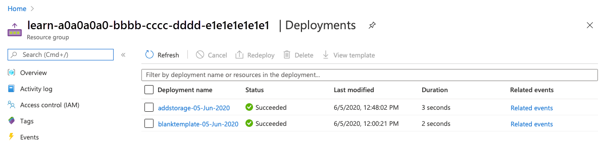

In this exercise, you create a Microsoft Azure Resource Manager Template and deploy it to Azure. Then you update that template to add parameters and outputs.

> [!NOTE]
> This exercise uses the [Azure Resource Manager Tools for Visual Studio Code](https://marketplace.visualstudio.com/items?itemName=msazurermtools.azurerm-vscode-tools). Be sure to install this extension in Visual Studio Code.

## Create an Azure Resource Manager template

1. Open Visual Studio Code and create a new file called *azuredeploy.json*.
1. On the first line of the file, type **arm**.
1. You will see an intellisense choice **!arm**. Choose that snippet by clicking on the box next to it. Your file will now look like this:

    ```json
    {
    "$schema": "https://schema.management.azure.com/schemas/2019-04-01/deploymentTemplate.json#",
    "contentVersion": "1.0.0.0",
    "apiProfile": "",
    "parameters": {},
    "variables": {},
    "functions": [],
    "resources": [],
    "outputs": {}
    }
    ```

  Notice that his file has all of the sections of an Azure Resource Manager template that we discussed in the last unit.

1. Save the changes to the file.

## Deploy the Azure Resource Manager template to Azure

To deploy this template to Azure, you need to sign in to your Azure account from the Visual Studio Code terminal. Be sure you have the [Azure CLI tools](https://docs.microsoft.com/cli/azure/install-azure-cli?view=azure-cli-latest) installed and that you are signing in to the same account that activated the sandbox.

### Sign in to Azure

1. From the terminal in Visual Studio Code, run this command to sign in to Azure. Running this command will open a browser that allows you to sign in to your account.

    ```azurecli
    az login
    ```

1. Once you are logged in, you see a list of the subscriptions associated with this account. If you activated the sandbox, you see one called *Concierge Subscription*. You use this one for the rest of the exercise.
1. Set the default subscription for all of the Azure CLI commands you run in this session.

    ```azurecli
    az account set --subscription "Concierge Subscription"
    ```

1. Set the default resource group to the resource group created for you in the sandbox environment. This allows you to omit that parameter from the rest of the Azure CLI commands in this exercise.

    ```azurecli
    az configure --defaults group=<rgn>[sandbox resource group name]</rgn>
    ```

### Deploy the template to Azure

Here, you deploy the template to Azure. The template doesn't have any resources yet, so you won't see resources created. However, you'll see a successful deployment.

1. Deploy the template using Azure CLI commands in the terminal.

    ```azurecli
    templateFile="azuredeploy.json"
    today=$(date +"%d-%b-%Y")
    DeploymentName="blanktemplate-"$today

    az deployment group create \
     --name $DeploymentName \
     --template-file $templateFile
    ```

  Here, you set Azure CLI variables for the path to the template file to deploy, and the name of this deployment. Then use the ```az deployment group create``` command to deploy the template to Azure.

1. You see ```Running...``` in the terminal. When that finishes, navigate to the [Azure portal](portal.azure.com?azure-portal=true) and make sure you are in the sandbox subscription. To do that, click on your avatar in the upper right corner of the page. Choose **Switch directory**. In the list, choose the **Microsoft Learn Sandbox** directory.

1. On the left side panel, choose *Resource groups*.
1. Select <rgn>[sandbox resource group name]</rgn>.
1. In the *Overview*, you see one deployment succeeded.

    

1. Select *1 Succeeded* to see the details of the deployment.

    

1. Select *blanktemplate* to see what resources were deployed. In this case it will be empty since you didn't specify any resources in the template yet.

    

1. Leave the portal open in your browser. You will check on deployments again.

## Add a resource to the template

Here, you add an Azure storage account resource to the template using a snippet from the Azure Resource Manager Tools for Visual Studio Code extension.

1. In the *azuredeploy.json* file in Visual Studio Code, place your curser between the square brackets in the resources block. ```"resources":[],```
1. Type **storage** in the square brackets. You see a list of related snippets. Choose **arm-storage**.

1. Your file will look like this:

    [!code-json[](../code/parameter1?highlight=3-4)]

  Values that you should edit are highlighted in new section of your file and can be navigated using the <kbd>tab</kbd> key.

1. Change the values of the resource *name:* and *displayName:* to something unique. For example *learnexercise12321*. This name must be unique across all of Azure, so choose something unique to you.
1. Change the value of the sku name from *Premium_LRS* to **Standard**. Do the same for the value of *tier*.
1. Note that the location of the resource is set to the location of the resource group where it will be deployed. Leave the default here.
1. Save the file.

### Deploy the updated template

Here, you change the name of the deployment to better reflect what this deployment does.

1. Run the following Azure CLI commands in the terminal. This is the same code you used previously, however the name of the deployment is changed.

    ```azurecli
    templateFile="azuredeploy.json"
    today=$(date +"%d-%b-%Y")
    DeploymentName="addstorage-"$today

    az deployment group create \
      --name $DeploymentName \
      --template-file $templateFile
    ```

1. Navigate back to the portal. Go to your resource group and see that there are now *2 Succeeded* deployments. Select this link.
1. Notice that both deployments are in the list.

    

1. Select *addstorage**.

    

  Notice that the storage account has been deployed.

## Create parameters for the template

Here, you make your template more flexible by adding parameters that can be set at runtime. You create a parameter for the ```storageName``` value.

1. In the *azuredeploy.json* file in Visual Studio Code, place your curser between the curly braces in the parameters attribute. ```"parameters":{},```
1. Press <kbd>Enter</kbd> and then type **par**. You see a list of related snippets. Choose **arm-param**. This adds a generic parameter to the template. It will look like this:

    ```json
     "parameters": {
        "parameter1": {
        "type": "string",
        "metadata": {
            "description": "description"
        }
      }
    },
    ```

1. Change the parameter to be called **storageName**, leave the type as a string, add a **minLength** value of **3**, a **maxLength** value of **24**, and add a description value of **The name of the Azure storage resource"**.
1. The parameter block should look like this:

    ```json
    "parameters": {
       "storageName": {
           "type": "string",
           "minLength": 3,
           "maxLength": 24,
           "metadata": {
                "description": "The name of the Azure storage resource"
            }
       }
   },
    ```

1. Use the new parameter in the ```resources``` block in both the ```name``` and ```displayName``` values. The entire file will look like this:

   [!code-json[](../code/parameter2?highlight=3-4)]

1. Save the file.

### Deploy the updated template

Here, you change the name of the deployment to better reflect what this deployment does.

1. Run the following Azure CLI commands in the terminal. This is the same code you used previously, however the name of the deployment is changed and you need to fill in a unique name for the ```storageName``` parameter. Remember, this must be unique across all of Azure. You can use the unique name you created in the last section. In that case, Azure will update the resource instead of creating a new one.

    ```azurecli
    templateFile="azuredeploy.json"
    today=$(date +"%d-%b-%Y")
    DeploymentName="addnameparameter-"$today

    az deployment group create \
      --name $DeploymentName \
      --template-file $templateFile \
      --parameters storageName={your-unique-name}
    ```

1. Navigate back to the portal. Go to your resource group and see that there are now *3 Succeeded* deployments. Select this link.
1. Notice that all three deployments are in the list.
1. Explore the  *addnameparameter* deployment as you did previously.

### Add another parameter to limit allowed values

Here you use parameters to limit the values allowed for a parameter.

1. Place your cursor after the closing curly brace for the ```storageName```parameter. Add a comma and press the <kbd>Enter</kbd> key.
1. Again, type **par** and choose **arm-param**.
1. Change this new generic parameter to this:

    ```json
    "storageSKU": {
       "type": "string",
       "defaultValue": "Standard_LRS",
       "allowedValues": [
         "Standard_LRS",
         "Standard_GRS",
         "Standard_RAGRS",
         "Standard_ZRS",
         "Premium_LRS",
         "Premium_ZRS",
         "Standard_GZRS",
         "Standard_RAGZRS"
       ]
     }
    ```

  Here you are listing the values that this parameter will allow. If the template is run with a value that is not allowed, the deployment will fail.

1. Update the ```resources``` to use the ```storageSKU``` parameter.

    ```json
    "sku": {
         "name": "[parameters('storageSKU')]"
       }
    ```

1. The entire file will look like this:

    [!code-json[](../code/parameter3?highlight=3-4)]

1. Save the file.

### Deploy the template

Here you deploy successfully using a ```storageSKU``` parameter that is in the allowed list, then try to deploy the template using a ```storageSKU``` parameter that is not in the allowed list. The second deployment will fail as expected.

1. Run the following commands to deploy the template.

    ```azurecli
    templateFile="azuredeploy.json"
    today=$(date +"%d-%b-%Y")
    DeploymentName="addSkuParameter-"$today

    az deployment group create \
      --name $DeploymentName \
      --template-file $templateFile \
      --parameters storageSKU=Standard_GRS storageName={your-unique-name}
    ```

  Allow this deployment to finish. This deployment succeeds as expected.

1. Run the following commands to deploy the template with a parameter that is not allowed. Here. you changed the ```storageSKU``` parameter to *Basic*.

    ```azurecli
    templateFile="azuredeploy.json"
    today=$(date +"%d-%b-%Y")
    DeploymentName="addSkuParameter-"$today

    az deployment group create \
      --name $DeploymentName \
      --template-file $templateFile \
      --parameters storageSKU=Basic storageName={your-unique-name}
    ```

    This deployment fails. Notice the error.

    

## Add output to the template

Here you add to the ```outputs``` section of the template to output the endpoints for the storage account resource.

1. 1. In the *azuredeploy.json* file in Visual Studio Code, place your curser between the curly braces in the outputs attribute. ```"outputs":{},```
1. Press <kbd>Enter</kbd> and then type **out**. You see a list of related snippets. Choose **arm-output**. This adds a generic output to the template. It will look like this:

    ```json
    "outputs": {
        "output1": {
        "type": "string",
        "value": "value"
      }
    ```

1. Change ```output1``` to **"storageEndpoint"**, the value of ```type``` to **"object"**, and the value of ```value``` to **"[reference(parameters('storageName')).primaryEndpoints]"**. This is the expression we discussed in the previous unit that gets the endpoint data, and because we specified *object* as the type, it will return the object in JSON format.

    ```json
    "outputs": {
       "storageEndpoint": {
           "type": "object",
           "value": "[reference(parameters('storageName')).primaryEndpoints]"
       }
    ```

1. Save the file.

### Deploy the template

Here, you deploy the template and see the endpoints output as JSON.

1. Run the following commands to deploy the template.

    ```azurecli
    templateFile="azuredeploy.json"
    today=$(date +"%d-%b-%Y")
    DeploymentName="addoutputs-"$today

    az deployment group create \
      --name $DeploymentName \
      --template-file $templateFile \
      --parameters storageSKU=Standard_LRS storageName={your-unique-name}
    ```

1. Notice the output.

    

1. In the portal, navigate to your *addOutputs* deployment. You can find your output there as well.

    


