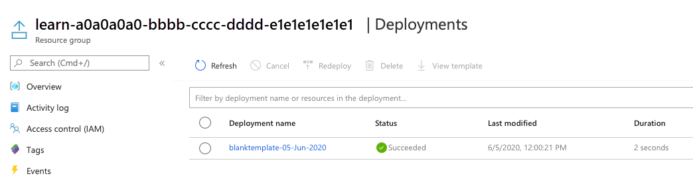
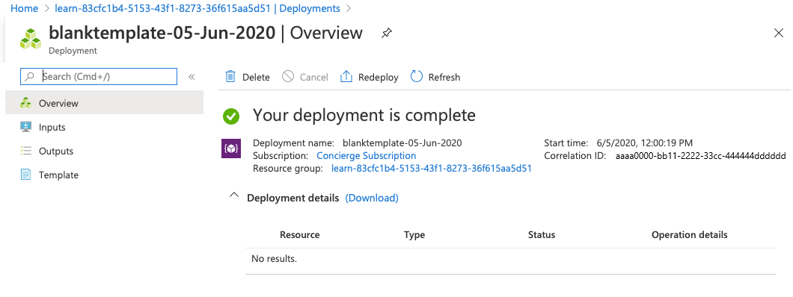
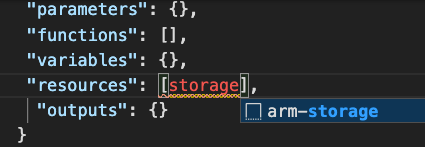
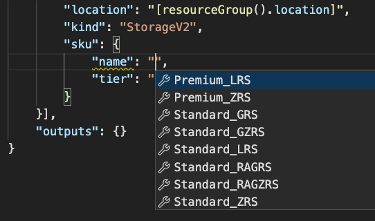
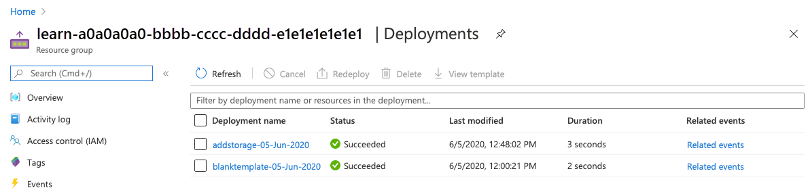
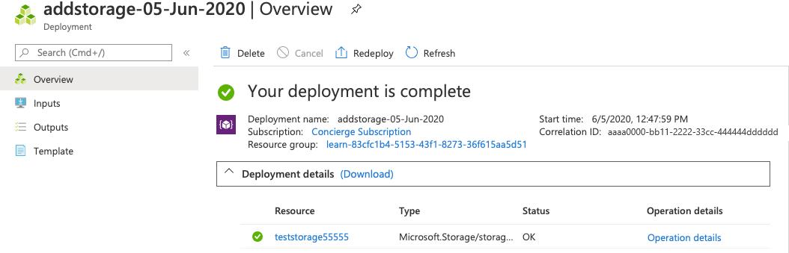

In this exercise, you create a Microsoft Azure Resource Manager template and deploy it to Azure. Then you update that template to add parameters and outputs.

This exercise uses the [Azure Resource Manager Tools for Visual Studio Code](https://marketplace.visualstudio.com/items?itemName=msazurermtools.azurerm-vscode-tools). Be sure to install this extension in Visual Studio Code.

## Create an Azure Resource Manager template

1. Open Visual Studio Code and create a new file called *azuredeploy.json*.
1. On the first line of the file, type **arm**.
1. You see an intellisense choice **!arm**. Choose that snippet by clicking on the box next to it. Your file will now look like this:

    ```json
    {
    "$schema": "https://schema.management.azure.com/schemas/2019-04-01/deploymentTemplate.json#",
    "contentVersion": "1.0.0.0",
    "apiProfile": "",
    "parameters": {},
    "variables": {},
    "functions": [],
    "resources": [],
    "outputs": {}
    }
    ```

  Notice that this file has all of the sections of an Azure Resource Manager template that we discussed in the last unit.

1. Save the changes to the file.

## Deploy the Azure Resource Manager template to Azure

To deploy this template to Azure, you need to sign in to your Azure account from the Visual Studio Code terminal. Be sure you have the [Azure CLI](https://docs.microsoft.com/cli/azure/install-azure-cli?view=azure-cli-latest) tools installed and that you are signing in to the same account that activated the sandbox.

### Sign in to Azure

1. From the terminal in Visual Studio Code, run this command to sign in to Azure. Running this command will open a browser that allows you to sign in to your account.

    ```azurecli
    az login
    ```

1. Once you are logged in, you see a list of the subscriptions associated with this account in the terminal. If you activated the sandbox, you see one called *Concierge Subscription*. You use this one for the rest of the exercise.
1. Set the default subscription for all of the Azure CLI commands you run in this session.

    ```azurecli
    az account set --subscription "Concierge Subscription"
    ```

> [!NOTE]
> If you have used more than one sandbox recently, there may be more than one *Concierge Subscription* listed. In this case, use the next two steps to set the default subscription. If the above command was successful, skip the next two steps.

1. Get the *Concierge Subscription* IDs.

   ```azurecli
    az account list \
      --refresh \
      --query "[?contains(name, 'Concierge Subscription')].id" \
      --output table
    ```

1. Set the default subscription using the subscription ID. Replace the *{your subscription ID}* with the latest Concierge Subscription ID.

    ```azurecli
    az account set --subscription {your subscription ID}
    ```

### Set the default resource group

1. Set the default resource group to the resource group created for you in the sandbox environment. This allows you to omit that parameter from the rest of the Azure CLI commands in this exercise.

    ```azurecli
    az configure --defaults group=<rgn>[sandbox resource group name]</rgn>
    ```

### Deploy the template to Azure

Here, you deploy the template to Azure. The template doesn't have any resources yet, so you won't see resources created. However, you'll see a successful deployment.

1. Deploy the template using Azure CLI commands in the terminal.

    ```azurecli
    templateFile="azuredeploy.json"
    today=$(date +"%d-%b-%Y")
    DeploymentName="blanktemplate-"$today

    az deployment group create \
     --name $DeploymentName \
     --template-file $templateFile
    ```

  In the top section of this code, you set Azure CLI variables for the path to the template file to deploy, and the name of this deployment. Then, you use the ```az deployment group create``` command to deploy the template to Azure.

1. You see ```Running...``` in the terminal. When that finishes, navigate to [Azure](https://portal.azure.com?azure-portal=true) and make sure you are in the sandbox subscription. To do that, select your avatar in the upper right corner of the page. Choose **Switch directory**. In the list, choose the **Microsoft Learn Sandbox** directory.

1. On the left side panel, choose *Resource groups*.
1. Select <rgn>[sandbox resource group name]</rgn>.
1. In the *Overview*, you see one deployment succeeded.

    

1. Select *1 Succeeded* to see the details of the deployment.

    

1. Select *blanktemplate* to see what resources were deployed. In this case, it will be empty since you didn't specify any resources in the template yet.

    

1. Leave the page open in your browser. You will check on deployments again.

## Add a resource to the template

Here, you add an Azure storage account resource to the template using a snippet from the Azure Resource Manager Tools for Visual Studio Code extension.

1. In the *azuredeploy.json* file in Visual Studio Code, place your curser between the square brackets in the resources block. ```"resources":[],```
1. Type **storage** in the square brackets. You see a list of related snippets. Choose **arm-storage**.

    

1. Your file will look like this:

    [!code-json[](code/parameter1.json)]

  Values that you should edit are highlighted in new section of your file and can be navigated using the <kbd>tab</kbd> key.

1. Change the values of the resource *name:* and *displayName:* to something unique. For example, **learnexercise12321**. This name must be unique across all of Azure, so choose something unique to you.
1. Change the value of the sku *name* from **Premium_LRS** to **Standard**. Do the same for the value of *tier*. Notice that Visual Studio Code gives you the proper choices for your attribute values in intellisense.

    

1. Note the location of the resource is set to the location of the resource group where it will be deployed. Leave the default here.
1. Save the file.

### Deploy the updated template

Here, you change the name of the deployment to better reflect what this deployment does.

1. Run the following Azure CLI commands in the terminal. This is the same code you used previously, however the name of the deployment is changed.

    ```azurecli
    templateFile="azuredeploy.json"
    today=$(date +"%d-%b-%Y")
    DeploymentName="addstorage-"$today

    az deployment group create \
      --name $DeploymentName \
      --template-file $templateFile
    ```

1. In your browser, navigate back to Azure. Go to your resource group and see that there are now *2 Succeeded* deployments. Select this link.
1. Notice that both deployments are in the list.

    

1. Select *addstorage*.

    

1. Notice that the storage account has been deployed.
