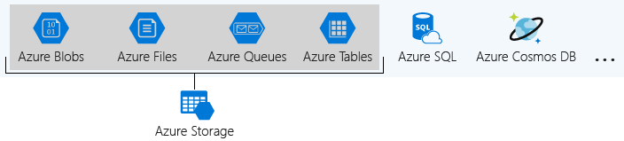
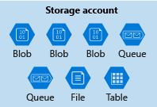
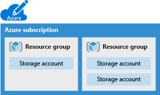
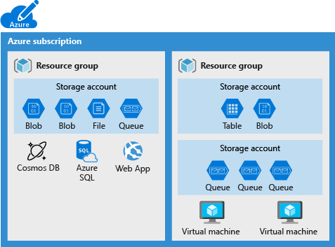
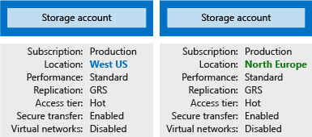

Organizations often have multiple storage accounts to enable them to implement different sets of requirements. In the chocolate-manufacturer example, there will be one storage account for private business data and one storage account for consumer-facing files. In this exercise, you'll learn the policy factors that are controlled by each type of storage account, which will help you decide how many accounts you need.

## What is Azure Storage?

Azure provides many ways to store your data, including multiple database options like Azure SQL Database, Azure Cosmos DB, and Azure Table Storage. Azure offers multiple ways to store and send messages, such as Azure Queues and Event Hubs. You can even store loose files using services like Azure Files and Azure Blobs.

Azure groups four of these data services together under the name _Azure Storage_. The four services are Azure Blobs, Azure Files, Azure Queues, and Azure Tables. The following illustration shows the elements of Azure Storage.

These four data services are all primitive, cloud-based storage services, and are often used together in the same application.

## What is a storage account?

A _storage account_ is a container that groups a set of Azure Storage services together. Only data services from Azure Storage can be included in a storage account (Azure Blobs, Azure Files, Azure Queues, and Azure Tables). The following illustration shows a storage account containing several data services.

Combining data services into a single storage account enables you to manage them as a group. The settings you specify when you create the account, or any changes that you make after creation, apply to all services in the storage account. Deleting a storage account deletes all of the data stored inside it.

A storage account is an Azure resource and is part of a resource group. The following illustration shows an Azure subscription containing multiple resource groups, where each group contains one or more storage accounts.

Other Azure data services, such as Azure SQL and Azure Cosmos DB, are managed as independent Azure resources and cannot be included in a storage account. The following illustration shows a typical arrangement: Blobs, Files, Queues, and Tables are contained within storage accounts, while other services are not.

## Storage account settings

A storage account defines a policy that applies to all the storage services in the account. For example, you could specify that all the contained services will be stored in the West US datacenter, accessible only over https, and billed to the sales department's subscription.

The settings that are defined by a storage account are:

- **Subscription**: The Azure subscription that will be billed for the services in the account.

- **Location**: The datacenter that will store the services in the account.

- **Performance**: Determines the data services you can have in your storage account and the type of hardware disks used to store the data. 
  - **Standard** allows you to have any data service (Blob, File, Queue, Table) and uses magnetic disk drives. 
  - **Premium** provides more services for storing data. For example, storing unstructured object data as block blobs or append blobs, and specialized file storage used to store and create premium file shares. These storage accounts use solid-state drives (SSD) for storage.

- **Replication**: Determines the strategy used to make copies of your data to protect against hardware failure or natural disaster. At a minimum, Azure automatically maintains three copies of your data within the datacenter associated with the storage account. The minimum replication is called locally redundant storage (LRS), and guards against hardware failure but does not protect you from an event that incapacitates the entire datacenter. You can upgrade to one of the other options such as geo-redundant storage (GRS) to get replication at different datacenters across the world.

- **Access tier**: Controls how quickly you'll be able to access the blobs in a storage account. The Hot access tier is optimized for storing data that's accessed or modified frequently and gives quicker access than Cool, but at increased storage cost. The Cool access tier is optimized for storing data that's infrequently accessed or modified, and has a lower storage cost. Hot access tier applies only to blobs, and serves as the default value for new blobs.

- **Secure transfer required**: A security feature that determines the supported protocols for access. Enabled requires HTTPS, while disabled allows HTTP.

- **Virtual networks**: A security feature that allows inbound access requests only from the virtual network(s) you specify.

## How many storage accounts do you need?

A storage account represents a collection of settings like location, replication strategy, and subscription owner. You need one storage account for each group of settings that you want to apply to your data. The following illustration shows two storage accounts that differ in one setting; that one difference is enough to require separate storage accounts.

The number of storage accounts you need is typically determined by your data diversity, cost sensitivity, and tolerance for management overhead.

### Data diversity

Organizations often generate data that differs in where it is consumed, how sensitive it is, which group pays the bills, etc. Diversity along any of these vectors can lead to multiple storage accounts. Let's consider two examples:

1. Do you have data that is specific to a country or region? If so, you might want to store the data in a datacenter in that region or country for performance or compliance reasons. You will need one storage account for each geographical region.

1. Do you have some data that is proprietary and some for public consumption? If so, you could enable virtual networks for the proprietary data and not for the public data. Separating proprietary data and public data will also require separate storage accounts.

In general, increased diversity means an increased number of storage accounts.

### Cost sensitivity

A storage account by itself has no financial cost; however, the settings you choose for the account do influence the cost of services in the account. Geo-redundant storage costs more than locally redundant storage. Premium performance and the Hot access tier increase the cost of blobs.

You can use multiple storage accounts to reduce costs. For example, you could partition your data into critical and non-critical categories. You could place your critical data into a storage account with geo-redundant storage and put your non-critical data in a different storage account with locally redundant storage.

### Tolerance for management overhead

Each storage account requires some time and attention from an administrator to create and maintain. It also increases complexity for anyone who adds data to your cloud storage; everyone in an administrator role needs to understand the purpose of each storage account so they add new data to the correct account.

Storage accounts are powerful tools to help you obtain the performance and security you need while minimizing costs. A typical strategy is to start with an analysis of your data and create partitions that share characteristics like location, billing, and replication strategy, and then create one storage account for each partition.
